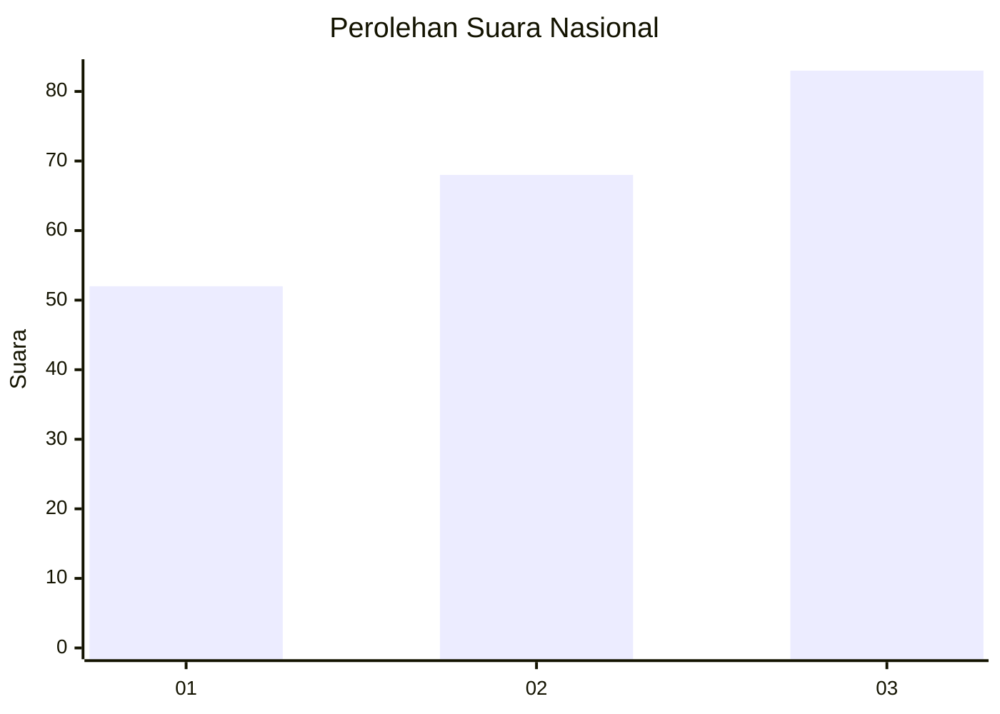
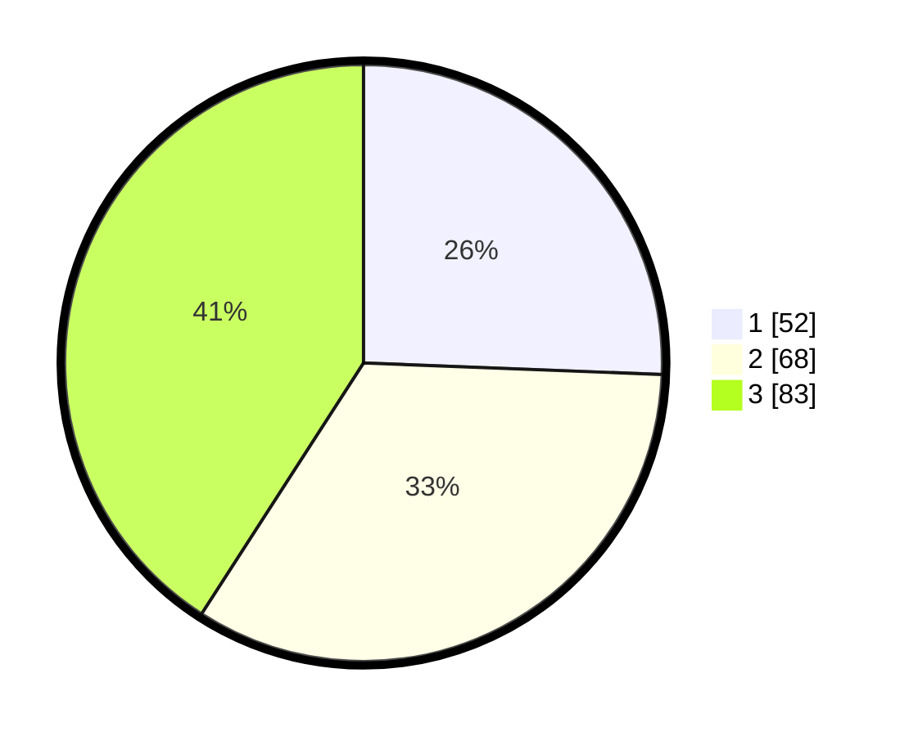

# Hasil

## Grafik

## Tabel

| No. | Nama Paslon    | Suara | Suara (raw) | Persentase |
|:--- |:-------------- | -----:| -----------:| ----------:|
| 1   | ANIES MUHAIMIN | 52    | [52][p-1]   | 25,62      |
| 2   | PRABOWO GIBRAN | 68    | [68][p-2]   | 33,50      |
| 3   | GANJAR MAHFUD  | 83    | [83][p-3]   | 40,89      |

[p-1]: https://github.com/gigit-pemilu/pemilu-2024/blob/main/pilpres/hitung-suara/sub/34-di-yogyakarta/sub/04-sleman/sub/12-ngaglik/sub/2006-donoharjo/sub/006-tps/sub/paslon-1.txt
[p-2]: https://github.com/gigit-pemilu/pemilu-2024/blob/main/pilpres/hitung-suara/sub/34-di-yogyakarta/sub/04-sleman/sub/12-ngaglik/sub/2006-donoharjo/sub/006-tps/sub/paslon-2.txt
[p-3]: https://github.com/gigit-pemilu/pemilu-2024/blob/main/pilpres/hitung-suara/sub/34-di-yogyakarta/sub/04-sleman/sub/12-ngaglik/sub/2006-donoharjo/sub/006-tps/sub/paslon-3.txt

## Foto C Plano

https://sirekap-obj-formc.kpu.go.id/c484/pemilu/ppwp/34/04/12/20/06/3404122006006-20240215-081921--131e349e-0ae0-4f1e-9b83-d39d9f6b2726.jpg

https://sirekap-obj-formc.kpu.go.id/c484/pemilu/ppwp/34/04/12/20/06/3404122006006-20240215-050929--7149000c-1211-4e7f-8b41-b082cf4f42bf.jpg

https://sirekap-obj-formc.kpu.go.id/c484/pemilu/ppwp/34/04/12/20/06/3404122006006-20240215-051034--d3fbb864-559b-4db9-a8fd-dfc443e686b8.jpg

## Metadata

| Key        | Value               |
| ---------- | ------------------- |
| Time Stamp | 2024-02-15 21:30:27 |

