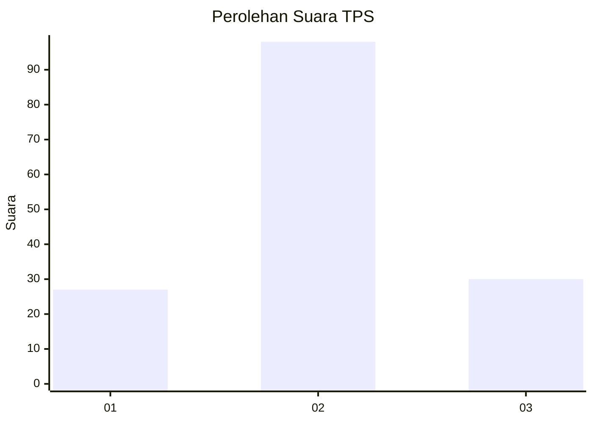
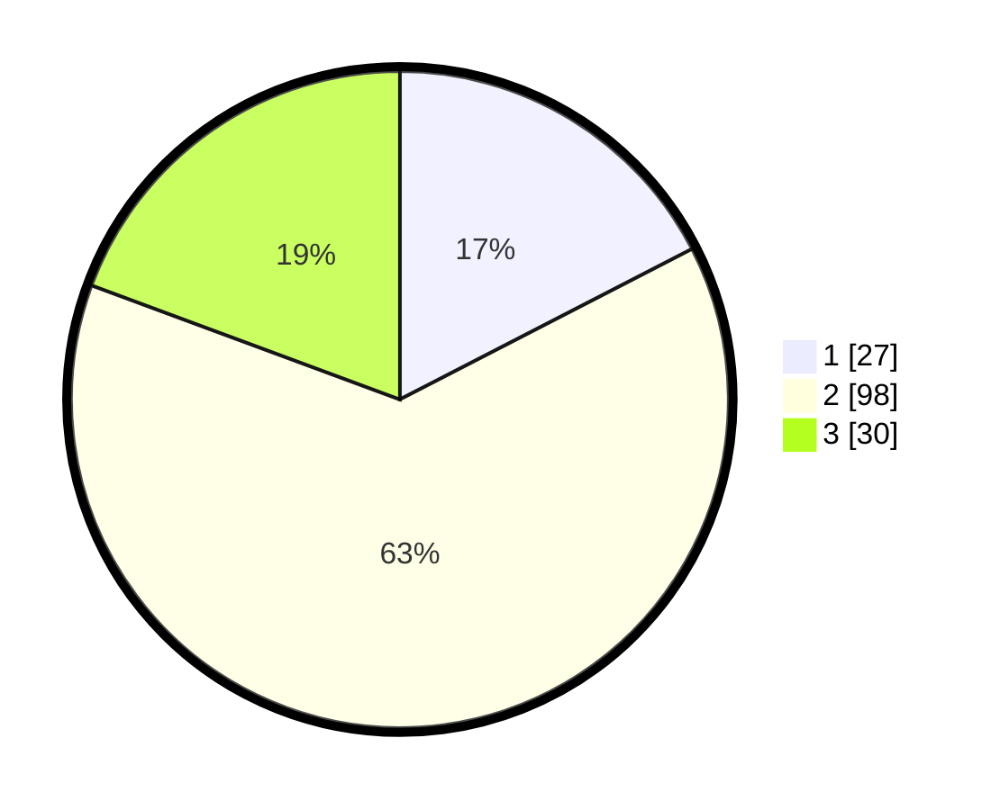

# Hasil

## Grafik

## Tabel

| No. | Nama Paslon    | Suara | Suara (raw) | Persentase |
|:--- |:-------------- | -----:| -----------:| ----------:|
| 1   | ANIES MUHAIMIN | 27    | [27][p-1]   | 17,42      |
| 2   | PRABOWO GIBRAN | 98    | [98][p-2]   | 63,23      |
| 3   | GANJAR MAHFUD  | 30    | [30][p-3]   | 19,35      |

[p-1]: https://github.com/gigit-pemilu/pemilu-2024-34-di-yogyakarta/blob/main/pilpres/hitung-suara/sub/34-di-yogyakarta/sub/04-sleman/sub/12-ngaglik/sub/2006-donoharjo/sub/030-tps/sub/paslon-1.txt
[p-2]: https://github.com/gigit-pemilu/pemilu-2024-34-di-yogyakarta/blob/main/pilpres/hitung-suara/sub/34-di-yogyakarta/sub/04-sleman/sub/12-ngaglik/sub/2006-donoharjo/sub/030-tps/sub/paslon-2.txt
[p-3]: https://github.com/gigit-pemilu/pemilu-2024-34-di-yogyakarta/blob/main/pilpres/hitung-suara/sub/34-di-yogyakarta/sub/04-sleman/sub/12-ngaglik/sub/2006-donoharjo/sub/030-tps/sub/paslon-3.txt

## Foto C Plano

https://sirekap-obj-formc.kpu.go.id/c0ce/pemilu/ppwp/34/04/12/20/06/3404122006030-20240214-215557--96925526-47f8-44e1-8e58-72f0e08ab81f.jpg

https://sirekap-obj-formc.kpu.go.id/c0ce/pemilu/ppwp/34/04/12/20/06/3404122006030-20240214-215710--95df7098-15b0-4a14-9bf9-bb5097c5cd97.jpg

https://sirekap-obj-formc.kpu.go.id/c0ce/pemilu/ppwp/34/04/12/20/06/3404122006030-20240214-215807--838011cd-b7dc-412e-a8a2-7ddc9a69aaa2.jpg

## Metadata

| Key        | Value               |
| ---------- | ------------------- |
| Time Stamp | 2024-02-21 23:00:00 |

