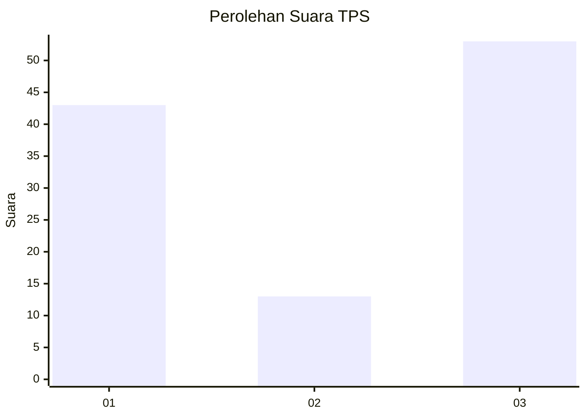
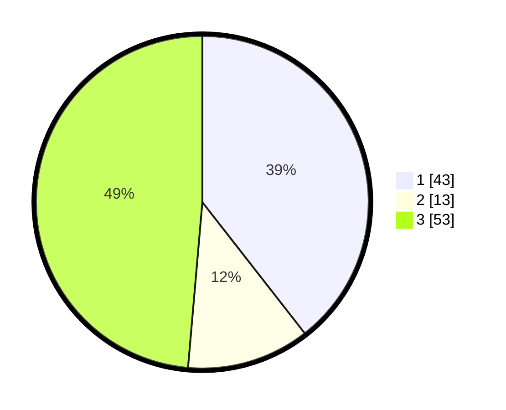

# Hasil

## Grafik

## Tabel

| No. | Nama Paslon    | Suara | Suara (raw) | Persentase |
|:--- |:-------------- | -----:| -----------:| ----------:|
| 1   | ANIES MUHAIMIN | 43    | [43][p-1]   | 39,45      |
| 2   | PRABOWO GIBRAN | 13    | [13][p-2]   | 11,93      |
| 3   | GANJAR MAHFUD  | 53    | [53][p-3]   | 48,62      |

[p-1]: https://github.com/gigit-pemilu/pemilu-2024-34-di-yogyakarta/blob/main/pilpres/hitung-suara/sub/34-di-yogyakarta/sub/04-sleman/sub/12-ngaglik/sub/2006-donoharjo/sub/031-tps/sub/paslon-1.txt
[p-2]: https://github.com/gigit-pemilu/pemilu-2024-34-di-yogyakarta/blob/main/pilpres/hitung-suara/sub/34-di-yogyakarta/sub/04-sleman/sub/12-ngaglik/sub/2006-donoharjo/sub/031-tps/sub/paslon-2.txt
[p-3]: https://github.com/gigit-pemilu/pemilu-2024-34-di-yogyakarta/blob/main/pilpres/hitung-suara/sub/34-di-yogyakarta/sub/04-sleman/sub/12-ngaglik/sub/2006-donoharjo/sub/031-tps/sub/paslon-3.txt

## Foto C Plano

https://sirekap-obj-formc.kpu.go.id/7337/pemilu/ppwp/34/04/12/20/06/3404122006031-20240214-141231--8ed444dc-55b6-41ad-a319-af96d5513511.jpg

https://sirekap-obj-formc.kpu.go.id/7337/pemilu/ppwp/34/04/12/20/06/3404122006031-20240214-141529--c9317412-e94b-44af-abe5-4994b9dfbbd5.jpg

https://sirekap-obj-formc.kpu.go.id/7337/pemilu/ppwp/34/04/12/20/06/3404122006031-20240214-141428--e55e7906-bdb5-4b69-9d74-3a6d01414de5.jpg

## Metadata

| Key        | Value               |
| ---------- | ------------------- |
| Time Stamp | 2024-02-21 23:00:00 |

