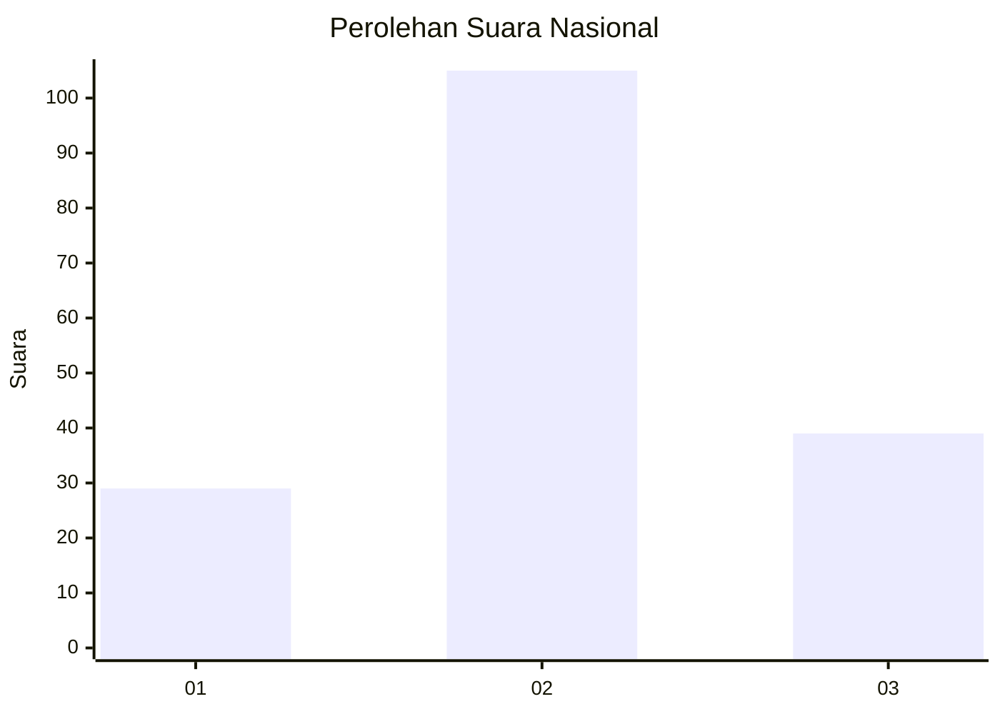
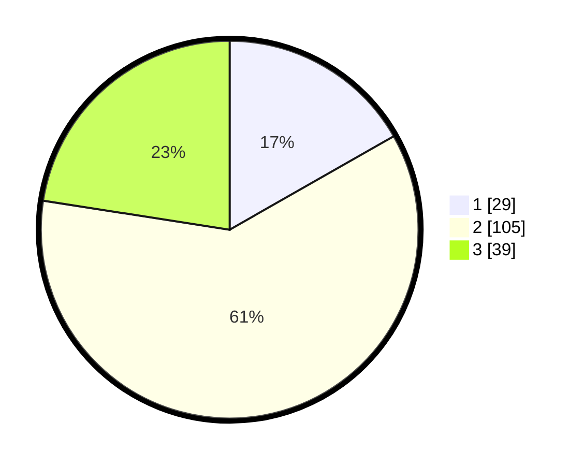

# Hasil

## Grafik

## Tabel

| No. | Nama Paslon    | Suara | Suara (raw) | Persentase |
|:--- |:-------------- | -----:| -----------:| ----------:|
| 1   | ANIES MUHAIMIN | 29    | [29][p-1]   | 16,76      |
| 2   | PRABOWO GIBRAN | 105   | [105][p-2]  | 60,69      |
| 3   | GANJAR MAHFUD  | 39    | [39][p-3]   | 22,54      |

[p-1]: https://github.com/gigit-pemilu/pemilu-2024/blob/main/pilpres/hitung-suara/sub/34-di-yogyakarta/sub/04-sleman/sub/13-sleman/sub/2001-caturharjo/sub/002-tps/sub/paslon-1.txt
[p-2]: https://github.com/gigit-pemilu/pemilu-2024/blob/main/pilpres/hitung-suara/sub/34-di-yogyakarta/sub/04-sleman/sub/13-sleman/sub/2001-caturharjo/sub/002-tps/sub/paslon-2.txt
[p-3]: https://github.com/gigit-pemilu/pemilu-2024/blob/main/pilpres/hitung-suara/sub/34-di-yogyakarta/sub/04-sleman/sub/13-sleman/sub/2001-caturharjo/sub/002-tps/sub/paslon-3.txt

## Foto C Plano

https://sirekap-obj-formc.kpu.go.id/0bc5/pemilu/ppwp/34/04/13/20/01/3404132001002-20240216-045350--4cb04135-6fdf-44ec-a95c-ee51e06f3b24.jpg

https://sirekap-obj-formc.kpu.go.id/0bc5/pemilu/ppwp/34/04/13/20/01/3404132001002-20240216-045354--1329c2e9-0569-45e4-8a17-e48bbb2f0b71.jpg

https://sirekap-obj-formc.kpu.go.id/0bc5/pemilu/ppwp/34/04/13/20/01/3404132001002-20240216-045352--c0105802-9740-4054-8ccf-a44cbc7a7cc3.jpg

## Metadata

| Key        | Value               |
| ---------- | ------------------- |
| Time Stamp | 2024-02-16 11:00:29 |

## DATA PEMILIH TETAP

Jumlah pemilih dalam DPT: **184**.
 * L: **88**.
 * P: **96**.

## DATA PENGGUNA HAK PILIH

Jumlah pengguna hak pilih dalam DPT: **168**.
 * L: **79**.
 * P: **89**.

Jumlah pengguna hak pilih dalam DPTb: **6**.
 * L: **3**.
 * P: **3**.

Jumlah pengguna hak pilih dalam DPK: **2**.
 * L: **1**.
 * P: **1**.

Jumlah pengguna hak pilih: **176**.
 * L: **83**.
 * P: **93**.

## JUMLAH SUARA SAH DAN TIDAK SAH

JUMLAH SELURUH SUARA SAH: **173**.

JUMLAH SUARA TIDAK SAH: **3**.

JUMLAH SELURUH SUARA SAH DAN SUARA TIDAK SAH: **176**.

