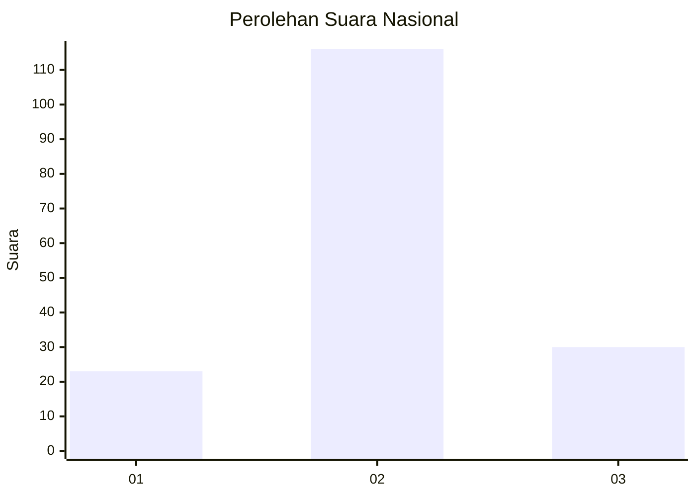
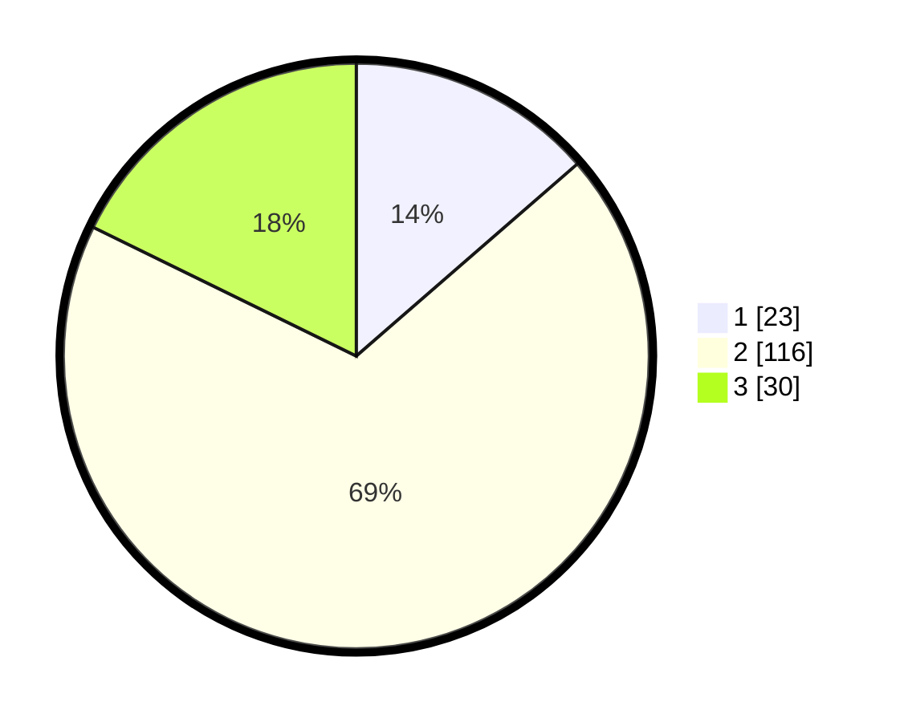

# Hasil

## Grafik

## Tabel

| No. | Nama Paslon    | Suara | Suara (raw) | Persentase |
|:--- |:-------------- | -----:| -----------:| ----------:|
| 1   | ANIES MUHAIMIN | 23    | [23][p-1]   | 13,61      |
| 2   | PRABOWO GIBRAN | 116   | [116][p-2]  | 68,64      |
| 3   | GANJAR MAHFUD  | 30    | [30][p-3]   | 17,75      |

[p-1]: https://github.com/gigit-pemilu/pemilu-2024/blob/main/pilpres/hitung-suara/sub/34-di-yogyakarta/sub/04-sleman/sub/13-sleman/sub/2001-caturharjo/sub/003-tps/sub/paslon-1.txt
[p-2]: https://github.com/gigit-pemilu/pemilu-2024/blob/main/pilpres/hitung-suara/sub/34-di-yogyakarta/sub/04-sleman/sub/13-sleman/sub/2001-caturharjo/sub/003-tps/sub/paslon-2.txt
[p-3]: https://github.com/gigit-pemilu/pemilu-2024/blob/main/pilpres/hitung-suara/sub/34-di-yogyakarta/sub/04-sleman/sub/13-sleman/sub/2001-caturharjo/sub/003-tps/sub/paslon-3.txt

## Foto C Plano

https://sirekap-obj-formc.kpu.go.id/c38b/pemilu/ppwp/34/04/13/20/01/3404132001003-20240214-141545--af1eb37b-133f-4a9c-9c2e-eae1d03699c3.jpg

https://sirekap-obj-formc.kpu.go.id/c38b/pemilu/ppwp/34/04/13/20/01/3404132001003-20240214-155258--9747019b-226b-44aa-a2f5-203cc5bca559.jpg

https://sirekap-obj-formc.kpu.go.id/c38b/pemilu/ppwp/34/04/13/20/01/3404132001003-20240214-155305--c6d63c9e-9abd-421a-ac7b-9efb6b4d2055.jpg

## Metadata

| Key        | Value               |
| ---------- | ------------------- |
| Time Stamp | 2024-02-14 21:46:01 |

## DATA PEMILIH TETAP

Jumlah pemilih dalam DPT: **189**.
 * L: **94**.
 * P: **95**.

## DATA PENGGUNA HAK PILIH

Jumlah pengguna hak pilih dalam DPT: **165**.
 * L: **81**.
 * P: **84**.

Jumlah pengguna hak pilih dalam DPTb: **8**.
 * L: **7**.
 * P: **1**.

Jumlah pengguna hak pilih dalam DPK: **1**.
 * L: **1**.
 * P: **0**.

Jumlah pengguna hak pilih: **174**.
 * L: **89**.
 * P: **85**.

## JUMLAH SUARA SAH DAN TIDAK SAH

JUMLAH SELURUH SUARA SAH: **169**.

JUMLAH SUARA TIDAK SAH: **5**.

JUMLAH SELURUH SUARA SAH DAN SUARA TIDAK SAH: **174**.

