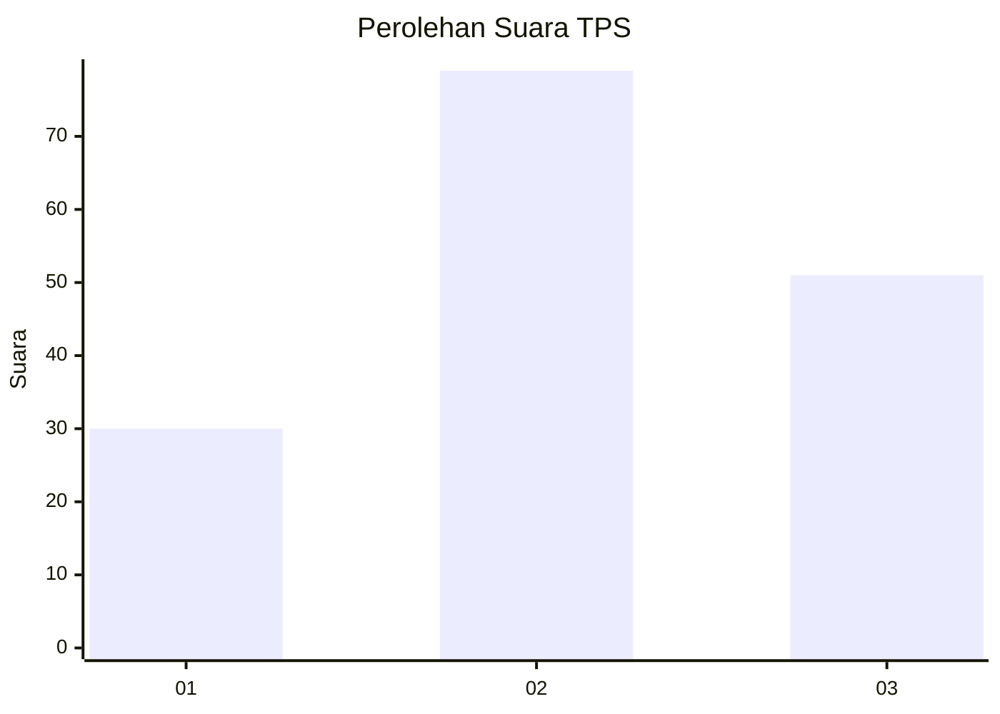
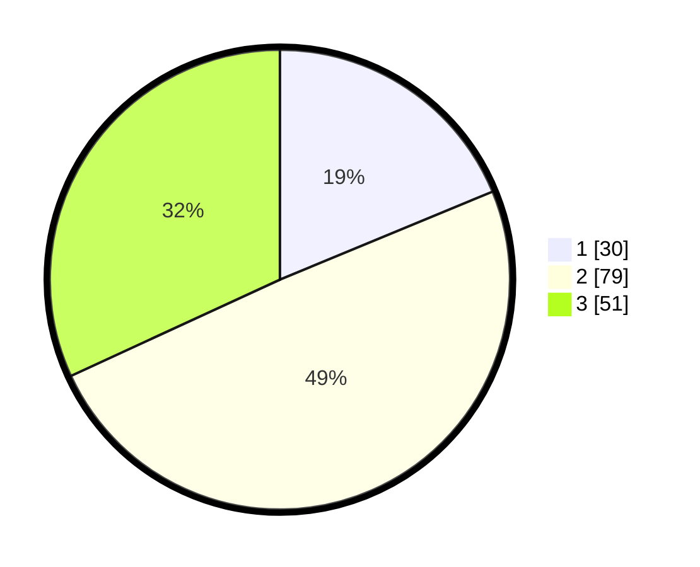

# Hasil

## Grafik

## Tabel

| No. | Nama Paslon    | Suara | Suara (raw) | Persentase |
|:--- |:-------------- | -----:| -----------:| ----------:|
| 1   | ANIES MUHAIMIN | 30    | [30][p-1]   | 18,75      |
| 2   | PRABOWO GIBRAN | 79    | [79][p-2]   | 49,38      |
| 3   | GANJAR MAHFUD  | 51    | [51][p-3]   | 31,88      |

[p-1]: https://github.com/gigit-pemilu/pemilu-2024-34-di-yogyakarta/blob/main/pilpres/hitung-suara/sub/34-di-yogyakarta/sub/04-sleman/sub/13-sleman/sub/2001-caturharjo/sub/005-tps/sub/paslon-1.txt
[p-2]: https://github.com/gigit-pemilu/pemilu-2024-34-di-yogyakarta/blob/main/pilpres/hitung-suara/sub/34-di-yogyakarta/sub/04-sleman/sub/13-sleman/sub/2001-caturharjo/sub/005-tps/sub/paslon-2.txt
[p-3]: https://github.com/gigit-pemilu/pemilu-2024-34-di-yogyakarta/blob/main/pilpres/hitung-suara/sub/34-di-yogyakarta/sub/04-sleman/sub/13-sleman/sub/2001-caturharjo/sub/005-tps/sub/paslon-3.txt

## Foto C Plano

https://sirekap-obj-formc.kpu.go.id/50e7/pemilu/ppwp/34/04/13/20/01/3404132001005-20240216-120549--3f2f72a6-cada-47c6-8e4c-c058a552466d.jpg

https://sirekap-obj-formc.kpu.go.id/50e7/pemilu/ppwp/34/04/13/20/01/3404132001005-20240216-120555--48285a42-6a68-4b6b-bd70-f2f2d4a2fc82.jpg

https://sirekap-obj-formc.kpu.go.id/50e7/pemilu/ppwp/34/04/13/20/01/3404132001005-20240215-005306--8f398556-c3d8-4aa1-8a17-2764a76db739.jpg

## Metadata

| Key        | Value               |
| ---------- | ------------------- |
| Time Stamp | 2024-02-17 10:30:03 |

## DATA PEMILIH TETAP

Jumlah pemilih dalam DPT: **172**.
 * L: **84**.
 * P: **88**.

## DATA PENGGUNA HAK PILIH

Jumlah pengguna hak pilih dalam DPT: **151**.
 * L: **74**.
 * P: **77**.

Jumlah pengguna hak pilih dalam DPTb: **7**.
 * L: **3**.
 * P: **4**.

Jumlah pengguna hak pilih dalam DPK: **4**.
 * L: **2**.
 * P: **2**.

Jumlah pengguna hak pilih: **162**.
 * L: **79**.
 * P: **83**.

## JUMLAH SUARA SAH DAN TIDAK SAH

JUMLAH SELURUH SUARA SAH: **160**.

JUMLAH SUARA TIDAK SAH: **2**.

JUMLAH SELURUH SUARA SAH DAN SUARA TIDAK SAH: **162**.

