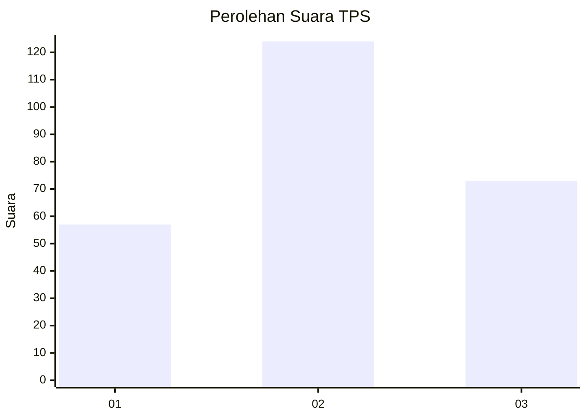
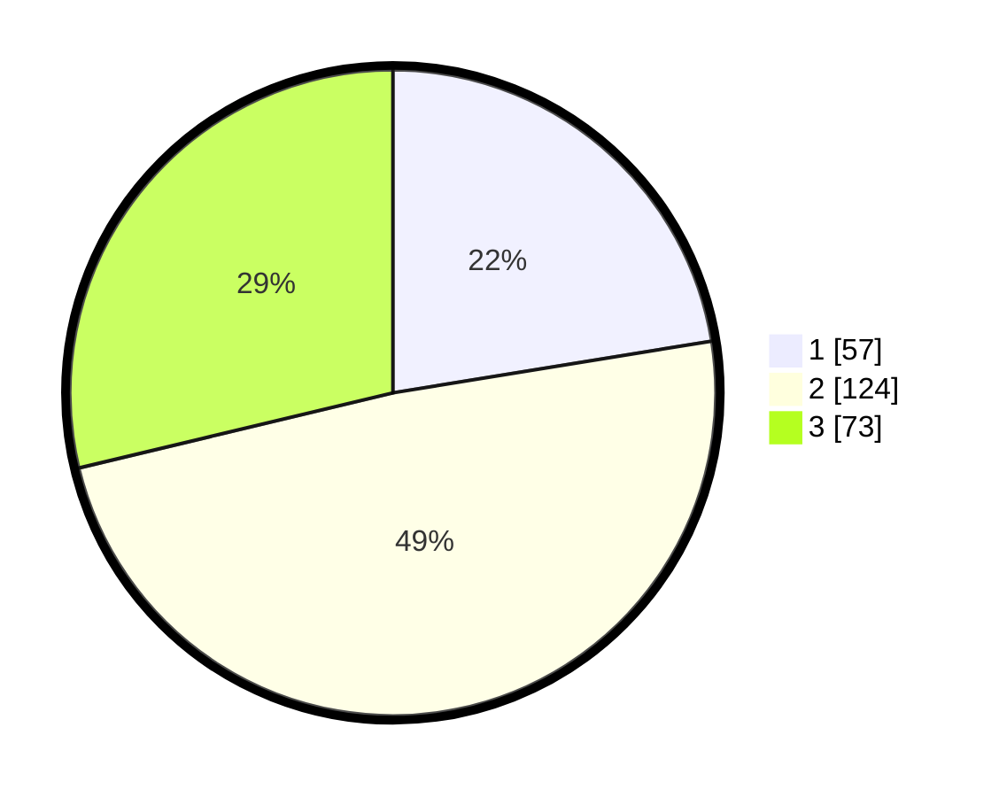

# Hasil

## Grafik

## Tabel

| No. | Nama Paslon    | Suara | Suara (raw) | Persentase |
|:--- |:-------------- | -----:| -----------:| ----------:|
| 1   | ANIES MUHAIMIN | 57    | [57][p-1]   | 22,44      |
| 2   | PRABOWO GIBRAN | 124   | [124][p-2]  | 48,82      |
| 3   | GANJAR MAHFUD  | 73    | [73][p-3]   | 28,74      |

[p-1]: https://github.com/gigit-pemilu/pemilu-2024-34-di-yogyakarta/blob/main/pilpres/hitung-suara/sub/34-di-yogyakarta/sub/04-sleman/sub/13-sleman/sub/2001-caturharjo/sub/008-tps/sub/paslon-1.txt
[p-2]: https://github.com/gigit-pemilu/pemilu-2024-34-di-yogyakarta/blob/main/pilpres/hitung-suara/sub/34-di-yogyakarta/sub/04-sleman/sub/13-sleman/sub/2001-caturharjo/sub/008-tps/sub/paslon-2.txt
[p-3]: https://github.com/gigit-pemilu/pemilu-2024-34-di-yogyakarta/blob/main/pilpres/hitung-suara/sub/34-di-yogyakarta/sub/04-sleman/sub/13-sleman/sub/2001-caturharjo/sub/008-tps/sub/paslon-3.txt

## Foto C Plano

https://sirekap-obj-formc.kpu.go.id/51f9/pemilu/ppwp/34/04/13/20/01/3404132001008-20240215-001027--297d897a-19ca-409a-9b10-4e4e2f142a5e.jpg

https://sirekap-obj-formc.kpu.go.id/51f9/pemilu/ppwp/34/04/13/20/01/3404132001008-20240215-001325--12dec2be-a754-4e66-95fd-ebe5cafa5bfa.jpg

https://sirekap-obj-formc.kpu.go.id/51f9/pemilu/ppwp/34/04/13/20/01/3404132001008-20240215-001958--8fb11288-b5ce-4770-ad98-59b84843563e.jpg

## Metadata

| Key        | Value               |
| ---------- | ------------------- |
| Time Stamp | 2024-02-15 21:30:27 |

