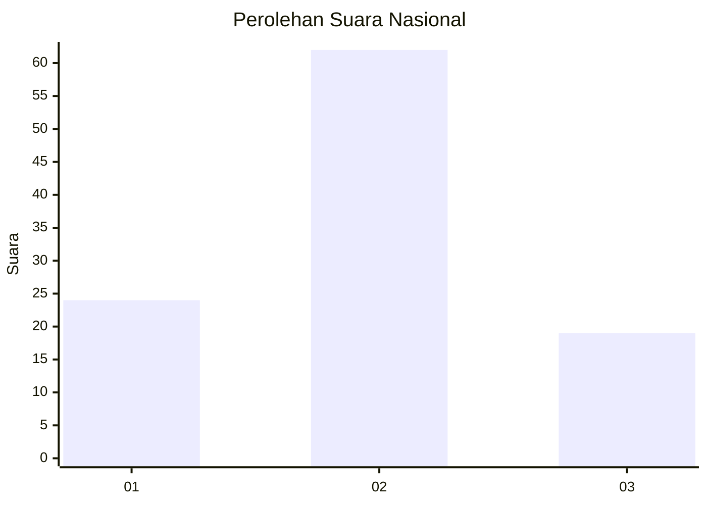
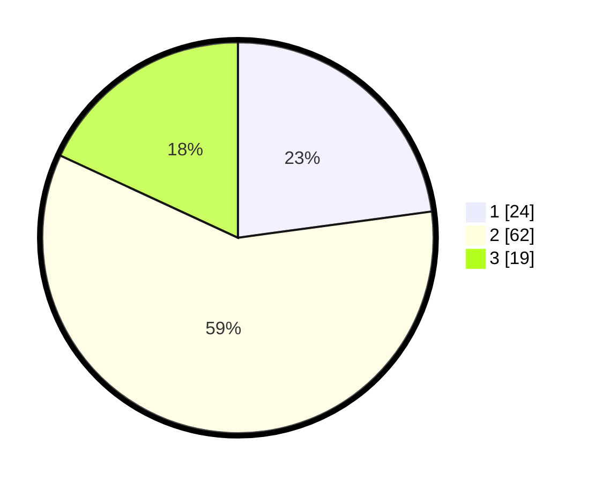

# Hasil

## Grafik

## Tabel

| No. | Nama Paslon    | Suara | Suara (raw) | Persentase |
|:--- |:-------------- | -----:| -----------:| ----------:|
| 1   | ANIES MUHAIMIN | 24    | [24][p-1]   | 22,86      |
| 2   | PRABOWO GIBRAN | 62    | [62][p-2]   | 59,05      |
| 3   | GANJAR MAHFUD  | 19    | [19][p-3]   | 18,10      |

[p-1]: https://github.com/gigit-pemilu/pemilu-2024/blob/main/pilpres/hitung-suara/sub/34-di-yogyakarta/sub/04-sleman/sub/13-sleman/sub/2001-caturharjo/sub/009-tps/sub/paslon-1.txt
[p-2]: https://github.com/gigit-pemilu/pemilu-2024/blob/main/pilpres/hitung-suara/sub/34-di-yogyakarta/sub/04-sleman/sub/13-sleman/sub/2001-caturharjo/sub/009-tps/sub/paslon-2.txt
[p-3]: https://github.com/gigit-pemilu/pemilu-2024/blob/main/pilpres/hitung-suara/sub/34-di-yogyakarta/sub/04-sleman/sub/13-sleman/sub/2001-caturharjo/sub/009-tps/sub/paslon-3.txt

## Foto C Plano

https://sirekap-obj-formc.kpu.go.id/0b64/pemilu/ppwp/34/04/13/20/01/3404132001009-20240215-202711--9657074b-fd02-435b-994c-3258cfcca557.jpg

https://sirekap-obj-formc.kpu.go.id/0b64/pemilu/ppwp/34/04/13/20/01/3404132001009-20240215-202717--53f6e811-4bcd-4dba-bbe1-d3ef4e8a5c34.jpg

https://sirekap-obj-formc.kpu.go.id/0b64/pemilu/ppwp/34/04/13/20/01/3404132001009-20240215-202738--b69d1aa2-e94f-4bca-b73e-d0d83a4ddf99.jpg

## Metadata

| Key        | Value               |
| ---------- | ------------------- |
| Time Stamp | 2024-02-17 14:56:33 |

## DATA PEMILIH TETAP

Jumlah pemilih dalam DPT: **108**.
 * L: **51**.
 * P: **57**.

## DATA PENGGUNA HAK PILIH

Jumlah pengguna hak pilih dalam DPT: **99**.
 * L: **45**.
 * P: **54**.

Jumlah pengguna hak pilih dalam DPTb: **5**.
 * L: **2**.
 * P: **3**.

Jumlah pengguna hak pilih dalam DPK: **3**.
 * L: **2**.
 * P: **1**.

Jumlah pengguna hak pilih: **107**.
 * L: **49**.
 * P: **58**.

## JUMLAH SUARA SAH DAN TIDAK SAH

JUMLAH SELURUH SUARA SAH: **105**.

JUMLAH SUARA TIDAK SAH: **2**.

JUMLAH SELURUH SUARA SAH DAN SUARA TIDAK SAH: **107**.

