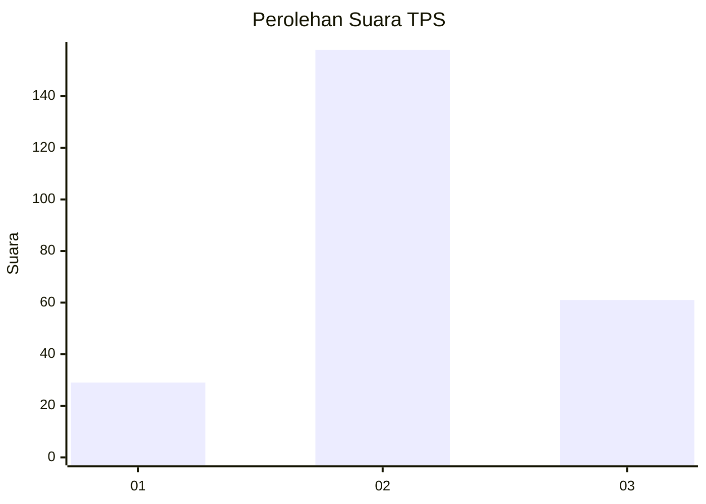
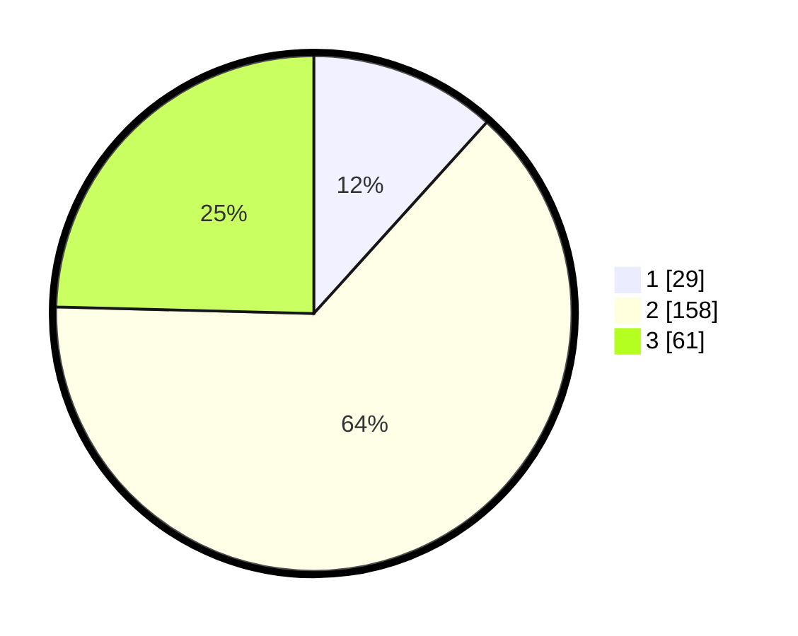

# Hasil

## Grafik

## Tabel

| No. | Nama Paslon    | Suara | Suara (raw) | Persentase |
|:--- |:-------------- | -----:| -----------:| ----------:|
| 1   | ANIES MUHAIMIN | 29    | [29][p-1]   | 11,69      |
| 2   | PRABOWO GIBRAN | 158   | [158][p-2]  | 63,71      |
| 3   | GANJAR MAHFUD  | 61    | [61][p-3]   | 24,60      |

[p-1]: https://github.com/gigit-pemilu/pemilu-2024-34-di-yogyakarta/blob/main/pilpres/hitung-suara/sub/34-di-yogyakarta/sub/04-sleman/sub/13-sleman/sub/2001-caturharjo/sub/015-tps/sub/paslon-1.txt
[p-2]: https://github.com/gigit-pemilu/pemilu-2024-34-di-yogyakarta/blob/main/pilpres/hitung-suara/sub/34-di-yogyakarta/sub/04-sleman/sub/13-sleman/sub/2001-caturharjo/sub/015-tps/sub/paslon-2.txt
[p-3]: https://github.com/gigit-pemilu/pemilu-2024-34-di-yogyakarta/blob/main/pilpres/hitung-suara/sub/34-di-yogyakarta/sub/04-sleman/sub/13-sleman/sub/2001-caturharjo/sub/015-tps/sub/paslon-3.txt

## Foto C Plano

https://sirekap-obj-formc.kpu.go.id/eee8/pemilu/ppwp/34/04/13/20/01/3404132001015-20240215-062838--ca29208c-e6a3-4a00-91f3-feb49e5aff22.jpg

https://sirekap-obj-formc.kpu.go.id/eee8/pemilu/ppwp/34/04/13/20/01/3404132001015-20240214-233001--26471c21-4dcb-4106-b77f-fb48b87a3327.jpg

https://sirekap-obj-formc.kpu.go.id/eee8/pemilu/ppwp/34/04/13/20/01/3404132001015-20240215-014032--4be6a361-0c91-4d2b-aca2-59128bd8c9d6.jpg

## Metadata

| Key        | Value               |
| ---------- | ------------------- |
| Time Stamp | 2024-02-15 21:30:27 |

