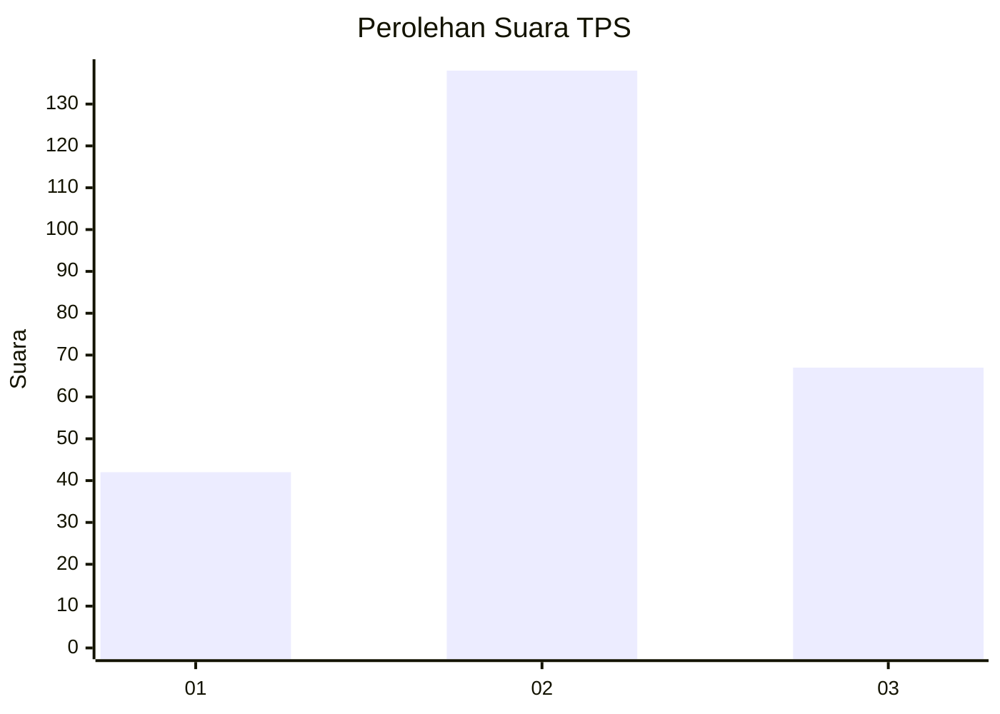
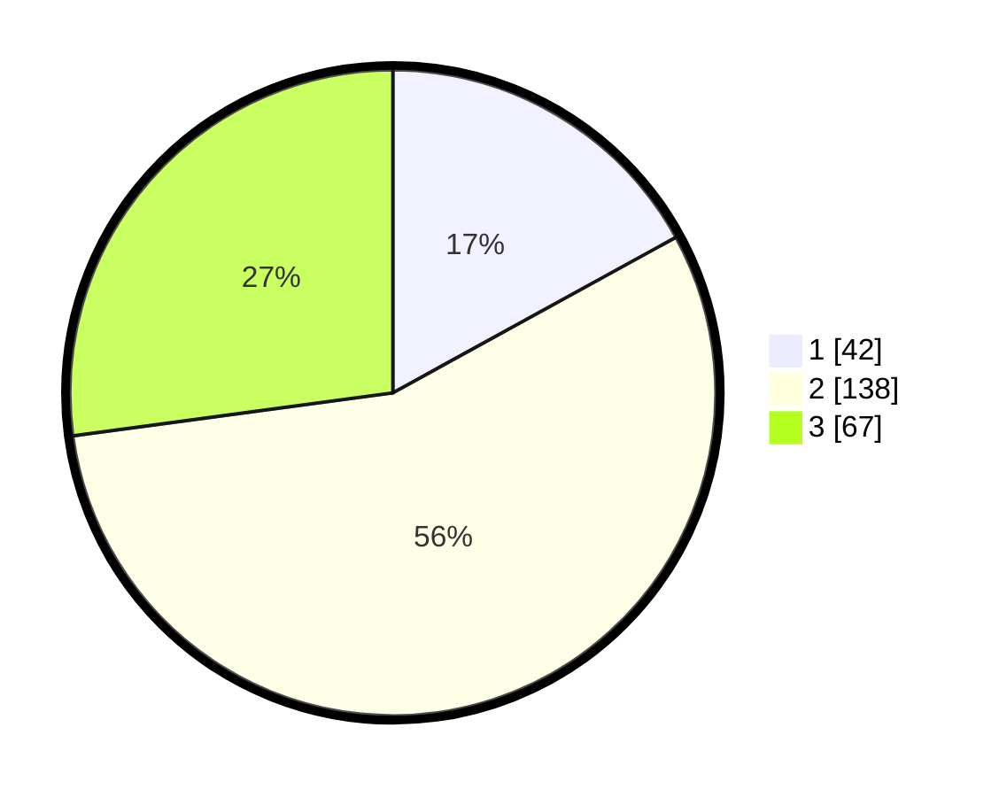

# Hasil

## Grafik

## Tabel

| No. | Nama Paslon    | Suara | Suara (raw) | Persentase |
|:--- |:-------------- | -----:| -----------:| ----------:|
| 1   | ANIES MUHAIMIN | 42    | [42][p-1]   | 17,00      |
| 2   | PRABOWO GIBRAN | 138   | [138][p-2]  | 55,87      |
| 3   | GANJAR MAHFUD  | 67    | [67][p-3]   | 27,13      |

[p-1]: https://github.com/gigit-pemilu/pemilu-2024-34-di-yogyakarta/blob/main/pilpres/hitung-suara/sub/34-di-yogyakarta/sub/04-sleman/sub/13-sleman/sub/2001-caturharjo/sub/018-tps/sub/paslon-1.txt
[p-2]: https://github.com/gigit-pemilu/pemilu-2024-34-di-yogyakarta/blob/main/pilpres/hitung-suara/sub/34-di-yogyakarta/sub/04-sleman/sub/13-sleman/sub/2001-caturharjo/sub/018-tps/sub/paslon-2.txt
[p-3]: https://github.com/gigit-pemilu/pemilu-2024-34-di-yogyakarta/blob/main/pilpres/hitung-suara/sub/34-di-yogyakarta/sub/04-sleman/sub/13-sleman/sub/2001-caturharjo/sub/018-tps/sub/paslon-3.txt

## Foto C Plano

https://sirekap-obj-formc.kpu.go.id/629f/pemilu/ppwp/34/04/13/20/01/3404132001018-20240217-210311--750df632-a6ad-4794-9f6f-3d46b425378a.jpg

https://sirekap-obj-formc.kpu.go.id/629f/pemilu/ppwp/34/04/13/20/01/3404132001018-20240217-212110--4b9c052f-f9be-40f2-9989-1022fee80677.jpg

https://sirekap-obj-formc.kpu.go.id/629f/pemilu/ppwp/34/04/13/20/01/3404132001018-20240216-230032--f19b965b-8d66-40d6-86f4-5bdc352da2b8.jpg

## Metadata

| Key        | Value               |
| ---------- | ------------------- |
| Time Stamp | 2024-02-24 22:31:28 |

