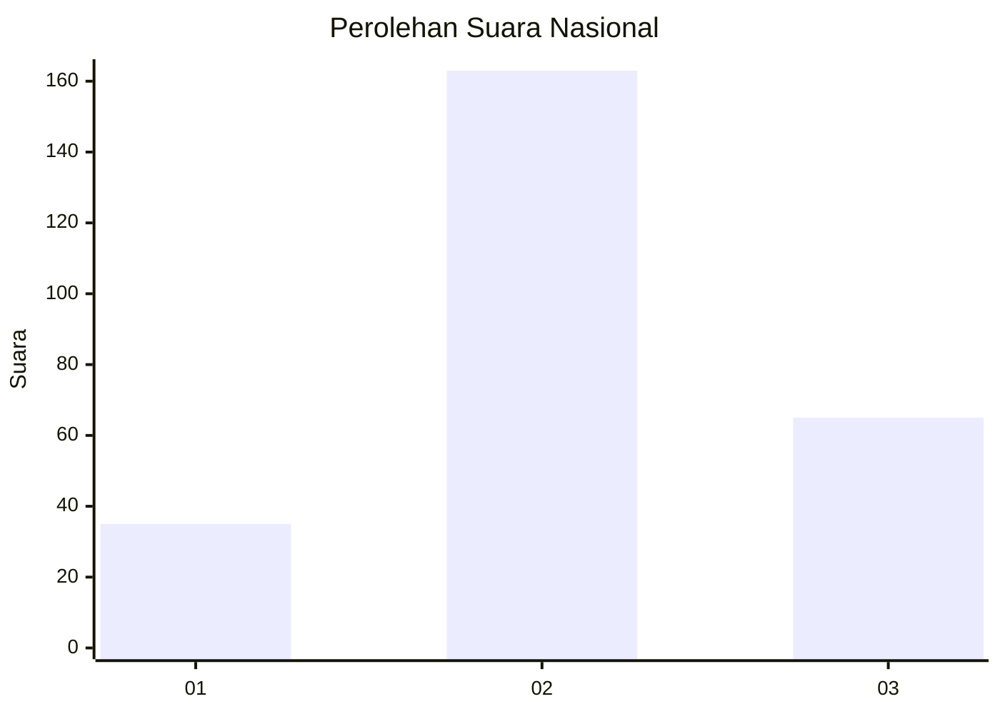
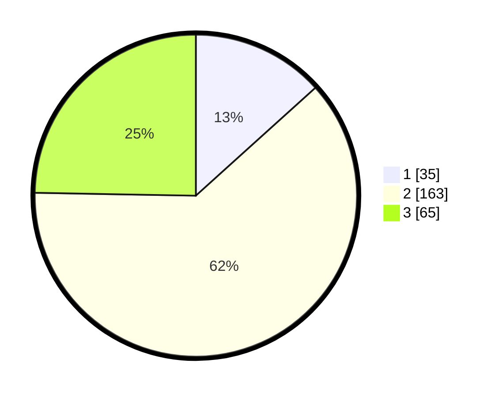

# Hasil

## Grafik

## Tabel

| No. | Nama Paslon    | Suara | Suara (raw) | Persentase |
|:--- |:-------------- | -----:| -----------:| ----------:|
| 1   | ANIES MUHAIMIN | 35    | [35][p-1]   | 13,31      |
| 2   | PRABOWO GIBRAN | 163   | [163][p-2]  | 61,98      |
| 3   | GANJAR MAHFUD  | 65    | [65][p-3]   | 24,71      |

[p-1]: https://github.com/gigit-pemilu/pemilu-2024/blob/main/pilpres/hitung-suara/sub/34-di-yogyakarta/sub/04-sleman/sub/13-sleman/sub/2001-caturharjo/sub/030-tps/sub/paslon-1.txt
[p-2]: https://github.com/gigit-pemilu/pemilu-2024/blob/main/pilpres/hitung-suara/sub/34-di-yogyakarta/sub/04-sleman/sub/13-sleman/sub/2001-caturharjo/sub/030-tps/sub/paslon-2.txt
[p-3]: https://github.com/gigit-pemilu/pemilu-2024/blob/main/pilpres/hitung-suara/sub/34-di-yogyakarta/sub/04-sleman/sub/13-sleman/sub/2001-caturharjo/sub/030-tps/sub/paslon-3.txt

## Foto C Plano

https://sirekap-obj-formc.kpu.go.id/bdd7/pemilu/ppwp/34/04/13/20/01/3404132001030-20240214-201917--0e80c1af-cb6f-4762-8bf9-3eca5378d1d1.jpg

https://sirekap-obj-formc.kpu.go.id/bdd7/pemilu/ppwp/34/04/13/20/01/3404132001030-20240214-202025--34cb3186-8dad-49ed-a169-29154b025f98.jpg

https://sirekap-obj-formc.kpu.go.id/bdd7/pemilu/ppwp/34/04/13/20/01/3404132001030-20240214-202142--82ec9fab-19dc-405e-8dcb-fc252d680276.jpg

## Metadata

| Key        | Value               |
| ---------- | ------------------- |
| Time Stamp | 2024-02-15 15:00:29 |

