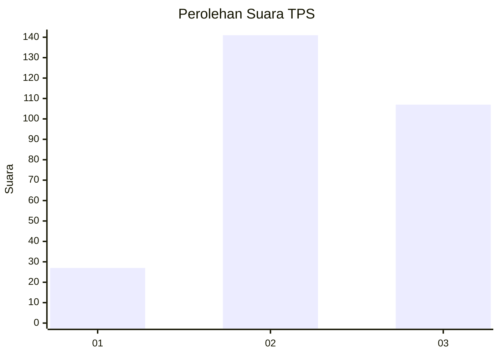
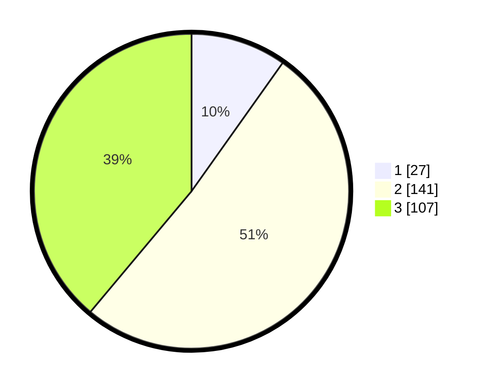

# Hasil

## Grafik

## Tabel

| No. | Nama Paslon    | Suara | Suara (raw) | Persentase |
|:--- |:-------------- | -----:| -----------:| ----------:|
| 1   | ANIES MUHAIMIN | 27    | [27][p-1]   | 9,82       |
| 2   | PRABOWO GIBRAN | 141   | [141][p-2]  | 51,27      |
| 3   | GANJAR MAHFUD  | 107   | [107][p-3]  | 38,91      |

[p-1]: https://github.com/gigit-pemilu/pemilu-2024-34-di-yogyakarta/blob/main/pilpres/hitung-suara/sub/34-di-yogyakarta/sub/04-sleman/sub/13-sleman/sub/2001-caturharjo/sub/033-tps/sub/paslon-1.txt
[p-2]: https://github.com/gigit-pemilu/pemilu-2024-34-di-yogyakarta/blob/main/pilpres/hitung-suara/sub/34-di-yogyakarta/sub/04-sleman/sub/13-sleman/sub/2001-caturharjo/sub/033-tps/sub/paslon-2.txt
[p-3]: https://github.com/gigit-pemilu/pemilu-2024-34-di-yogyakarta/blob/main/pilpres/hitung-suara/sub/34-di-yogyakarta/sub/04-sleman/sub/13-sleman/sub/2001-caturharjo/sub/033-tps/sub/paslon-3.txt

## Foto C Plano

https://sirekap-obj-formc.kpu.go.id/2e74/pemilu/ppwp/34/04/13/20/01/3404132001033-20240215-010259--580dc59c-58a6-4ff2-b662-9d04ae224f2e.jpg

https://sirekap-obj-formc.kpu.go.id/2e74/pemilu/ppwp/34/04/13/20/01/3404132001033-20240215-010434--93ab83e9-ca15-4bd9-a185-0e0b95a79962.jpg

https://sirekap-obj-formc.kpu.go.id/2e74/pemilu/ppwp/34/04/13/20/01/3404132001033-20240215-010558--07320633-23a9-4ba3-b19f-16cc02b45b12.jpg

## Metadata

| Key        | Value               |
| ---------- | ------------------- |
| Time Stamp | 2024-02-17 10:30:03 |

