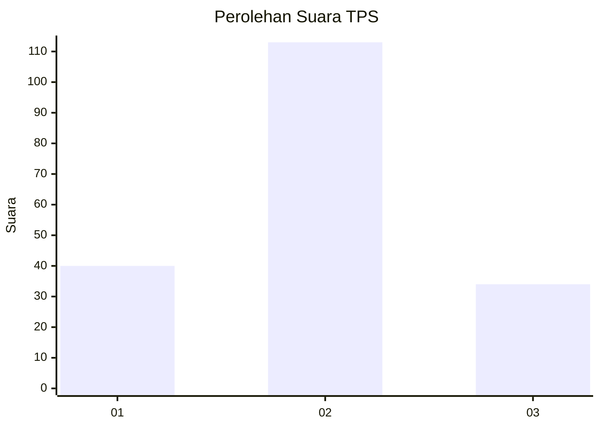
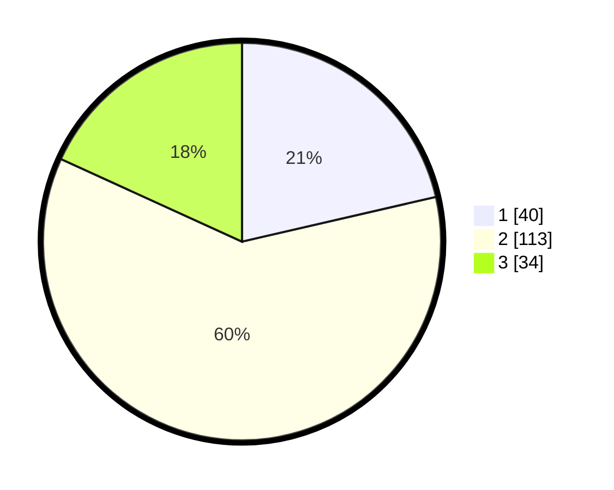

# Hasil

## Grafik

## Tabel

| No. | Nama Paslon    | Suara | Suara (raw) | Persentase |
|:--- |:-------------- | -----:| -----------:| ----------:|
| 1   | ANIES MUHAIMIN | 40    | [40][p-1]   | 21,39      |
| 2   | PRABOWO GIBRAN | 113   | [113][p-2]  | 60,43      |
| 3   | GANJAR MAHFUD  | 34    | [34][p-3]   | 18,18      |

[p-1]: https://github.com/gigit-pemilu/pemilu-2024-34-di-yogyakarta/blob/main/pilpres/hitung-suara/sub/34-di-yogyakarta/sub/04-sleman/sub/13-sleman/sub/2001-caturharjo/sub/036-tps/sub/paslon-1.txt
[p-2]: https://github.com/gigit-pemilu/pemilu-2024-34-di-yogyakarta/blob/main/pilpres/hitung-suara/sub/34-di-yogyakarta/sub/04-sleman/sub/13-sleman/sub/2001-caturharjo/sub/036-tps/sub/paslon-2.txt
[p-3]: https://github.com/gigit-pemilu/pemilu-2024-34-di-yogyakarta/blob/main/pilpres/hitung-suara/sub/34-di-yogyakarta/sub/04-sleman/sub/13-sleman/sub/2001-caturharjo/sub/036-tps/sub/paslon-3.txt

## Foto C Plano

https://sirekap-obj-formc.kpu.go.id/7dd9/pemilu/ppwp/34/04/13/20/01/3404132001036-20240216-154243--80b9e532-27e0-4e22-b57a-8f0aeb09781c.jpg

https://sirekap-obj-formc.kpu.go.id/7dd9/pemilu/ppwp/34/04/13/20/01/3404132001036-20240216-154247--52407586-3820-48a1-a99e-79f0820b3584.jpg

https://sirekap-obj-formc.kpu.go.id/7dd9/pemilu/ppwp/34/04/13/20/01/3404132001036-20240216-154251--cfac6f9c-0f4a-499a-aa55-1c4d6754e43d.jpg

## Metadata

| Key        | Value               |
| ---------- | ------------------- |
| Time Stamp | 2024-02-17 10:30:03 |

