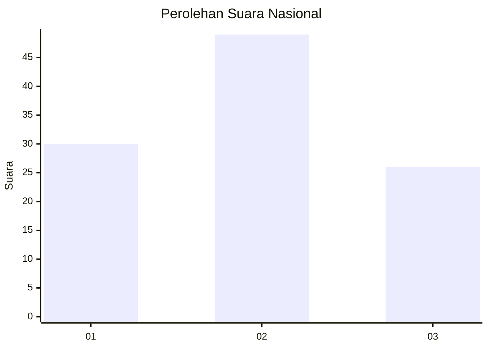
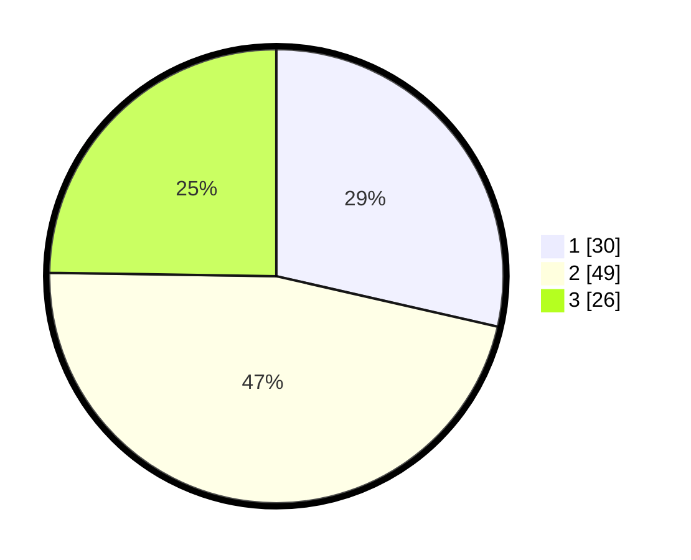

# Hasil

## Grafik

## Tabel

| No. | Nama Paslon    | Suara | Suara (raw) | Persentase |
|:--- |:-------------- | -----:| -----------:| ----------:|
| 1   | ANIES MUHAIMIN | 30    | [30][p-1]   | 28,57      |
| 2   | PRABOWO GIBRAN | 49    | [49][p-2]   | 46,67      |
| 3   | GANJAR MAHFUD  | 26    | [26][p-3]   | 24,76      |

[p-1]: https://github.com/gigit-pemilu/pemilu-2024/blob/main/pilpres/hitung-suara/sub/34-di-yogyakarta/sub/04-sleman/sub/13-sleman/sub/2002-triharjo/sub/001-tps/sub/paslon-1.txt
[p-2]: https://github.com/gigit-pemilu/pemilu-2024/blob/main/pilpres/hitung-suara/sub/34-di-yogyakarta/sub/04-sleman/sub/13-sleman/sub/2002-triharjo/sub/001-tps/sub/paslon-2.txt
[p-3]: https://github.com/gigit-pemilu/pemilu-2024/blob/main/pilpres/hitung-suara/sub/34-di-yogyakarta/sub/04-sleman/sub/13-sleman/sub/2002-triharjo/sub/001-tps/sub/paslon-3.txt

## Foto C Plano

https://sirekap-obj-formc.kpu.go.id/54f6/pemilu/ppwp/34/04/13/20/02/3404132002001-20240214-185001--17df958a-f01b-42d7-bf33-c695749dadc2.jpg

https://sirekap-obj-formc.kpu.go.id/54f6/pemilu/ppwp/34/04/13/20/02/3404132002001-20240214-185228--cda8210c-dfb6-4ab2-81cb-6db2e49e9c36.jpg

https://sirekap-obj-formc.kpu.go.id/54f6/pemilu/ppwp/34/04/13/20/02/3404132002001-20240214-185045--0d1c0800-c82c-4005-b027-aa7ee29616d1.jpg

## Metadata

| Key        | Value               |
| ---------- | ------------------- |
| Time Stamp | 2024-02-14 21:46:01 |

## DATA PEMILIH TETAP

Jumlah pemilih dalam DPT: **131**.
 * L: **66**.
 * P: **65**.

## DATA PENGGUNA HAK PILIH

Jumlah pengguna hak pilih dalam DPT: **100**.
 * L: **48**.
 * P: **52**.

Jumlah pengguna hak pilih dalam DPTb: **4**.
 * L: **2**.
 * P: **2**.

Jumlah pengguna hak pilih dalam DPK: **1**.
 * L: **0**.
 * P: **1**.

Jumlah pengguna hak pilih: **105**.
 * L: **50**.
 * P: **55**.

## JUMLAH SUARA SAH DAN TIDAK SAH

JUMLAH SELURUH SUARA SAH: **105**.

JUMLAH SUARA TIDAK SAH: **0**.

JUMLAH SELURUH SUARA SAH DAN SUARA TIDAK SAH: **105**.

