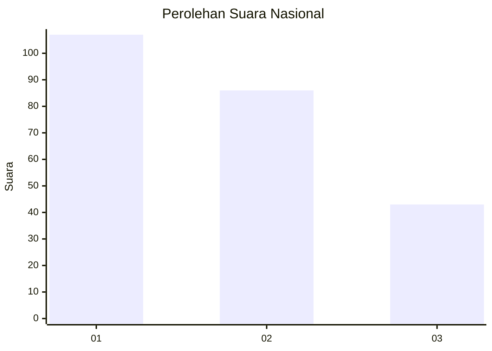
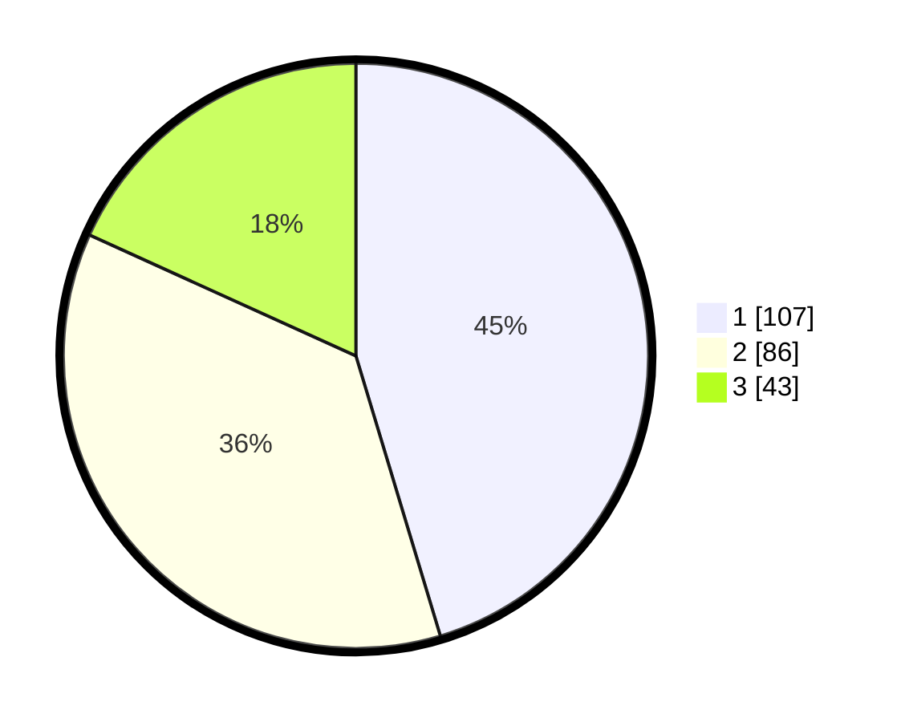

# Hasil

## Grafik

## Tabel

| No. | Nama Paslon    | Suara | Suara (raw) | Persentase |
|:--- |:-------------- | -----:| -----------:| ----------:|
| 1   | ANIES MUHAIMIN | 107   | [107][p-1]  | 45,34      |
| 2   | PRABOWO GIBRAN | 86    | [86][p-2]   | 36,44      |
| 3   | GANJAR MAHFUD  | 43    | [43][p-3]   | 18,22      |

[p-1]: https://github.com/gigit-pemilu/pemilu-2024/blob/main/pilpres/hitung-suara/sub/34-di-yogyakarta/sub/04-sleman/sub/13-sleman/sub/2002-triharjo/sub/003-tps/sub/paslon-1.txt
[p-2]: https://github.com/gigit-pemilu/pemilu-2024/blob/main/pilpres/hitung-suara/sub/34-di-yogyakarta/sub/04-sleman/sub/13-sleman/sub/2002-triharjo/sub/003-tps/sub/paslon-2.txt
[p-3]: https://github.com/gigit-pemilu/pemilu-2024/blob/main/pilpres/hitung-suara/sub/34-di-yogyakarta/sub/04-sleman/sub/13-sleman/sub/2002-triharjo/sub/003-tps/sub/paslon-3.txt

## Foto C Plano

https://sirekap-obj-formc.kpu.go.id/3543/pemilu/ppwp/34/04/13/20/02/3404132002003-20240214-162226--51efcfa0-c2ae-40a6-be13-9e2b6816f550.jpg

https://sirekap-obj-formc.kpu.go.id/3543/pemilu/ppwp/34/04/13/20/02/3404132002003-20240214-162235--ec173b0c-600c-4354-97f2-a7e830f3e993.jpg

https://sirekap-obj-formc.kpu.go.id/3543/pemilu/ppwp/34/04/13/20/02/3404132002003-20240214-185642--9cef1389-773f-4d06-9700-a9f2a810b8a6.jpg

## Metadata

| Key        | Value               |
| ---------- | ------------------- |
| Time Stamp | 2024-02-15 15:00:29 |

