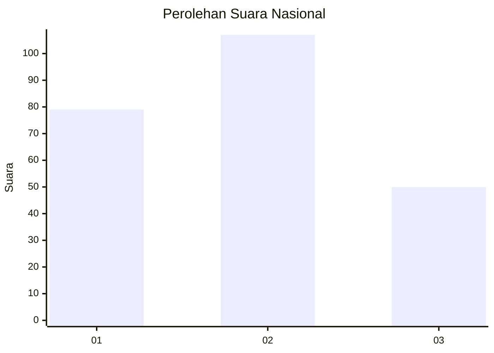
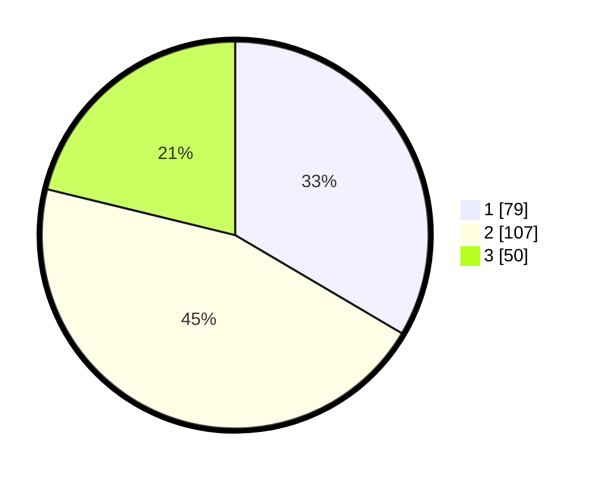

# Hasil

## Grafik

## Tabel

| No. | Nama Paslon    | Suara | Suara (raw) | Persentase |
|:--- |:-------------- | -----:| -----------:| ----------:|
| 1   | ANIES MUHAIMIN | 79    | [79][p-1]   | 33,47      |
| 2   | PRABOWO GIBRAN | 107   | [107][p-2]  | 45,34      |
| 3   | GANJAR MAHFUD  | 50    | [50][p-3]   | 21,19      |

[p-1]: https://github.com/gigit-pemilu/pemilu-2024/blob/main/pilpres/hitung-suara/sub/34-di-yogyakarta/sub/04-sleman/sub/13-sleman/sub/2002-triharjo/sub/011-tps/sub/paslon-1.txt
[p-2]: https://github.com/gigit-pemilu/pemilu-2024/blob/main/pilpres/hitung-suara/sub/34-di-yogyakarta/sub/04-sleman/sub/13-sleman/sub/2002-triharjo/sub/011-tps/sub/paslon-2.txt
[p-3]: https://github.com/gigit-pemilu/pemilu-2024/blob/main/pilpres/hitung-suara/sub/34-di-yogyakarta/sub/04-sleman/sub/13-sleman/sub/2002-triharjo/sub/011-tps/sub/paslon-3.txt

## Foto C Plano

https://sirekap-obj-formc.kpu.go.id/19d7/pemilu/ppwp/34/04/13/20/02/3404132002011-20240215-021541--c1b99ade-6b05-4f8f-8cdb-c26842eaed80.jpg

https://sirekap-obj-formc.kpu.go.id/19d7/pemilu/ppwp/34/04/13/20/02/3404132002011-20240215-021658--a9e00b37-54b5-4e88-a120-cb69220e452c.jpg

https://sirekap-obj-formc.kpu.go.id/19d7/pemilu/ppwp/34/04/13/20/02/3404132002011-20240215-021825--bbce9b98-5510-4d56-96e0-59ab733b3ca5.jpg

## Metadata

| Key        | Value               |
| ---------- | ------------------- |
| Time Stamp | 2024-02-24 22:31:28 |

