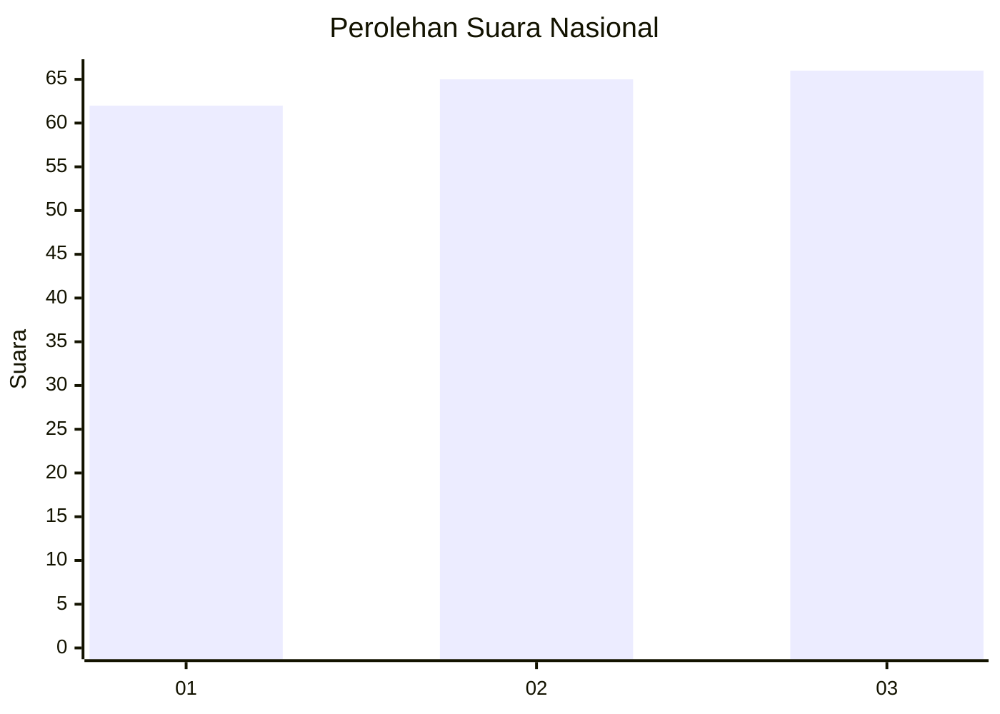
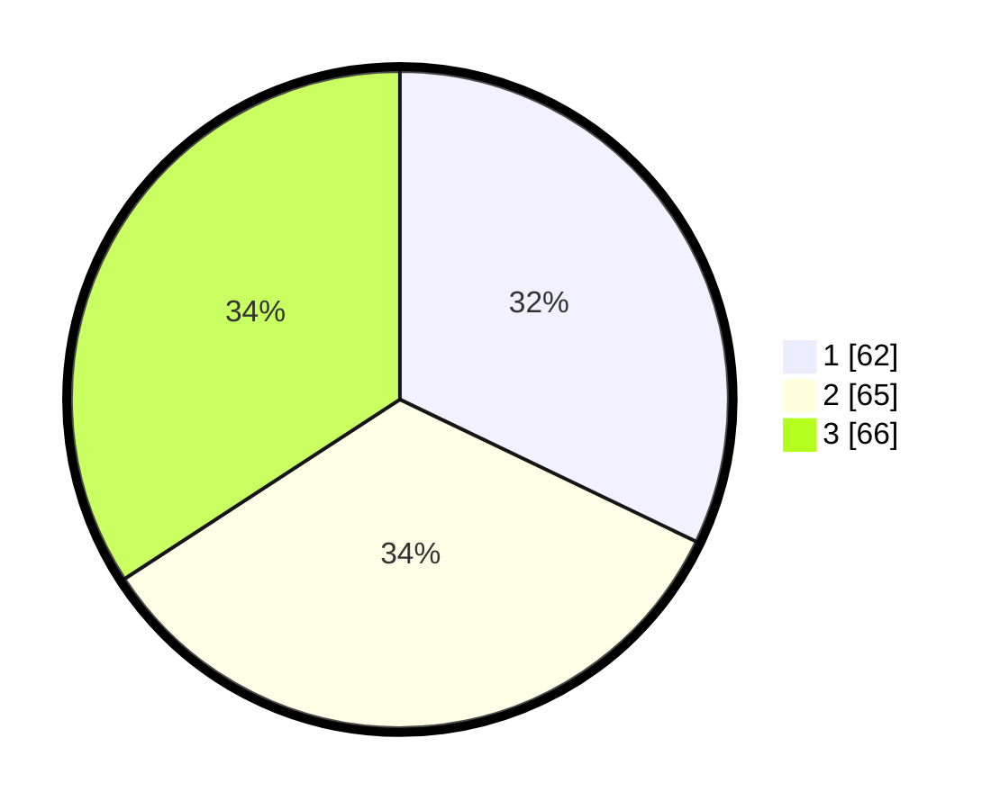

# Hasil

## Grafik

## Tabel

| No. | Nama Paslon    | Suara | Suara (raw) | Persentase |
|:--- |:-------------- | -----:| -----------:| ----------:|
| 1   | ANIES MUHAIMIN | 62    | [62][p-1]   | 32,12      |
| 2   | PRABOWO GIBRAN | 65    | [65][p-2]   | 33,68      |
| 3   | GANJAR MAHFUD  | 66    | [66][p-3]   | 34,20      |

[p-1]: https://github.com/gigit-pemilu/pemilu-2024/blob/main/pilpres/hitung-suara/sub/34-di-yogyakarta/sub/04-sleman/sub/13-sleman/sub/2002-triharjo/sub/012-tps/sub/paslon-1.txt
[p-2]: https://github.com/gigit-pemilu/pemilu-2024/blob/main/pilpres/hitung-suara/sub/34-di-yogyakarta/sub/04-sleman/sub/13-sleman/sub/2002-triharjo/sub/012-tps/sub/paslon-2.txt
[p-3]: https://github.com/gigit-pemilu/pemilu-2024/blob/main/pilpres/hitung-suara/sub/34-di-yogyakarta/sub/04-sleman/sub/13-sleman/sub/2002-triharjo/sub/012-tps/sub/paslon-3.txt

## Foto C Plano

https://sirekap-obj-formc.kpu.go.id/04eb/pemilu/ppwp/34/04/13/20/02/3404132002012-20240215-073000--3cc0bf00-a5bd-4bfa-8af4-a9e68fd9780a.jpg

https://sirekap-obj-formc.kpu.go.id/04eb/pemilu/ppwp/34/04/13/20/02/3404132002012-20240215-073034--20cc75a7-030f-451d-8388-821546f4cee2.jpg

https://sirekap-obj-formc.kpu.go.id/04eb/pemilu/ppwp/34/04/13/20/02/3404132002012-20240215-073054--5a6e5cca-86e4-4406-a852-125c031f0244.jpg

## Metadata

| Key        | Value               |
| ---------- | ------------------- |
| Time Stamp | 2024-02-24 22:31:28 |

