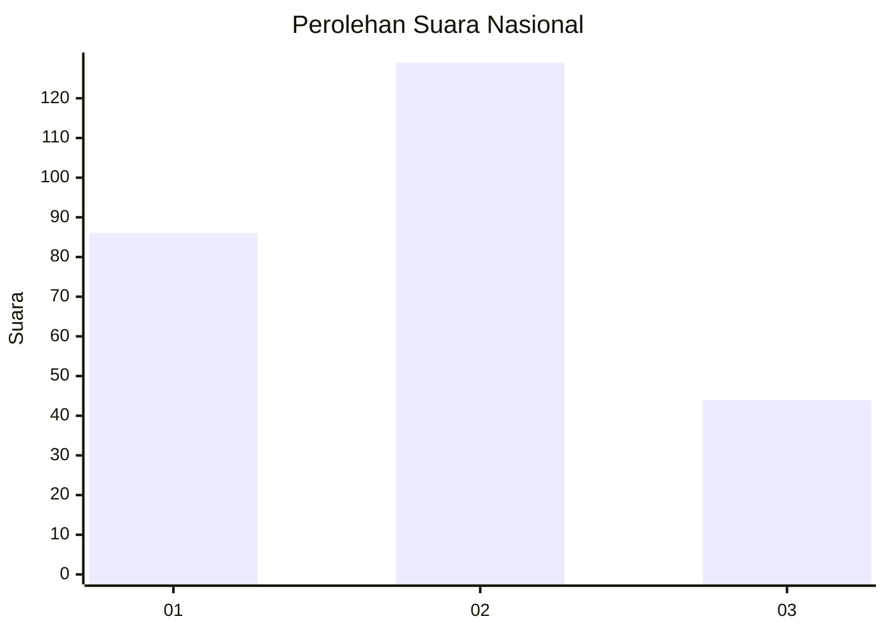
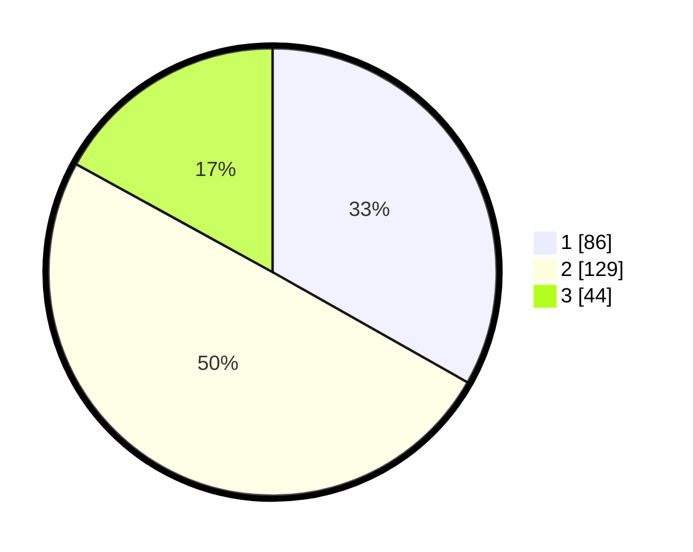

# Hasil

## Grafik

## Tabel

| No. | Nama Paslon    | Suara | Suara (raw) | Persentase |
|:--- |:-------------- | -----:| -----------:| ----------:|
| 1   | ANIES MUHAIMIN | 86    | [86][p-1]   | 33,20      |
| 2   | PRABOWO GIBRAN | 129   | [129][p-2]  | 49,81      |
| 3   | GANJAR MAHFUD  | 44    | [44][p-3]   | 16,99      |

[p-1]: https://github.com/gigit-pemilu/pemilu-2024/blob/main/pilpres/hitung-suara/sub/34-di-yogyakarta/sub/04-sleman/sub/13-sleman/sub/2002-triharjo/sub/018-tps/sub/paslon-1.txt
[p-2]: https://github.com/gigit-pemilu/pemilu-2024/blob/main/pilpres/hitung-suara/sub/34-di-yogyakarta/sub/04-sleman/sub/13-sleman/sub/2002-triharjo/sub/018-tps/sub/paslon-2.txt
[p-3]: https://github.com/gigit-pemilu/pemilu-2024/blob/main/pilpres/hitung-suara/sub/34-di-yogyakarta/sub/04-sleman/sub/13-sleman/sub/2002-triharjo/sub/018-tps/sub/paslon-3.txt

## Foto C Plano

https://sirekap-obj-formc.kpu.go.id/f7d4/pemilu/ppwp/34/04/13/20/02/3404132002018-20240214-195050--859cb2dc-c3f3-4a0e-978f-8fd98493fcfb.jpg

https://sirekap-obj-formc.kpu.go.id/f7d4/pemilu/ppwp/34/04/13/20/02/3404132002018-20240214-195211--cc46a60e-bf38-42b0-80ea-8f50cd8f5383.jpg

https://sirekap-obj-formc.kpu.go.id/f7d4/pemilu/ppwp/34/04/13/20/02/3404132002018-20240214-195329--6872bb7e-7877-4d15-9358-49515ed44452.jpg

## Metadata

| Key        | Value               |
| ---------- | ------------------- |
| Time Stamp | 2024-02-15 15:00:29 |

