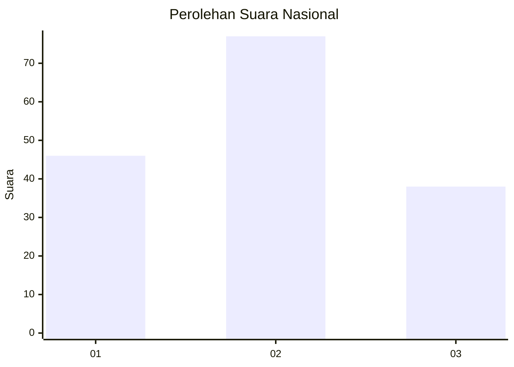
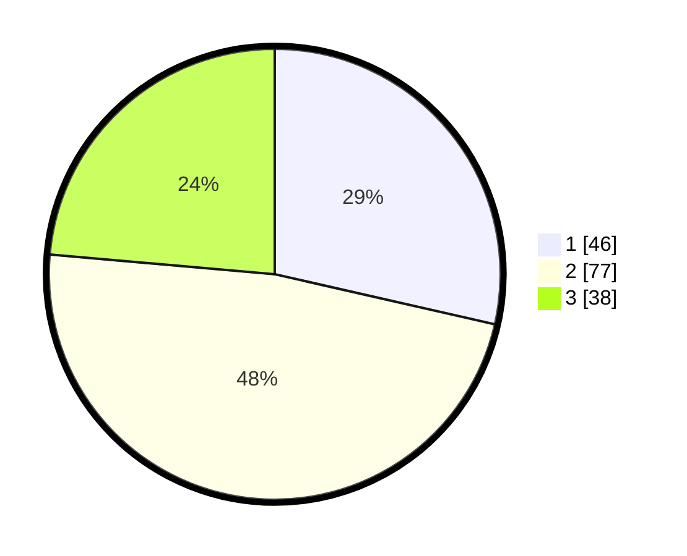

# Hasil

## Grafik

## Tabel

| No. | Nama Paslon    | Suara | Suara (raw) | Persentase |
|:--- |:-------------- | -----:| -----------:| ----------:|
| 1   | ANIES MUHAIMIN | 46    | [46][p-1]   | 28,57      |
| 2   | PRABOWO GIBRAN | 77    | [77][p-2]   | 47,83      |
| 3   | GANJAR MAHFUD  | 38    | [38][p-3]   | 23,60      |

[p-1]: https://github.com/gigit-pemilu/pemilu-2024/blob/main/pilpres/hitung-suara/sub/34-di-yogyakarta/sub/04-sleman/sub/13-sleman/sub/2002-triharjo/sub/021-tps/sub/paslon-1.txt
[p-2]: https://github.com/gigit-pemilu/pemilu-2024/blob/main/pilpres/hitung-suara/sub/34-di-yogyakarta/sub/04-sleman/sub/13-sleman/sub/2002-triharjo/sub/021-tps/sub/paslon-2.txt
[p-3]: https://github.com/gigit-pemilu/pemilu-2024/blob/main/pilpres/hitung-suara/sub/34-di-yogyakarta/sub/04-sleman/sub/13-sleman/sub/2002-triharjo/sub/021-tps/sub/paslon-3.txt

## Foto C Plano

https://sirekap-obj-formc.kpu.go.id/51de/pemilu/ppwp/34/04/13/20/02/3404132002021-20240214-141437--d63eccfa-1a8c-431d-9fed-b10a9bf24d68.jpg

https://sirekap-obj-formc.kpu.go.id/51de/pemilu/ppwp/34/04/13/20/02/3404132002021-20240214-141551--33cd7b4e-8a07-47e3-bf76-7c21ee1f7bc0.jpg

https://sirekap-obj-formc.kpu.go.id/51de/pemilu/ppwp/34/04/13/20/02/3404132002021-20240215-010906--7ba4057e-a378-432d-b442-030862c35376.jpg

## Metadata

| Key        | Value               |
| ---------- | ------------------- |
| Time Stamp | 2024-02-15 15:00:29 |

