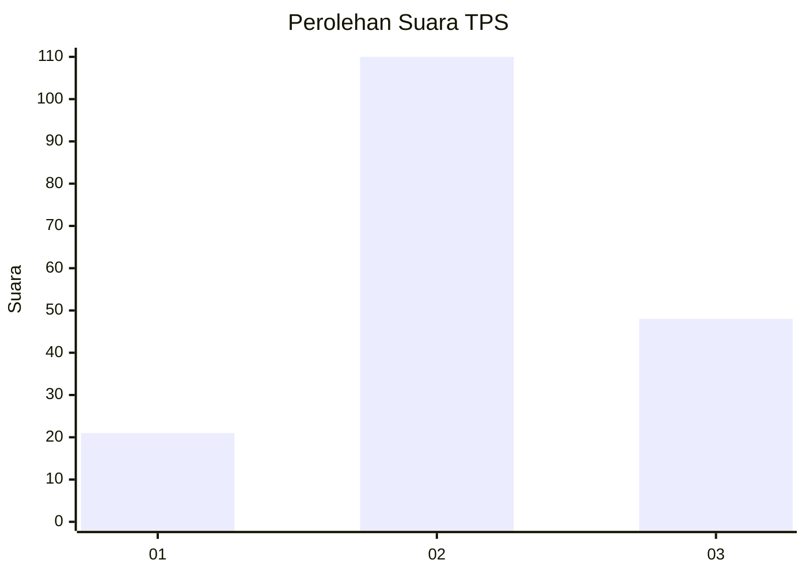
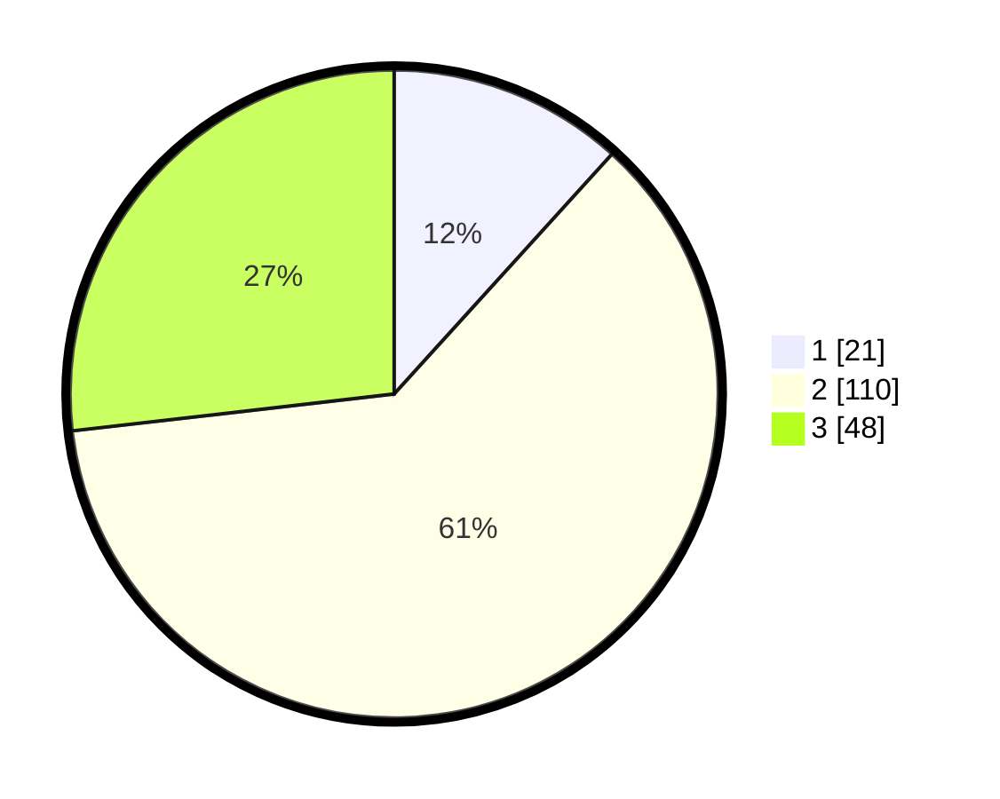

# Hasil

## Grafik

## Tabel

| No. | Nama Paslon    | Suara | Suara (raw) | Persentase |
|:--- |:-------------- | -----:| -----------:| ----------:|
| 1   | ANIES MUHAIMIN | 21    | [21][p-1]   | 11,73      |
| 2   | PRABOWO GIBRAN | 110   | [110][p-2]  | 61,45      |
| 3   | GANJAR MAHFUD  | 48    | [48][p-3]   | 26,82      |

[p-1]: https://github.com/gigit-pemilu/pemilu-2024-34-di-yogyakarta/blob/main/pilpres/hitung-suara/sub/34-di-yogyakarta/sub/04-sleman/sub/13-sleman/sub/2002-triharjo/sub/023-tps/sub/paslon-1.txt
[p-2]: https://github.com/gigit-pemilu/pemilu-2024-34-di-yogyakarta/blob/main/pilpres/hitung-suara/sub/34-di-yogyakarta/sub/04-sleman/sub/13-sleman/sub/2002-triharjo/sub/023-tps/sub/paslon-2.txt
[p-3]: https://github.com/gigit-pemilu/pemilu-2024-34-di-yogyakarta/blob/main/pilpres/hitung-suara/sub/34-di-yogyakarta/sub/04-sleman/sub/13-sleman/sub/2002-triharjo/sub/023-tps/sub/paslon-3.txt

## Foto C Plano

https://sirekap-obj-formc.kpu.go.id/5ce4/pemilu/ppwp/34/04/13/20/02/3404132002023-20240215-000527--a300ee64-c98c-4b68-bc68-286e0d3160a3.jpg

https://sirekap-obj-formc.kpu.go.id/5ce4/pemilu/ppwp/34/04/13/20/02/3404132002023-20240215-000257--dd1ccc23-fa36-48d5-95fb-e60f55fee91d.jpg

https://sirekap-obj-formc.kpu.go.id/5ce4/pemilu/ppwp/34/04/13/20/02/3404132002023-20240215-000318--4e2a8d66-46c0-419e-bf25-2ce22ed83309.jpg

## Metadata

| Key        | Value               |
| ---------- | ------------------- |
| Time Stamp | 2024-02-15 15:00:29 |

