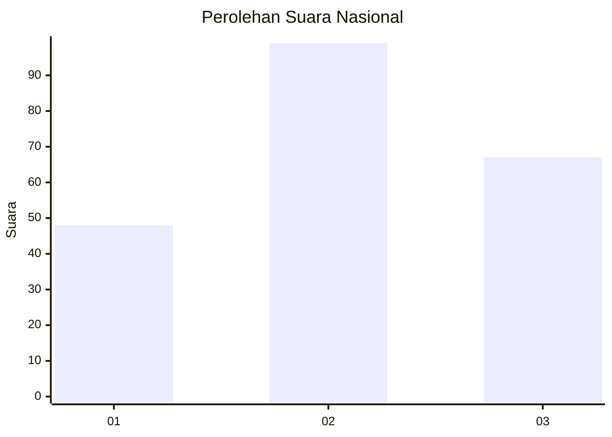
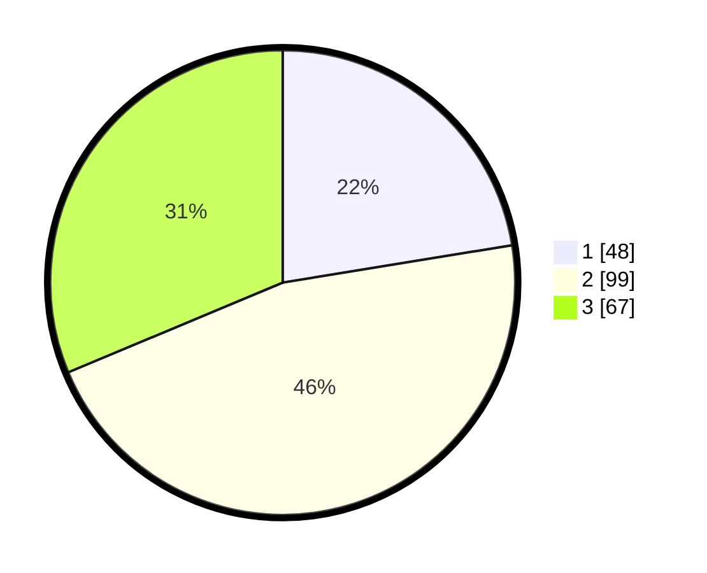

# Hasil

## Grafik

## Tabel

| No. | Nama Paslon    | Suara | Suara (raw) | Persentase |
|:--- |:-------------- | -----:| -----------:| ----------:|
| 1   | ANIES MUHAIMIN | 48    | [48][p-1]   | 22,43      |
| 2   | PRABOWO GIBRAN | 99    | [99][p-2]   | 46,26      |
| 3   | GANJAR MAHFUD  | 67    | [67][p-3]   | 31,31      |

[p-1]: https://github.com/gigit-pemilu/pemilu-2024/blob/main/pilpres/hitung-suara/sub/34-di-yogyakarta/sub/04-sleman/sub/13-sleman/sub/2002-triharjo/sub/024-tps/sub/paslon-1.txt
[p-2]: https://github.com/gigit-pemilu/pemilu-2024/blob/main/pilpres/hitung-suara/sub/34-di-yogyakarta/sub/04-sleman/sub/13-sleman/sub/2002-triharjo/sub/024-tps/sub/paslon-2.txt
[p-3]: https://github.com/gigit-pemilu/pemilu-2024/blob/main/pilpres/hitung-suara/sub/34-di-yogyakarta/sub/04-sleman/sub/13-sleman/sub/2002-triharjo/sub/024-tps/sub/paslon-3.txt

## Foto C Plano

https://sirekap-obj-formc.kpu.go.id/8fd6/pemilu/ppwp/34/04/13/20/02/3404132002024-20240215-121829--9b288544-d717-4c3b-a89f-a8711e127dd5.jpg

https://sirekap-obj-formc.kpu.go.id/8fd6/pemilu/ppwp/34/04/13/20/02/3404132002024-20240215-121914--4d0b1ab6-24a7-4061-8f9f-7b9339b3f828.jpg

https://sirekap-obj-formc.kpu.go.id/8fd6/pemilu/ppwp/34/04/13/20/02/3404132002024-20240215-122006--71f45c0b-1702-4a09-b016-50ffedfa3d2c.jpg

## Metadata

| Key        | Value               |
| ---------- | ------------------- |
| Time Stamp | 2024-02-15 17:30:25 |

