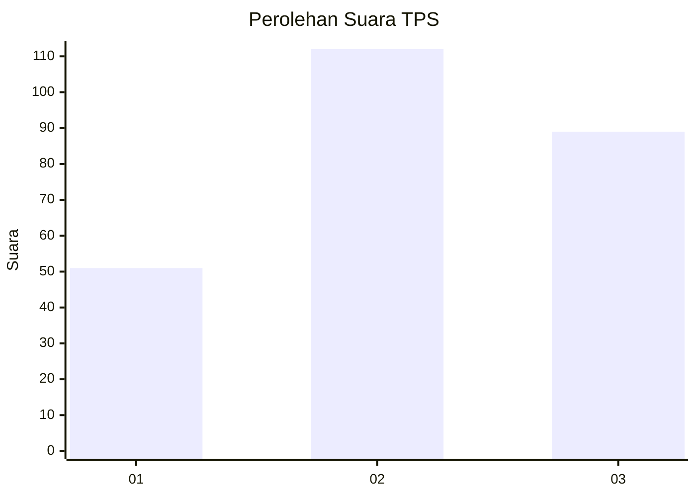
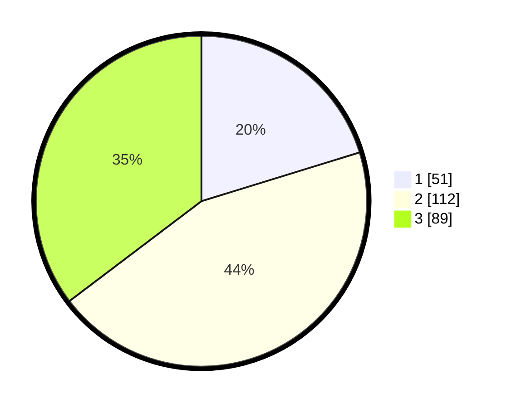

# Hasil

## Grafik

## Tabel

| No. | Nama Paslon    | Suara | Suara (raw) | Persentase |
|:--- |:-------------- | -----:| -----------:| ----------:|
| 1   | ANIES MUHAIMIN | 51    | [51][p-1]   | 20,24      |
| 2   | PRABOWO GIBRAN | 112   | [112][p-2]  | 44,44      |
| 3   | GANJAR MAHFUD  | 89    | [89][p-3]   | 35,32      |

[p-1]: https://github.com/gigit-pemilu/pemilu-2024-34-di-yogyakarta/blob/main/pilpres/hitung-suara/sub/34-di-yogyakarta/sub/04-sleman/sub/13-sleman/sub/2002-triharjo/sub/027-tps/sub/paslon-1.txt
[p-2]: https://github.com/gigit-pemilu/pemilu-2024-34-di-yogyakarta/blob/main/pilpres/hitung-suara/sub/34-di-yogyakarta/sub/04-sleman/sub/13-sleman/sub/2002-triharjo/sub/027-tps/sub/paslon-2.txt
[p-3]: https://github.com/gigit-pemilu/pemilu-2024-34-di-yogyakarta/blob/main/pilpres/hitung-suara/sub/34-di-yogyakarta/sub/04-sleman/sub/13-sleman/sub/2002-triharjo/sub/027-tps/sub/paslon-3.txt

## Foto C Plano

https://sirekap-obj-formc.kpu.go.id/7783/pemilu/ppwp/34/04/13/20/02/3404132002027-20240214-203041--179bc4b8-b5f0-4eaa-bb79-9825e7d60e07.jpg

https://sirekap-obj-formc.kpu.go.id/7783/pemilu/ppwp/34/04/13/20/02/3404132002027-20240214-203121--287e49a6-c6db-4f9e-9ec7-68d8c83079d2.jpg

https://sirekap-obj-formc.kpu.go.id/7783/pemilu/ppwp/34/04/13/20/02/3404132002027-20240214-203158--0fa75dab-023a-409d-995a-ff66b699d976.jpg

## Metadata

| Key        | Value               |
| ---------- | ------------------- |
| Time Stamp | 2024-02-15 15:00:29 |

