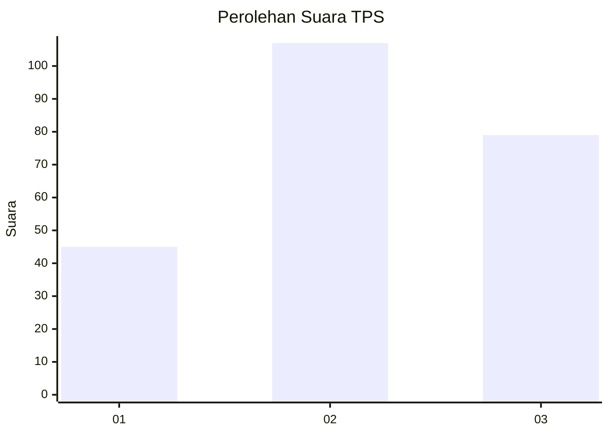
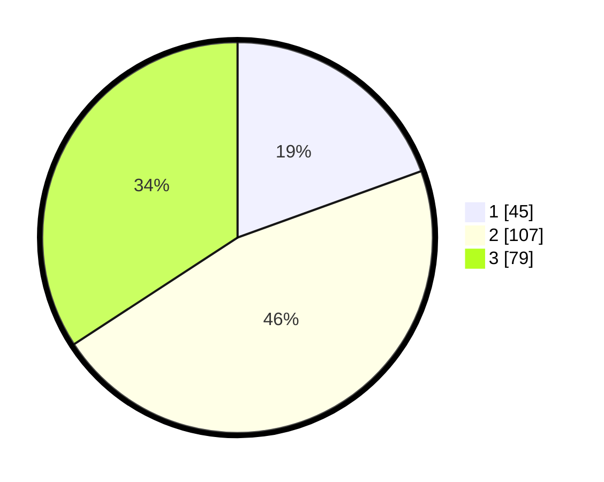

# Hasil

## Grafik

## Tabel

| No. | Nama Paslon    | Suara | Suara (raw) | Persentase |
|:--- |:-------------- | -----:| -----------:| ----------:|
| 1   | ANIES MUHAIMIN | 45    | [45][p-1]   | 19,48      |
| 2   | PRABOWO GIBRAN | 107   | [107][p-2]  | 46,32      |
| 3   | GANJAR MAHFUD  | 79    | [79][p-3]   | 34,20      |

[p-1]: https://github.com/gigit-pemilu/pemilu-2024-34-di-yogyakarta/blob/main/pilpres/hitung-suara/sub/34-di-yogyakarta/sub/04-sleman/sub/13-sleman/sub/2002-triharjo/sub/028-tps/sub/paslon-1.txt
[p-2]: https://github.com/gigit-pemilu/pemilu-2024-34-di-yogyakarta/blob/main/pilpres/hitung-suara/sub/34-di-yogyakarta/sub/04-sleman/sub/13-sleman/sub/2002-triharjo/sub/028-tps/sub/paslon-2.txt
[p-3]: https://github.com/gigit-pemilu/pemilu-2024-34-di-yogyakarta/blob/main/pilpres/hitung-suara/sub/34-di-yogyakarta/sub/04-sleman/sub/13-sleman/sub/2002-triharjo/sub/028-tps/sub/paslon-3.txt

## Foto C Plano

https://sirekap-obj-formc.kpu.go.id/809c/pemilu/ppwp/34/04/13/20/02/3404132002028-20240214-225946--9b40897d-f493-4254-a00b-49ee4a3a9157.jpg

https://sirekap-obj-formc.kpu.go.id/809c/pemilu/ppwp/34/04/13/20/02/3404132002028-20240214-230048--4c7d3d88-3b72-4b6e-a3e9-6d7a19b919b3.jpg

https://sirekap-obj-formc.kpu.go.id/809c/pemilu/ppwp/34/04/13/20/02/3404132002028-20240214-230131--50dd4f74-916d-46b3-ac49-4d28c3801613.jpg

## Metadata

| Key        | Value               |
| ---------- | ------------------- |
| Time Stamp | 2024-02-15 15:00:29 |

