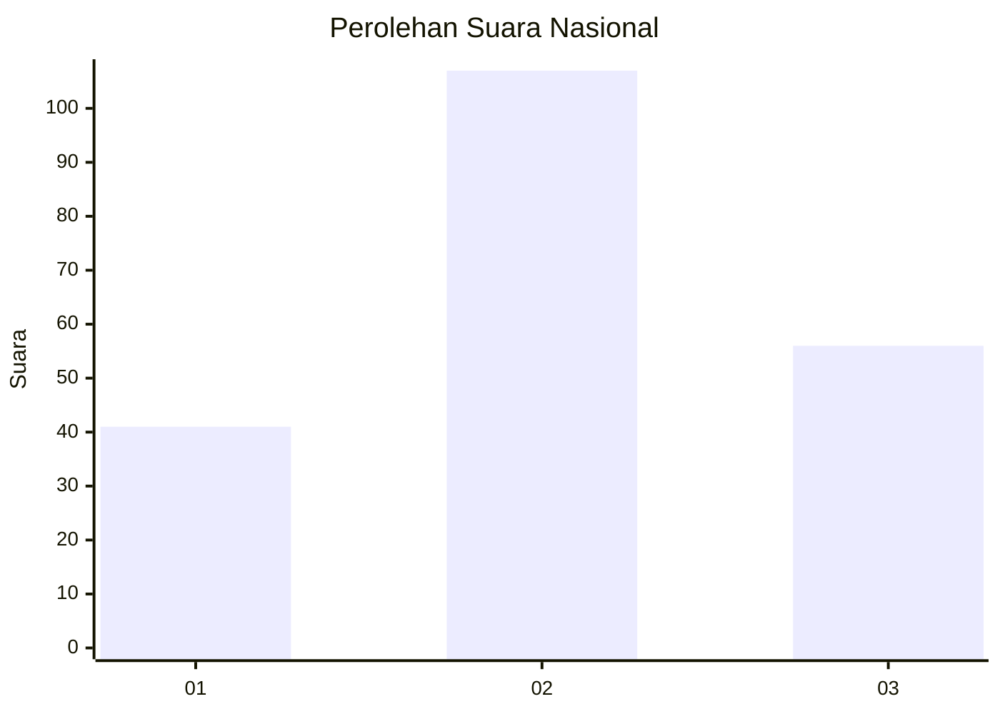
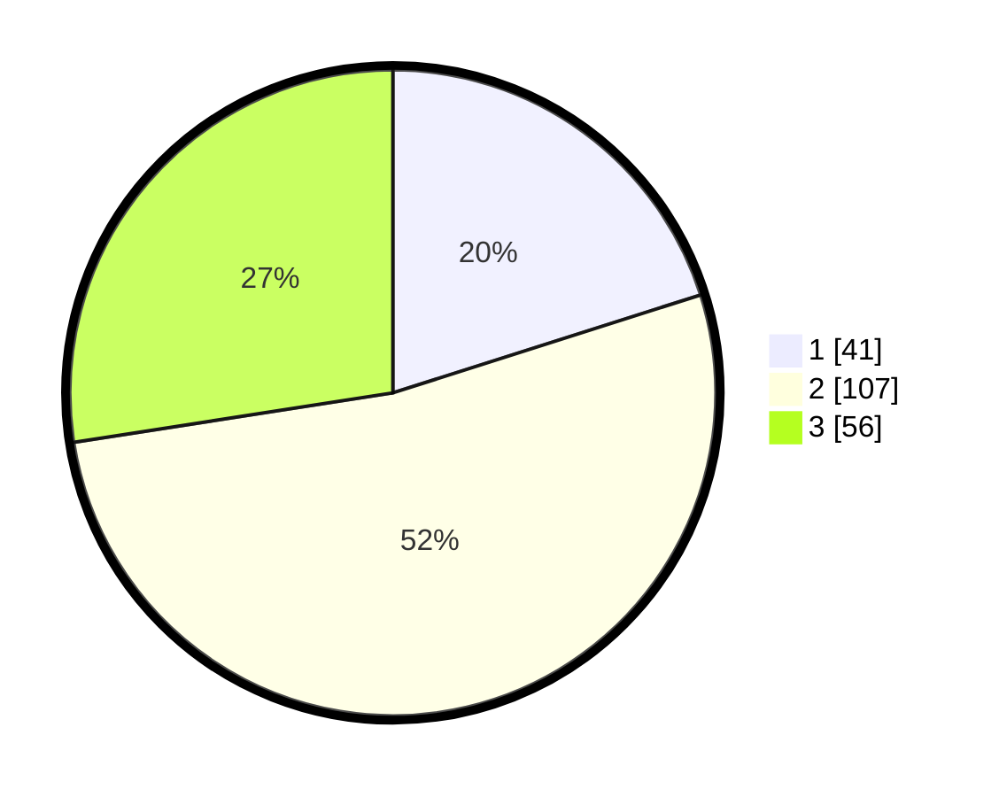

# Hasil

## Grafik

## Tabel

| No. | Nama Paslon    | Suara | Suara (raw) | Persentase |
|:--- |:-------------- | -----:| -----------:| ----------:|
| 1   | ANIES MUHAIMIN | 41    | [41][p-1]   | 20,10      |
| 2   | PRABOWO GIBRAN | 107   | [107][p-2]  | 52,45      |
| 3   | GANJAR MAHFUD  | 56    | [56][p-3]   | 27,45      |

[p-1]: https://github.com/gigit-pemilu/pemilu-2024/blob/main/pilpres/hitung-suara/sub/34-di-yogyakarta/sub/04-sleman/sub/13-sleman/sub/2002-triharjo/sub/029-tps/sub/paslon-1.txt
[p-2]: https://github.com/gigit-pemilu/pemilu-2024/blob/main/pilpres/hitung-suara/sub/34-di-yogyakarta/sub/04-sleman/sub/13-sleman/sub/2002-triharjo/sub/029-tps/sub/paslon-2.txt
[p-3]: https://github.com/gigit-pemilu/pemilu-2024/blob/main/pilpres/hitung-suara/sub/34-di-yogyakarta/sub/04-sleman/sub/13-sleman/sub/2002-triharjo/sub/029-tps/sub/paslon-3.txt

## Foto C Plano

https://sirekap-obj-formc.kpu.go.id/2398/pemilu/ppwp/34/04/13/20/02/3404132002029-20240215-020353--964ae0e3-c687-4d97-9367-ebdfcd48806f.jpg

https://sirekap-obj-formc.kpu.go.id/2398/pemilu/ppwp/34/04/13/20/02/3404132002029-20240214-190010--dc65e49b-46c4-4e98-89fa-f58d4b5d3234.jpg

https://sirekap-obj-formc.kpu.go.id/2398/pemilu/ppwp/34/04/13/20/02/3404132002029-20240214-190020--aa53c55e-f530-4a06-a2f3-09cb66369cf1.jpg

## Metadata

| Key        | Value               |
| ---------- | ------------------- |
| Time Stamp | 2024-02-15 15:00:29 |

