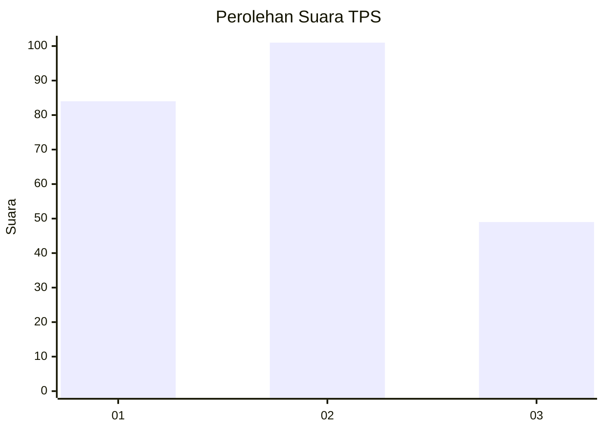
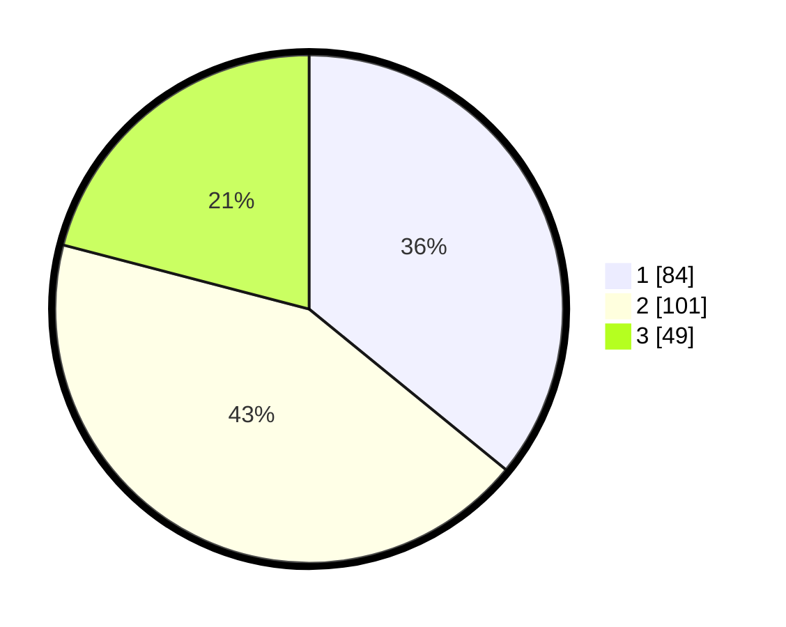

# Hasil

## Grafik

## Tabel

| No. | Nama Paslon    | Suara | Suara (raw) | Persentase |
|:--- |:-------------- | -----:| -----------:| ----------:|
| 1   | ANIES MUHAIMIN | 84    | [84][p-1]   | 35,90      |
| 2   | PRABOWO GIBRAN | 101   | [101][p-2]  | 43,16      |
| 3   | GANJAR MAHFUD  | 49    | [49][p-3]   | 20,94      |

[p-1]: https://github.com/gigit-pemilu/pemilu-2024-34-di-yogyakarta/blob/main/pilpres/hitung-suara/sub/34-di-yogyakarta/sub/04-sleman/sub/13-sleman/sub/2002-triharjo/sub/030-tps/sub/paslon-1.txt
[p-2]: https://github.com/gigit-pemilu/pemilu-2024-34-di-yogyakarta/blob/main/pilpres/hitung-suara/sub/34-di-yogyakarta/sub/04-sleman/sub/13-sleman/sub/2002-triharjo/sub/030-tps/sub/paslon-2.txt
[p-3]: https://github.com/gigit-pemilu/pemilu-2024-34-di-yogyakarta/blob/main/pilpres/hitung-suara/sub/34-di-yogyakarta/sub/04-sleman/sub/13-sleman/sub/2002-triharjo/sub/030-tps/sub/paslon-3.txt

## Foto C Plano

https://sirekap-obj-formc.kpu.go.id/6add/pemilu/ppwp/34/04/13/20/02/3404132002030-20240214-160102--b565f769-dae8-41e1-aaf8-24b01f6bde20.jpg

https://sirekap-obj-formc.kpu.go.id/6add/pemilu/ppwp/34/04/13/20/02/3404132002030-20240214-160059--a646b8a4-baf3-4e83-982b-1e3d28ba4f29.jpg

https://sirekap-obj-formc.kpu.go.id/6add/pemilu/ppwp/34/04/13/20/02/3404132002030-20240214-160143--8c40568a-1895-448a-a05b-e9d6cffc87f6.jpg

## Metadata

| Key        | Value               |
| ---------- | ------------------- |
| Time Stamp | 2024-02-15 15:00:29 |

