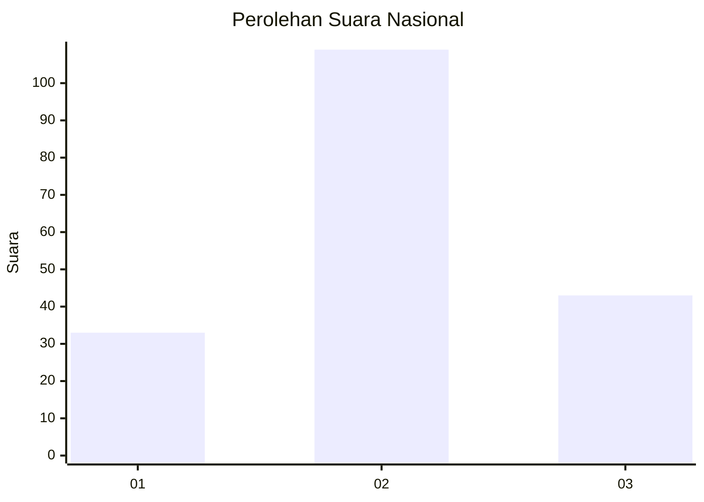
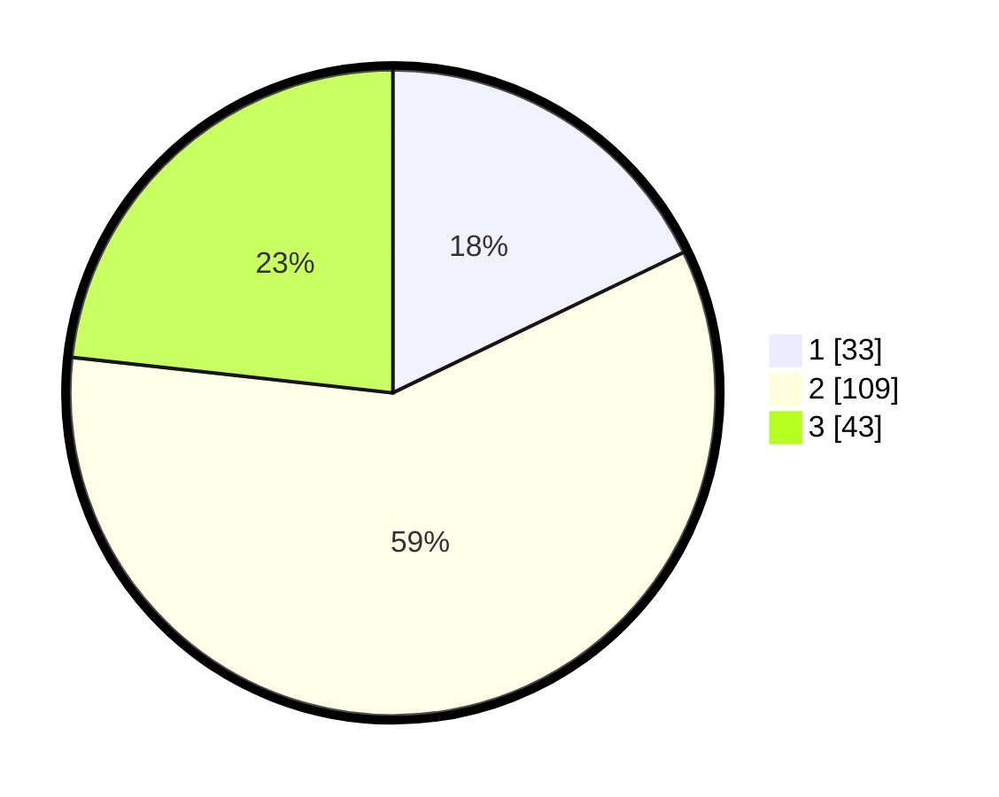

# Hasil

## Grafik

## Tabel

| No. | Nama Paslon    | Suara | Suara (raw) | Persentase |
|:--- |:-------------- | -----:| -----------:| ----------:|
| 1   | ANIES MUHAIMIN | 33    | [33][p-1]   | 17,84      |
| 2   | PRABOWO GIBRAN | 109   | [109][p-2]  | 58,92      |
| 3   | GANJAR MAHFUD  | 43    | [43][p-3]   | 23,24      |

[p-1]: https://github.com/gigit-pemilu/pemilu-2024/blob/main/pilpres/hitung-suara/sub/34-di-yogyakarta/sub/04-sleman/sub/13-sleman/sub/2002-triharjo/sub/034-tps/sub/paslon-1.txt
[p-2]: https://github.com/gigit-pemilu/pemilu-2024/blob/main/pilpres/hitung-suara/sub/34-di-yogyakarta/sub/04-sleman/sub/13-sleman/sub/2002-triharjo/sub/034-tps/sub/paslon-2.txt
[p-3]: https://github.com/gigit-pemilu/pemilu-2024/blob/main/pilpres/hitung-suara/sub/34-di-yogyakarta/sub/04-sleman/sub/13-sleman/sub/2002-triharjo/sub/034-tps/sub/paslon-3.txt

## Foto C Plano

https://sirekap-obj-formc.kpu.go.id/d842/pemilu/ppwp/34/04/13/20/02/3404132002034-20240215-010821--bb1d7cab-daa4-4b08-8ad4-ae5821ba42da.jpg

https://sirekap-obj-formc.kpu.go.id/d842/pemilu/ppwp/34/04/13/20/02/3404132002034-20240214-141031--f9b0b07d-d10d-4f15-92d4-d882fd5f6bb0.jpg

https://sirekap-obj-formc.kpu.go.id/d842/pemilu/ppwp/34/04/13/20/02/3404132002034-20240214-141111--6437524e-8e17-4b14-b11f-03f163c56f76.jpg

## Metadata

| Key        | Value               |
| ---------- | ------------------- |
| Time Stamp | 2024-02-15 15:00:29 |

