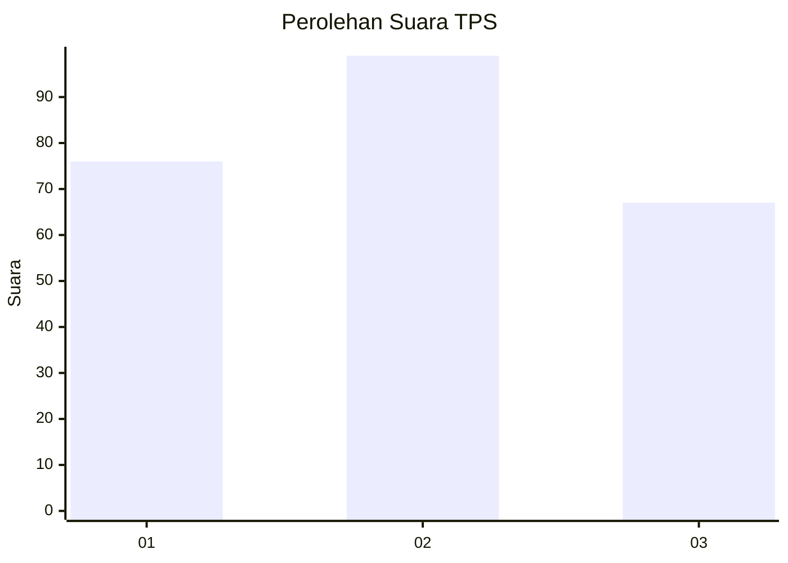
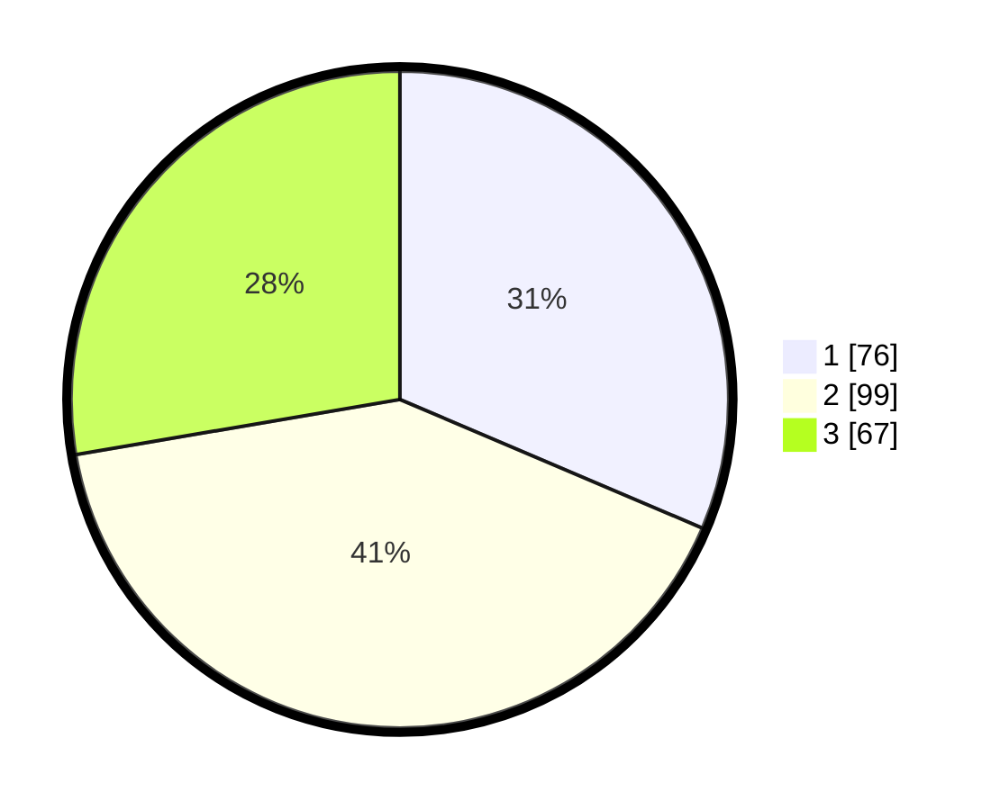

# Hasil

## Grafik

## Tabel

| No. | Nama Paslon    | Suara | Suara (raw) | Persentase |
|:--- |:-------------- | -----:| -----------:| ----------:|
| 1   | ANIES MUHAIMIN | 76    | [76][p-1]   | 31,40      |
| 2   | PRABOWO GIBRAN | 99    | [99][p-2]   | 40,91      |
| 3   | GANJAR MAHFUD  | 67    | [67][p-3]   | 27,69      |

[p-1]: https://github.com/gigit-pemilu/pemilu-2024-34-di-yogyakarta/blob/main/pilpres/hitung-suara/sub/34-di-yogyakarta/sub/04-sleman/sub/13-sleman/sub/2002-triharjo/sub/039-tps/sub/paslon-1.txt
[p-2]: https://github.com/gigit-pemilu/pemilu-2024-34-di-yogyakarta/blob/main/pilpres/hitung-suara/sub/34-di-yogyakarta/sub/04-sleman/sub/13-sleman/sub/2002-triharjo/sub/039-tps/sub/paslon-2.txt
[p-3]: https://github.com/gigit-pemilu/pemilu-2024-34-di-yogyakarta/blob/main/pilpres/hitung-suara/sub/34-di-yogyakarta/sub/04-sleman/sub/13-sleman/sub/2002-triharjo/sub/039-tps/sub/paslon-3.txt

## Foto C Plano

https://sirekap-obj-formc.kpu.go.id/2282/pemilu/ppwp/34/04/13/20/02/3404132002039-20240214-155240--594cb73c-2a81-4960-b5ca-1e2acff84514.jpg

https://sirekap-obj-formc.kpu.go.id/2282/pemilu/ppwp/34/04/13/20/02/3404132002039-20240214-155108--59a9a1e5-fe3b-4a5d-aa49-c913a256507a.jpg

https://sirekap-obj-formc.kpu.go.id/2282/pemilu/ppwp/34/04/13/20/02/3404132002039-20240214-155154--bcfa9f20-f6dc-4e42-97fa-2af77ae38fd3.jpg

## Metadata

| Key        | Value               |
| ---------- | ------------------- |
| Time Stamp | 2024-02-15 15:00:29 |

