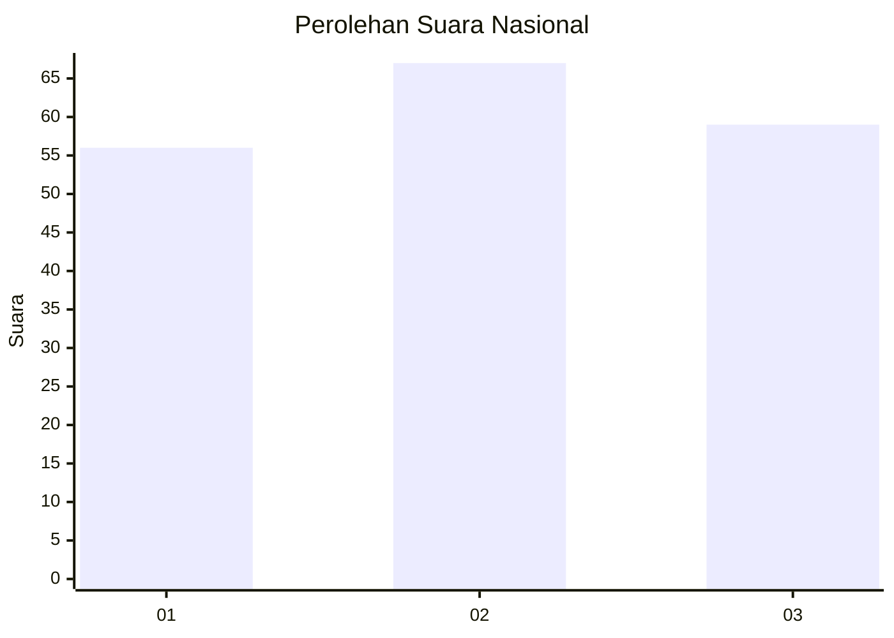
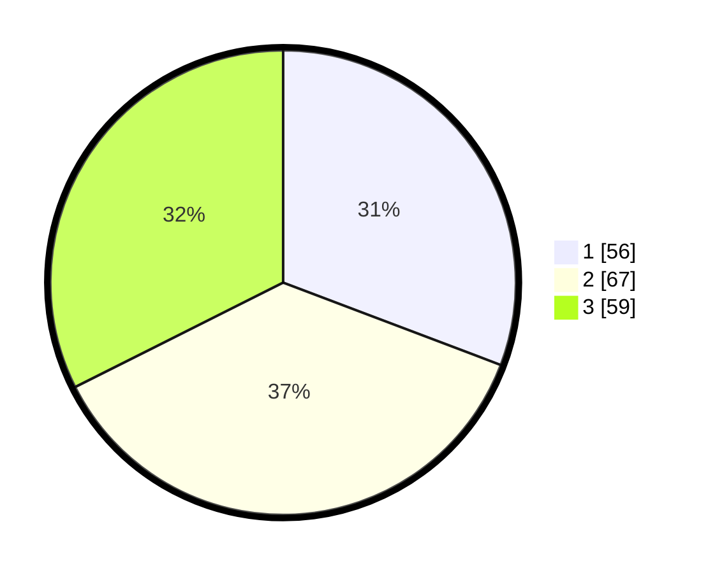

# Hasil

## Grafik

## Tabel

| No. | Nama Paslon    | Suara | Suara (raw) | Persentase |
|:--- |:-------------- | -----:| -----------:| ----------:|
| 1   | ANIES MUHAIMIN | 56    | [56][p-1]   | 30,77      |
| 2   | PRABOWO GIBRAN | 67    | [67][p-2]   | 36,81      |
| 3   | GANJAR MAHFUD  | 59    | [59][p-3]   | 32,42      |

[p-1]: https://github.com/gigit-pemilu/pemilu-2024/blob/main/pilpres/hitung-suara/sub/34-di-yogyakarta/sub/04-sleman/sub/13-sleman/sub/2002-triharjo/sub/040-tps/sub/paslon-1.txt
[p-2]: https://github.com/gigit-pemilu/pemilu-2024/blob/main/pilpres/hitung-suara/sub/34-di-yogyakarta/sub/04-sleman/sub/13-sleman/sub/2002-triharjo/sub/040-tps/sub/paslon-2.txt
[p-3]: https://github.com/gigit-pemilu/pemilu-2024/blob/main/pilpres/hitung-suara/sub/34-di-yogyakarta/sub/04-sleman/sub/13-sleman/sub/2002-triharjo/sub/040-tps/sub/paslon-3.txt

## Foto C Plano

https://sirekap-obj-formc.kpu.go.id/bb0d/pemilu/ppwp/34/04/13/20/02/3404132002040-20240215-000900--468dde6e-dc6a-479a-8d40-4c7d964de748.jpg

https://sirekap-obj-formc.kpu.go.id/bb0d/pemilu/ppwp/34/04/13/20/02/3404132002040-20240215-001042--9d99db71-eed4-4ac8-a8ad-5075045ae310.jpg

https://sirekap-obj-formc.kpu.go.id/bb0d/pemilu/ppwp/34/04/13/20/02/3404132002040-20240215-001255--421c5fdc-69f1-4af9-892b-f3764dd888d3.jpg

## Metadata

| Key        | Value               |
| ---------- | ------------------- |
| Time Stamp | 2024-02-15 19:30:26 |

