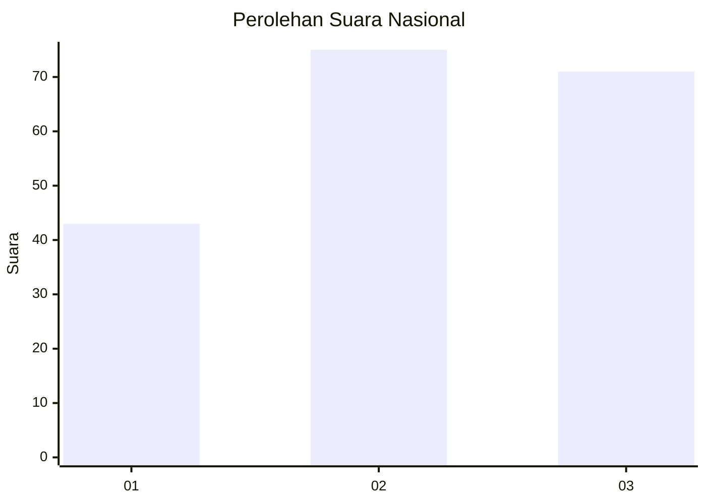
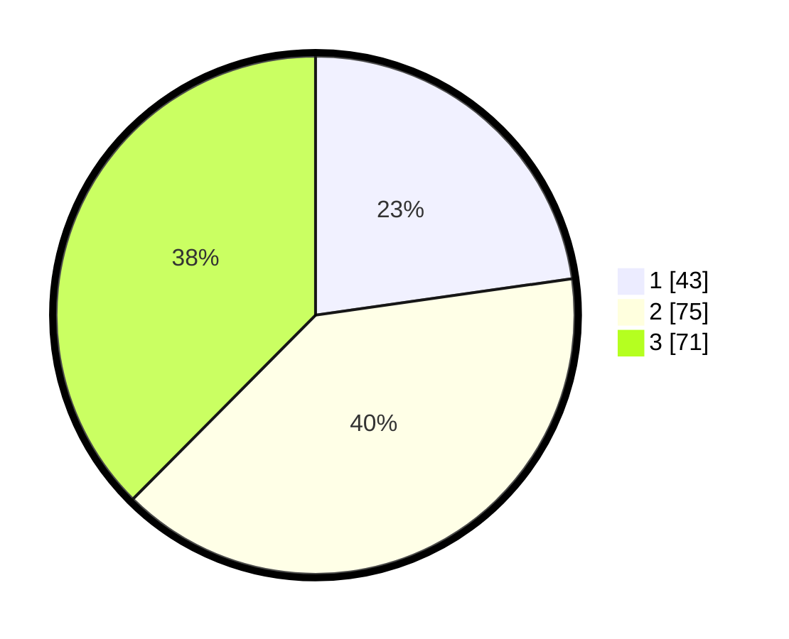

# Hasil

## Grafik

## Tabel

| No. | Nama Paslon    | Suara | Suara (raw) | Persentase |
|:--- |:-------------- | -----:| -----------:| ----------:|
| 1   | ANIES MUHAIMIN | 43    | [43][p-1]   | 22,75      |
| 2   | PRABOWO GIBRAN | 75    | [75][p-2]   | 39,68      |
| 3   | GANJAR MAHFUD  | 71    | [71][p-3]   | 37,57      |

[p-1]: https://github.com/gigit-pemilu/pemilu-2024/blob/main/pilpres/hitung-suara/sub/34-di-yogyakarta/sub/04-sleman/sub/13-sleman/sub/2002-triharjo/sub/041-tps/sub/paslon-1.txt
[p-2]: https://github.com/gigit-pemilu/pemilu-2024/blob/main/pilpres/hitung-suara/sub/34-di-yogyakarta/sub/04-sleman/sub/13-sleman/sub/2002-triharjo/sub/041-tps/sub/paslon-2.txt
[p-3]: https://github.com/gigit-pemilu/pemilu-2024/blob/main/pilpres/hitung-suara/sub/34-di-yogyakarta/sub/04-sleman/sub/13-sleman/sub/2002-triharjo/sub/041-tps/sub/paslon-3.txt

## Foto C Plano

https://sirekap-obj-formc.kpu.go.id/e546/pemilu/ppwp/34/04/13/20/02/3404132002041-20240215-011133--9904d1a0-36b3-4c44-afad-0593e510c9a4.jpg

https://sirekap-obj-formc.kpu.go.id/e546/pemilu/ppwp/34/04/13/20/02/3404132002041-20240215-011255--eb185076-d17b-4868-a3ca-b6da2c999beb.jpg

https://sirekap-obj-formc.kpu.go.id/e546/pemilu/ppwp/34/04/13/20/02/3404132002041-20240215-011408--75c7c81d-cf79-4266-b338-71429eecba9c.jpg

## Metadata

| Key        | Value               |
| ---------- | ------------------- |
| Time Stamp | 2024-02-15 15:00:29 |

