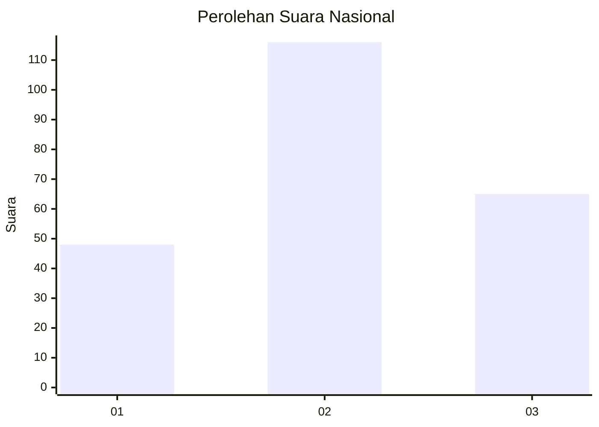
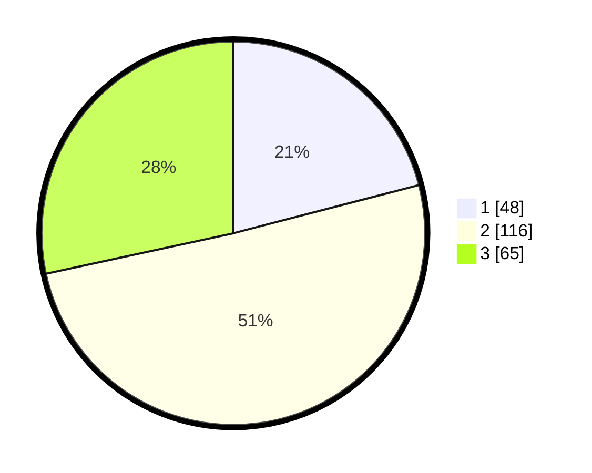

# Hasil

## Grafik

## Tabel

| No. | Nama Paslon    | Suara | Suara (raw) | Persentase |
|:--- |:-------------- | -----:| -----------:| ----------:|
| 1   | ANIES MUHAIMIN | 48    | [48][p-1]   | 20,96      |
| 2   | PRABOWO GIBRAN | 116   | [116][p-2]  | 50,66      |
| 3   | GANJAR MAHFUD  | 65    | [65][p-3]   | 28,38      |

[p-1]: https://github.com/gigit-pemilu/pemilu-2024/blob/main/pilpres/hitung-suara/sub/34-di-yogyakarta/sub/04-sleman/sub/13-sleman/sub/2002-triharjo/sub/044-tps/sub/paslon-1.txt
[p-2]: https://github.com/gigit-pemilu/pemilu-2024/blob/main/pilpres/hitung-suara/sub/34-di-yogyakarta/sub/04-sleman/sub/13-sleman/sub/2002-triharjo/sub/044-tps/sub/paslon-2.txt
[p-3]: https://github.com/gigit-pemilu/pemilu-2024/blob/main/pilpres/hitung-suara/sub/34-di-yogyakarta/sub/04-sleman/sub/13-sleman/sub/2002-triharjo/sub/044-tps/sub/paslon-3.txt

## Foto C Plano

https://sirekap-obj-formc.kpu.go.id/c391/pemilu/ppwp/34/04/13/20/02/3404132002044-20240214-141555--38b71e70-d6ec-4c28-b258-cf6adeb92b9e.jpg

https://sirekap-obj-formc.kpu.go.id/c391/pemilu/ppwp/34/04/13/20/02/3404132002044-20240214-141654--32a078d5-2727-4118-b64c-9f2831081cb9.jpg

https://sirekap-obj-formc.kpu.go.id/c391/pemilu/ppwp/34/04/13/20/02/3404132002044-20240214-141743--f7c4b458-7307-40fc-aabd-09699c418f21.jpg

## Metadata

| Key        | Value               |
| ---------- | ------------------- |
| Time Stamp | 2024-02-16 22:01:00 |

