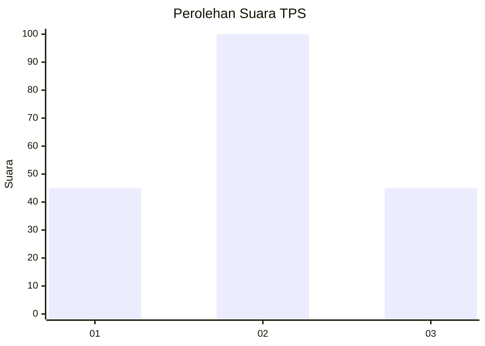
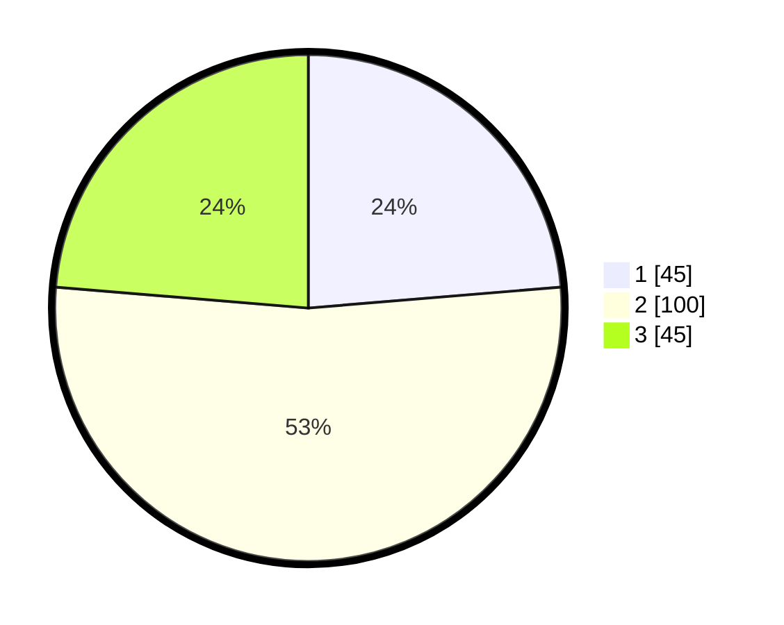

# Hasil

## Grafik

## Tabel

| No. | Nama Paslon    | Suara | Suara (raw) | Persentase |
|:--- |:-------------- | -----:| -----------:| ----------:|
| 1   | ANIES MUHAIMIN | 45    | [45][p-1]   | 23,68      |
| 2   | PRABOWO GIBRAN | 100   | [100][p-2]  | 52,63      |
| 3   | GANJAR MAHFUD  | 45    | [45][p-3]   | 23,68      |

[p-1]: https://github.com/gigit-pemilu/pemilu-2024-34-di-yogyakarta/blob/main/pilpres/hitung-suara/sub/34-di-yogyakarta/sub/04-sleman/sub/13-sleman/sub/2002-triharjo/sub/046-tps/sub/paslon-1.txt
[p-2]: https://github.com/gigit-pemilu/pemilu-2024-34-di-yogyakarta/blob/main/pilpres/hitung-suara/sub/34-di-yogyakarta/sub/04-sleman/sub/13-sleman/sub/2002-triharjo/sub/046-tps/sub/paslon-2.txt
[p-3]: https://github.com/gigit-pemilu/pemilu-2024-34-di-yogyakarta/blob/main/pilpres/hitung-suara/sub/34-di-yogyakarta/sub/04-sleman/sub/13-sleman/sub/2002-triharjo/sub/046-tps/sub/paslon-3.txt

## Foto C Plano

https://sirekap-obj-formc.kpu.go.id/f34a/pemilu/ppwp/34/04/13/20/02/3404132002046-20240215-000319--7965a9f1-ff24-4b56-be7f-5b9c6ba43235.jpg

https://sirekap-obj-formc.kpu.go.id/f34a/pemilu/ppwp/34/04/13/20/02/3404132002046-20240215-000451--32235098-a0cf-4dee-9e77-56505eeb2f79.jpg

https://sirekap-obj-formc.kpu.go.id/f34a/pemilu/ppwp/34/04/13/20/02/3404132002046-20240215-000552--32e4d052-7b0e-4cd0-8825-a88108122609.jpg

## Metadata

| Key        | Value               |
| ---------- | ------------------- |
| Time Stamp | 2024-02-24 23:00:00 |

