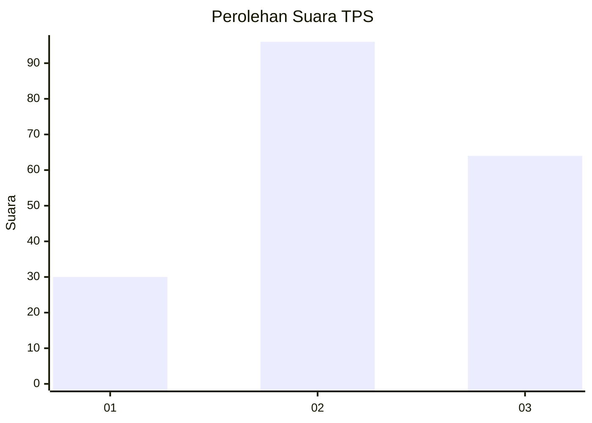
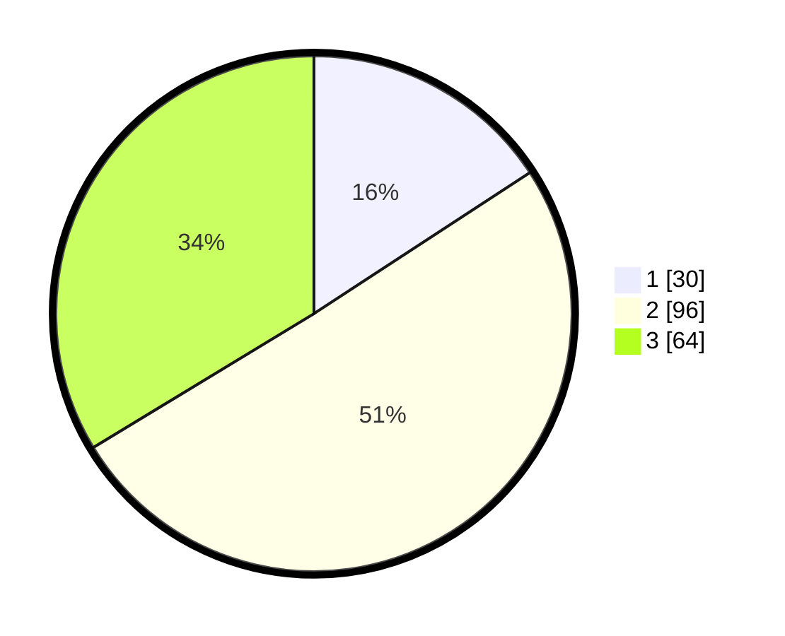

# Hasil

## Grafik

## Tabel

| No. | Nama Paslon    | Suara | Suara (raw) | Persentase |
|:--- |:-------------- | -----:| -----------:| ----------:|
| 1   | ANIES MUHAIMIN | 30    | [30][p-1]   | 15,79      |
| 2   | PRABOWO GIBRAN | 96    | [96][p-2]   | 50,53      |
| 3   | GANJAR MAHFUD  | 64    | [64][p-3]   | 33,68      |

[p-1]: https://github.com/gigit-pemilu/pemilu-2024-34-di-yogyakarta/blob/main/pilpres/hitung-suara/sub/34-di-yogyakarta/sub/04-sleman/sub/13-sleman/sub/2002-triharjo/sub/050-tps/sub/paslon-1.txt
[p-2]: https://github.com/gigit-pemilu/pemilu-2024-34-di-yogyakarta/blob/main/pilpres/hitung-suara/sub/34-di-yogyakarta/sub/04-sleman/sub/13-sleman/sub/2002-triharjo/sub/050-tps/sub/paslon-2.txt
[p-3]: https://github.com/gigit-pemilu/pemilu-2024-34-di-yogyakarta/blob/main/pilpres/hitung-suara/sub/34-di-yogyakarta/sub/04-sleman/sub/13-sleman/sub/2002-triharjo/sub/050-tps/sub/paslon-3.txt

## Foto C Plano

https://sirekap-obj-formc.kpu.go.id/2891/pemilu/ppwp/34/04/13/20/02/3404132002050-20240214-155613--ad4ff059-c3e8-4610-97aa-25ef4e2a236d.jpg

https://sirekap-obj-formc.kpu.go.id/2891/pemilu/ppwp/34/04/13/20/02/3404132002050-20240214-162232--7289244c-66ae-46d5-a8e4-63c08f45c512.jpg

https://sirekap-obj-formc.kpu.go.id/2891/pemilu/ppwp/34/04/13/20/02/3404132002050-20240214-162242--fefc68e2-214f-417d-9afc-9560c9daae93.jpg

## Metadata

| Key        | Value               |
| ---------- | ------------------- |
| Time Stamp | 2024-02-15 15:00:29 |

