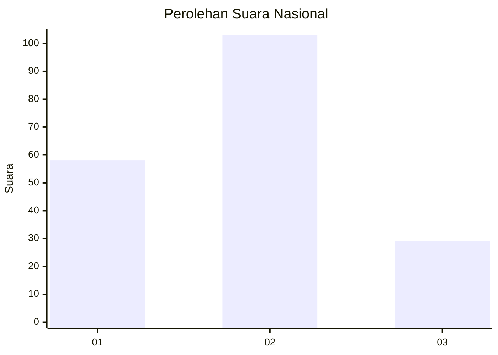
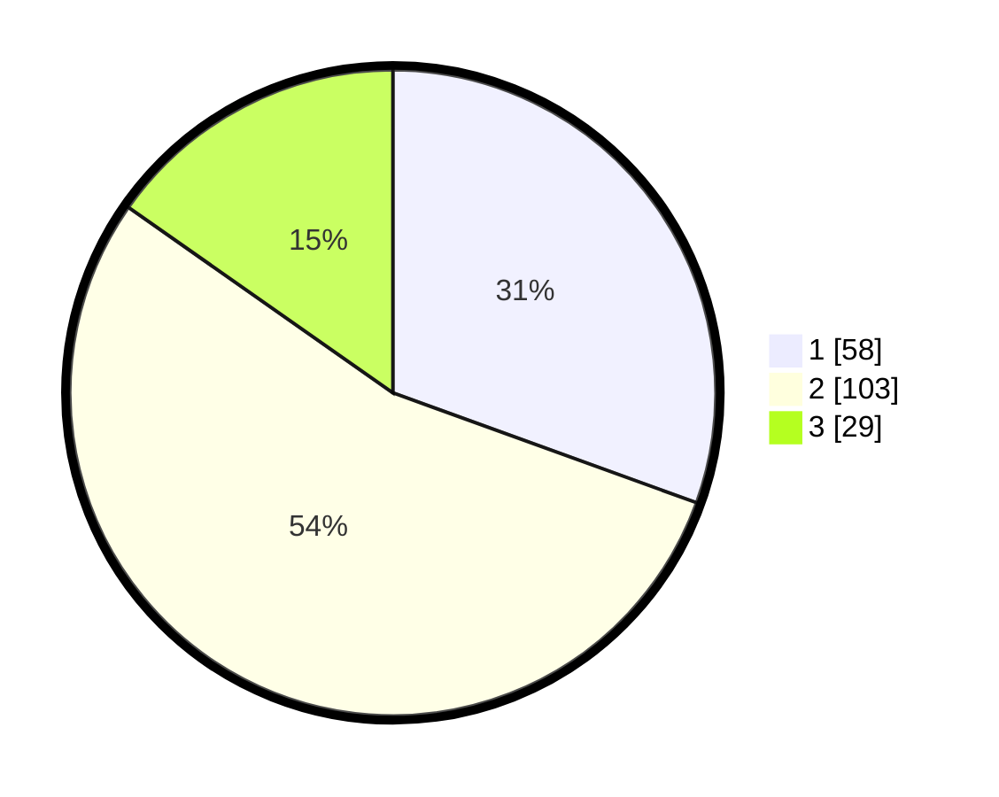

# Hasil

## Grafik

## Tabel

| No. | Nama Paslon    | Suara | Suara (raw) | Persentase |
|:--- |:-------------- | -----:| -----------:| ----------:|
| 1   | ANIES MUHAIMIN | 58    | [58][p-1]   | 30,53      |
| 2   | PRABOWO GIBRAN | 103   | [103][p-2]  | 54,21      |
| 3   | GANJAR MAHFUD  | 29    | [29][p-3]   | 15,26      |

[p-1]: https://github.com/gigit-pemilu/pemilu-2024/blob/main/pilpres/hitung-suara/sub/34-di-yogyakarta/sub/04-sleman/sub/13-sleman/sub/2002-triharjo/sub/051-tps/sub/paslon-1.txt
[p-2]: https://github.com/gigit-pemilu/pemilu-2024/blob/main/pilpres/hitung-suara/sub/34-di-yogyakarta/sub/04-sleman/sub/13-sleman/sub/2002-triharjo/sub/051-tps/sub/paslon-2.txt
[p-3]: https://github.com/gigit-pemilu/pemilu-2024/blob/main/pilpres/hitung-suara/sub/34-di-yogyakarta/sub/04-sleman/sub/13-sleman/sub/2002-triharjo/sub/051-tps/sub/paslon-3.txt

## Foto C Plano

https://sirekap-obj-formc.kpu.go.id/b1d2/pemilu/ppwp/34/04/13/20/02/3404132002051-20240216-173432--377de26d-5bcd-40a5-93dc-43571ffe1921.jpg

https://sirekap-obj-formc.kpu.go.id/b1d2/pemilu/ppwp/34/04/13/20/02/3404132002051-20240216-173553--b8acac9b-fba7-4cd8-b543-73d3c50428e3.jpg

https://sirekap-obj-formc.kpu.go.id/b1d2/pemilu/ppwp/34/04/13/20/02/3404132002051-20240214-141510--723b62e9-343a-492f-a93c-80b47ea16c82.jpg

## Metadata

| Key        | Value               |
| ---------- | ------------------- |
| Time Stamp | 2024-02-24 22:31:28 |

