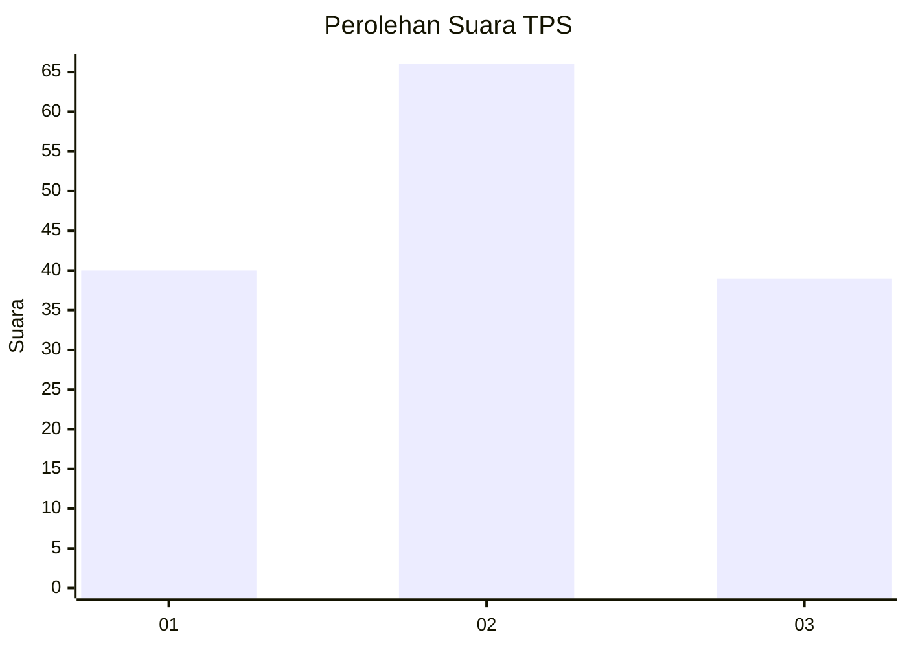
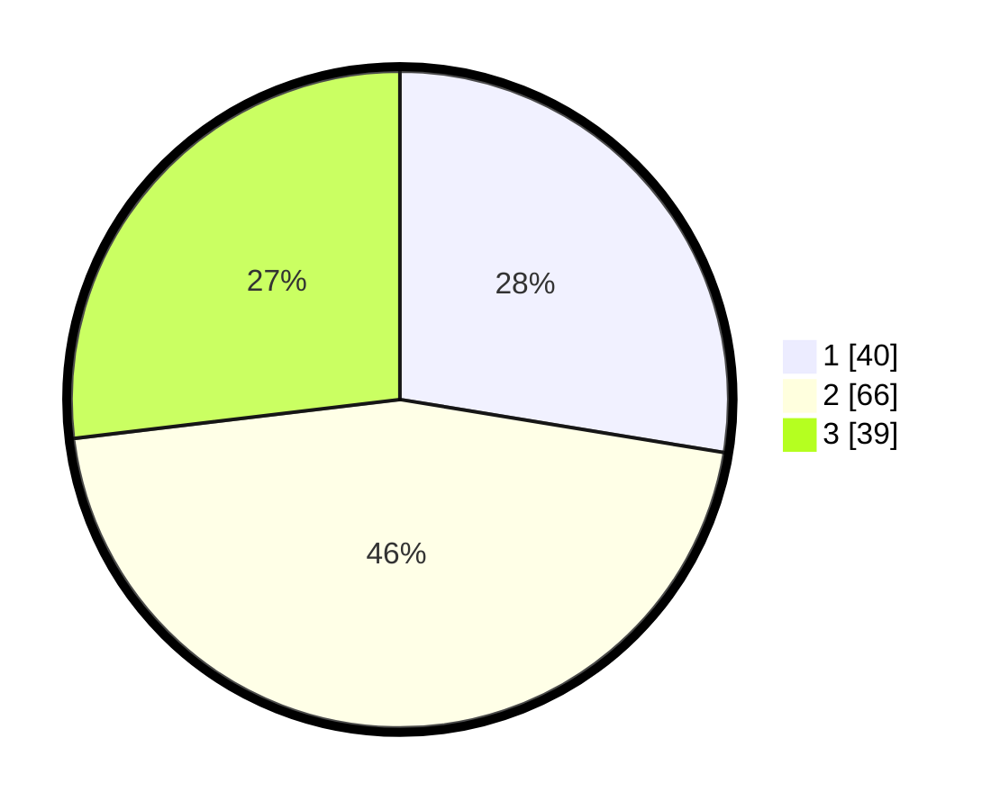

# Hasil

## Grafik

## Tabel

| No. | Nama Paslon    | Suara | Suara (raw) | Persentase |
|:--- |:-------------- | -----:| -----------:| ----------:|
| 1   | ANIES MUHAIMIN | 40    | [40][p-1]   | 27,59      |
| 2   | PRABOWO GIBRAN | 66    | [66][p-2]   | 45,52      |
| 3   | GANJAR MAHFUD  | 39    | [39][p-3]   | 26,90      |

[p-1]: https://github.com/gigit-pemilu/pemilu-2024-34-di-yogyakarta/blob/main/pilpres/hitung-suara/sub/34-di-yogyakarta/sub/04-sleman/sub/13-sleman/sub/2002-triharjo/sub/053-tps/sub/paslon-1.txt
[p-2]: https://github.com/gigit-pemilu/pemilu-2024-34-di-yogyakarta/blob/main/pilpres/hitung-suara/sub/34-di-yogyakarta/sub/04-sleman/sub/13-sleman/sub/2002-triharjo/sub/053-tps/sub/paslon-2.txt
[p-3]: https://github.com/gigit-pemilu/pemilu-2024-34-di-yogyakarta/blob/main/pilpres/hitung-suara/sub/34-di-yogyakarta/sub/04-sleman/sub/13-sleman/sub/2002-triharjo/sub/053-tps/sub/paslon-3.txt

## Foto C Plano

https://sirekap-obj-formc.kpu.go.id/4152/pemilu/ppwp/34/04/13/20/02/3404132002053-20240214-200557--98dc01f8-c504-4101-b778-571185cff9d3.jpg

https://sirekap-obj-formc.kpu.go.id/4152/pemilu/ppwp/34/04/13/20/02/3404132002053-20240214-200706--e66967d7-0a91-4a8f-9512-d89f1419ff62.jpg

https://sirekap-obj-formc.kpu.go.id/4152/pemilu/ppwp/34/04/13/20/02/3404132002053-20240214-200355--e8ece5fc-22c6-475f-a80b-88000a76c91d.jpg

## Metadata

| Key        | Value               |
| ---------- | ------------------- |
| Time Stamp | 2024-02-15 15:00:29 |

