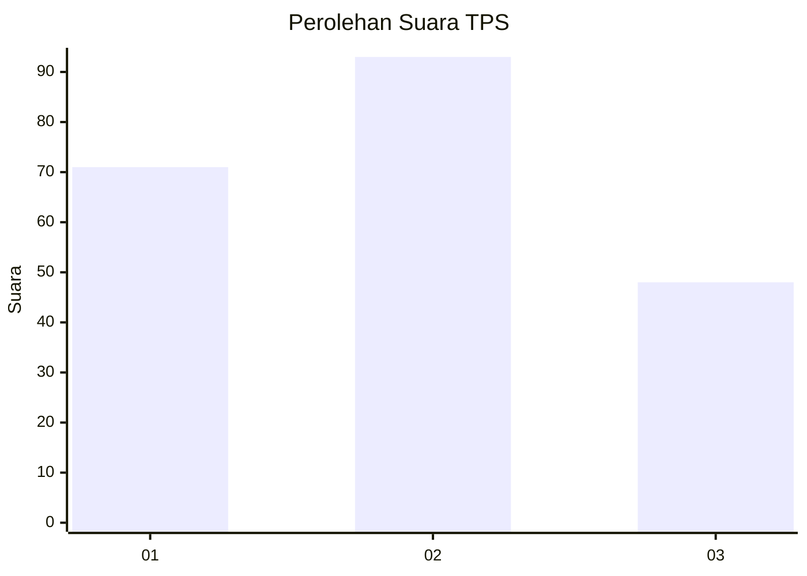
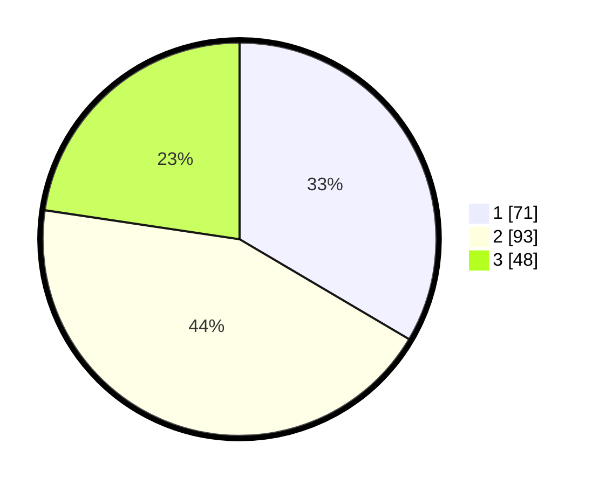

# Hasil

## Grafik

## Tabel

| No. | Nama Paslon    | Suara | Suara (raw) | Persentase |
|:--- |:-------------- | -----:| -----------:| ----------:|
| 1   | ANIES MUHAIMIN | 71    | [71][p-1]   | 33,49      |
| 2   | PRABOWO GIBRAN | 93    | [93][p-2]   | 43,87      |
| 3   | GANJAR MAHFUD  | 48    | [48][p-3]   | 22,64      |

[p-1]: https://github.com/gigit-pemilu/pemilu-2024-34-di-yogyakarta/blob/main/pilpres/hitung-suara/sub/34-di-yogyakarta/sub/04-sleman/sub/13-sleman/sub/2002-triharjo/sub/054-tps/sub/paslon-1.txt
[p-2]: https://github.com/gigit-pemilu/pemilu-2024-34-di-yogyakarta/blob/main/pilpres/hitung-suara/sub/34-di-yogyakarta/sub/04-sleman/sub/13-sleman/sub/2002-triharjo/sub/054-tps/sub/paslon-2.txt
[p-3]: https://github.com/gigit-pemilu/pemilu-2024-34-di-yogyakarta/blob/main/pilpres/hitung-suara/sub/34-di-yogyakarta/sub/04-sleman/sub/13-sleman/sub/2002-triharjo/sub/054-tps/sub/paslon-3.txt

## Foto C Plano

https://sirekap-obj-formc.kpu.go.id/ab00/pemilu/ppwp/34/04/13/20/02/3404132002054-20240214-210209--ff520dc4-eb36-4713-9d9f-25200d3740ff.jpg

https://sirekap-obj-formc.kpu.go.id/ab00/pemilu/ppwp/34/04/13/20/02/3404132002054-20240214-210309--c49845fa-3c2c-4c88-ac7d-4e1fdfa500ec.jpg

https://sirekap-obj-formc.kpu.go.id/ab00/pemilu/ppwp/34/04/13/20/02/3404132002054-20240214-210450--61d24b46-2fcd-4489-9b52-8b5f146f53ec.jpg

## Metadata

| Key        | Value               |
| ---------- | ------------------- |
| Time Stamp | 2024-02-15 21:30:27 |

