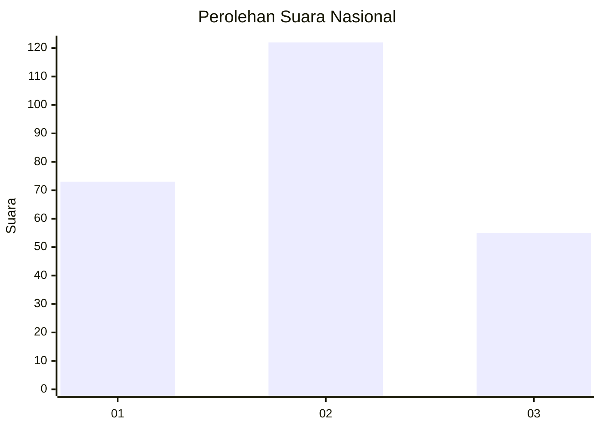
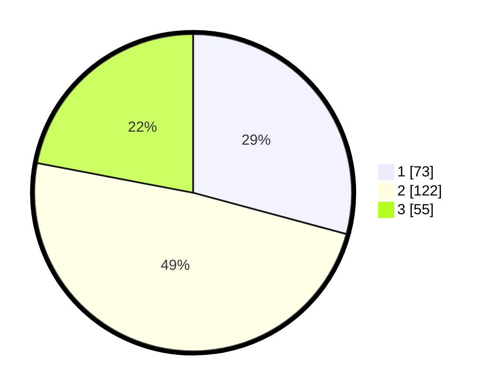

# Hasil

## Grafik

## Tabel

| No. | Nama Paslon    | Suara | Suara (raw) | Persentase |
|:--- |:-------------- | -----:| -----------:| ----------:|
| 1   | ANIES MUHAIMIN | 73    | [73][p-1]   | 29,20      |
| 2   | PRABOWO GIBRAN | 122   | [122][p-2]  | 48,80      |
| 3   | GANJAR MAHFUD  | 55    | [55][p-3]   | 22,00      |

[p-1]: https://github.com/gigit-pemilu/pemilu-2024/blob/main/pilpres/hitung-suara/sub/34-di-yogyakarta/sub/04-sleman/sub/13-sleman/sub/2002-triharjo/sub/055-tps/sub/paslon-1.txt
[p-2]: https://github.com/gigit-pemilu/pemilu-2024/blob/main/pilpres/hitung-suara/sub/34-di-yogyakarta/sub/04-sleman/sub/13-sleman/sub/2002-triharjo/sub/055-tps/sub/paslon-2.txt
[p-3]: https://github.com/gigit-pemilu/pemilu-2024/blob/main/pilpres/hitung-suara/sub/34-di-yogyakarta/sub/04-sleman/sub/13-sleman/sub/2002-triharjo/sub/055-tps/sub/paslon-3.txt

## Foto C Plano

https://sirekap-obj-formc.kpu.go.id/011a/pemilu/ppwp/34/04/13/20/02/3404132002055-20240214-184650--38e35d42-d5c3-461a-baa3-88b65403951a.jpg

https://sirekap-obj-formc.kpu.go.id/011a/pemilu/ppwp/34/04/13/20/02/3404132002055-20240214-155624--75ba4674-b9f7-4a7f-8c8a-06e1679eab2a.jpg

https://sirekap-obj-formc.kpu.go.id/011a/pemilu/ppwp/34/04/13/20/02/3404132002055-20240214-160146--93478fc5-9db5-40b8-94c1-e76a7e427348.jpg

## Metadata

| Key        | Value               |
| ---------- | ------------------- |
| Time Stamp | 2024-02-15 15:00:29 |

