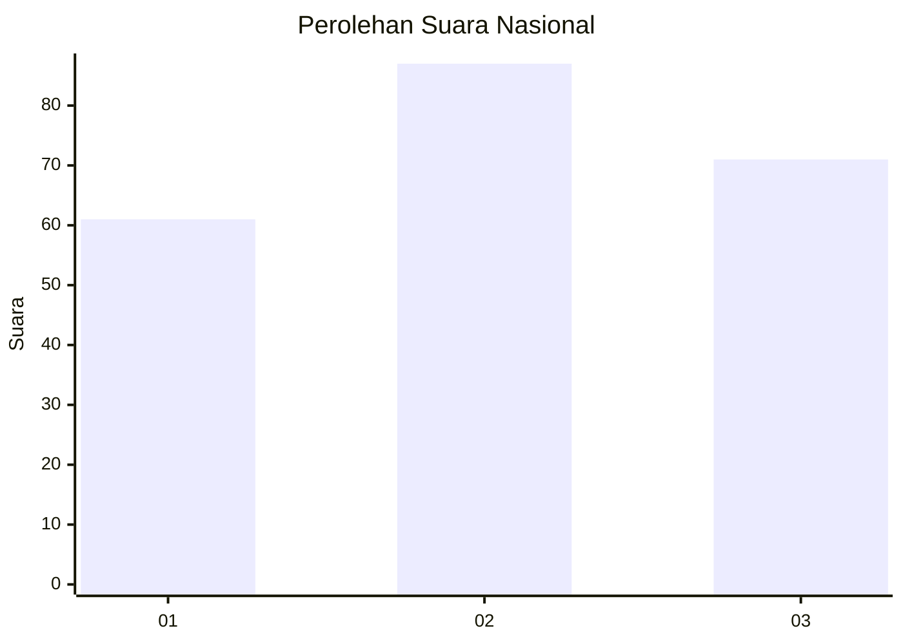
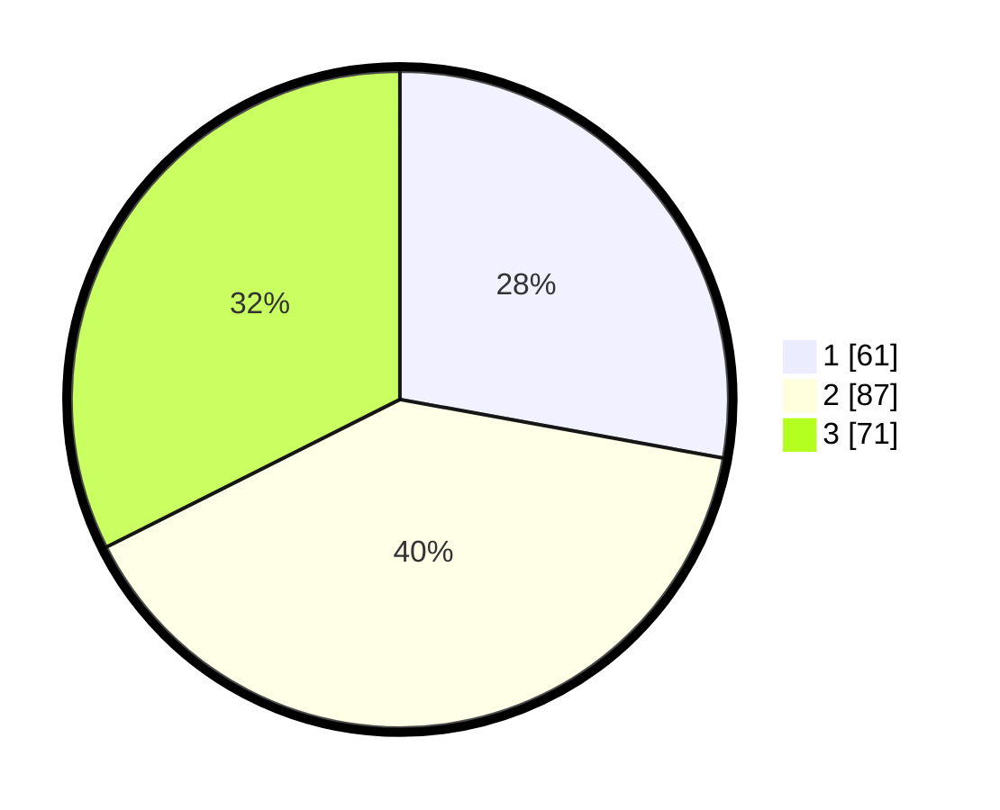

# Hasil

## Grafik

## Tabel

| No. | Nama Paslon    | Suara | Suara (raw) | Persentase |
|:--- |:-------------- | -----:| -----------:| ----------:|
| 1   | ANIES MUHAIMIN | 61    | [61][p-1]   | 27,85      |
| 2   | PRABOWO GIBRAN | 87    | [87][p-2]   | 39,73      |
| 3   | GANJAR MAHFUD  | 71    | [71][p-3]   | 32,42      |

[p-1]: https://github.com/gigit-pemilu/pemilu-2024/blob/main/pilpres/hitung-suara/sub/34-di-yogyakarta/sub/04-sleman/sub/13-sleman/sub/2002-triharjo/sub/056-tps/sub/paslon-1.txt
[p-2]: https://github.com/gigit-pemilu/pemilu-2024/blob/main/pilpres/hitung-suara/sub/34-di-yogyakarta/sub/04-sleman/sub/13-sleman/sub/2002-triharjo/sub/056-tps/sub/paslon-2.txt
[p-3]: https://github.com/gigit-pemilu/pemilu-2024/blob/main/pilpres/hitung-suara/sub/34-di-yogyakarta/sub/04-sleman/sub/13-sleman/sub/2002-triharjo/sub/056-tps/sub/paslon-3.txt

## Foto C Plano

https://sirekap-obj-formc.kpu.go.id/2806/pemilu/ppwp/34/04/13/20/02/3404132002056-20240215-101258--3784fd36-eef3-48a7-bea0-8362f51a6896.jpg

https://sirekap-obj-formc.kpu.go.id/2806/pemilu/ppwp/34/04/13/20/02/3404132002056-20240215-101305--16dda499-dba2-40b3-8a2a-89b228578075.jpg

https://sirekap-obj-formc.kpu.go.id/2806/pemilu/ppwp/34/04/13/20/02/3404132002056-20240215-101311--6d6c7b41-2f4f-48a0-8300-e01be0a8acab.jpg

## Metadata

| Key        | Value               |
| ---------- | ------------------- |
| Time Stamp | 2024-02-15 21:30:27 |

