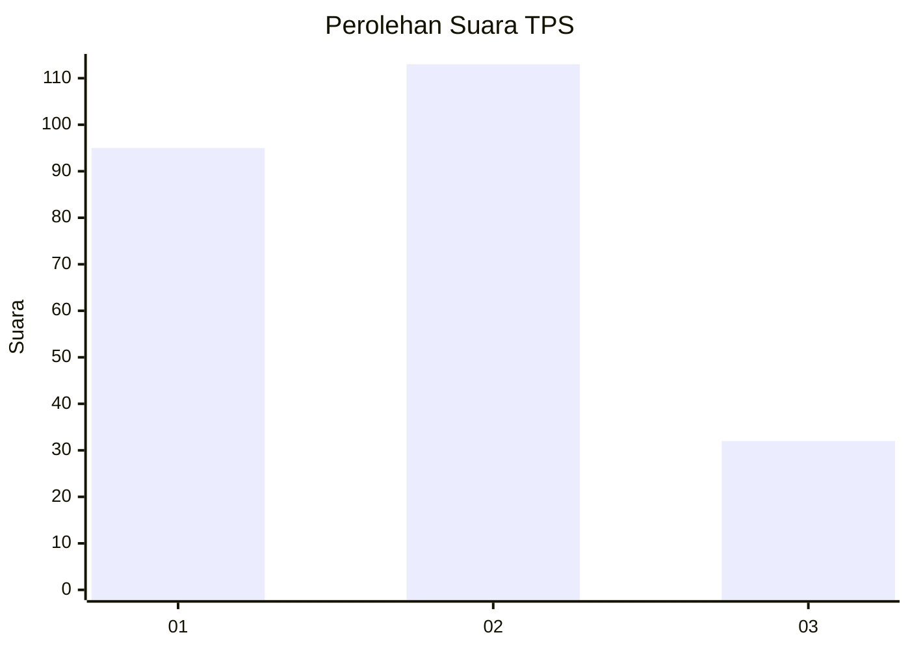
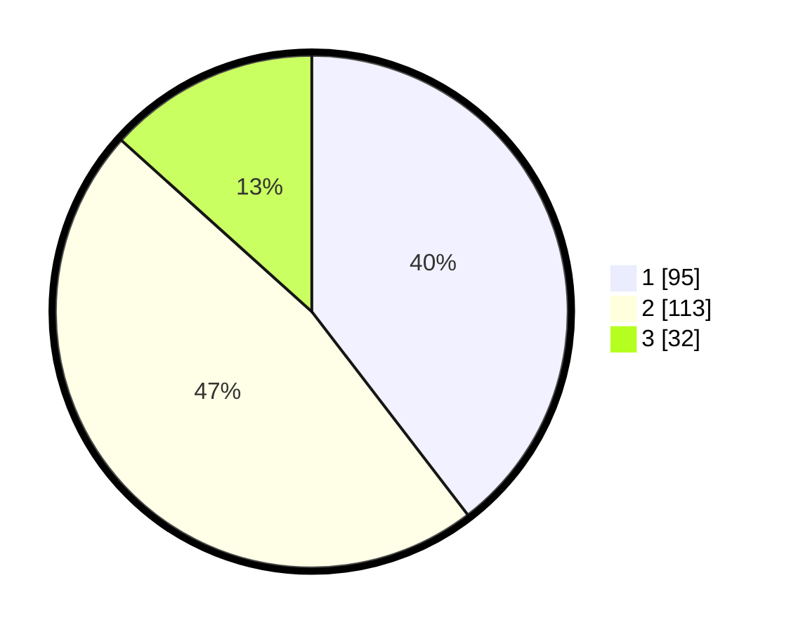

# Hasil

## Grafik

## Tabel

| No. | Nama Paslon    | Suara | Suara (raw) | Persentase |
|:--- |:-------------- | -----:| -----------:| ----------:|
| 1   | ANIES MUHAIMIN | 95    | [95][p-1]   | 39,58      |
| 2   | PRABOWO GIBRAN | 113   | [113][p-2]  | 47,08      |
| 3   | GANJAR MAHFUD  | 32    | [32][p-3]   | 13,33      |

[p-1]: https://github.com/gigit-pemilu/pemilu-2024-34-di-yogyakarta/blob/main/pilpres/hitung-suara/sub/34-di-yogyakarta/sub/04-sleman/sub/13-sleman/sub/2002-triharjo/sub/057-tps/sub/paslon-1.txt
[p-2]: https://github.com/gigit-pemilu/pemilu-2024-34-di-yogyakarta/blob/main/pilpres/hitung-suara/sub/34-di-yogyakarta/sub/04-sleman/sub/13-sleman/sub/2002-triharjo/sub/057-tps/sub/paslon-2.txt
[p-3]: https://github.com/gigit-pemilu/pemilu-2024-34-di-yogyakarta/blob/main/pilpres/hitung-suara/sub/34-di-yogyakarta/sub/04-sleman/sub/13-sleman/sub/2002-triharjo/sub/057-tps/sub/paslon-3.txt

## Foto C Plano

https://sirekap-obj-formc.kpu.go.id/c409/pemilu/ppwp/34/04/13/20/02/3404132002057-20240214-195810--d9932b21-01af-44fc-bba4-f5ff3fb4fe79.jpg

https://sirekap-obj-formc.kpu.go.id/c409/pemilu/ppwp/34/04/13/20/02/3404132002057-20240214-195030--b6845668-3587-49fe-99d3-bd59d620bf22.jpg

https://sirekap-obj-formc.kpu.go.id/c409/pemilu/ppwp/34/04/13/20/02/3404132002057-20240214-200037--71f7185e-7db1-414d-8b60-c8827d964aed.jpg

## Metadata

| Key        | Value               |
| ---------- | ------------------- |
| Time Stamp | 2024-02-25 14:00:00 |

