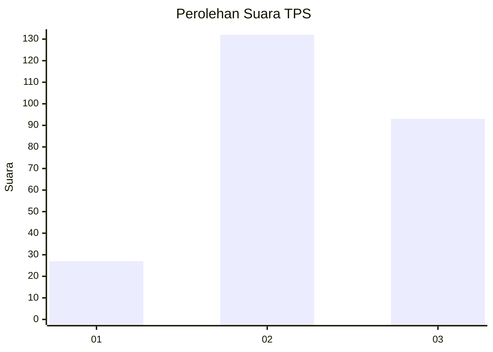
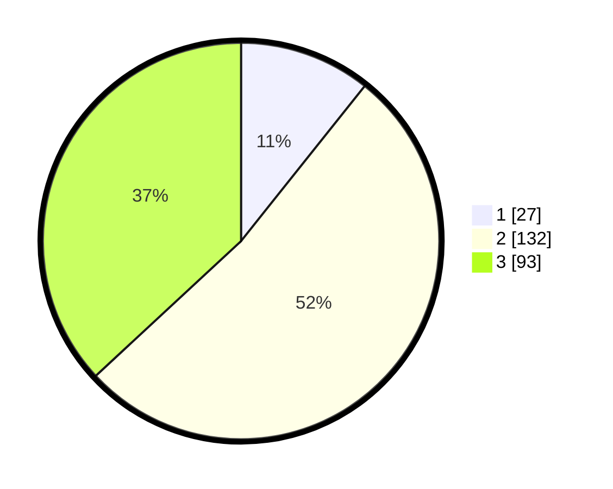

# Hasil

## Grafik

## Tabel

| No. | Nama Paslon    | Suara | Suara (raw) | Persentase |
|:--- |:-------------- | -----:| -----------:| ----------:|
| 1   | ANIES MUHAIMIN | 27    | [27][p-1]   | 10,71      |
| 2   | PRABOWO GIBRAN | 132   | [132][p-2]  | 52,38      |
| 3   | GANJAR MAHFUD  | 93    | [93][p-3]   | 36,90      |

[p-1]: https://github.com/gigit-pemilu/pemilu-2024-34-di-yogyakarta/blob/main/pilpres/hitung-suara/sub/34-di-yogyakarta/sub/04-sleman/sub/13-sleman/sub/2003-tridadi/sub/006-tps/sub/paslon-1.txt
[p-2]: https://github.com/gigit-pemilu/pemilu-2024-34-di-yogyakarta/blob/main/pilpres/hitung-suara/sub/34-di-yogyakarta/sub/04-sleman/sub/13-sleman/sub/2003-tridadi/sub/006-tps/sub/paslon-2.txt
[p-3]: https://github.com/gigit-pemilu/pemilu-2024-34-di-yogyakarta/blob/main/pilpres/hitung-suara/sub/34-di-yogyakarta/sub/04-sleman/sub/13-sleman/sub/2003-tridadi/sub/006-tps/sub/paslon-3.txt

## Foto C Plano

https://sirekap-obj-formc.kpu.go.id/c3ef/pemilu/ppwp/34/04/13/20/03/3404132003006-20240214-231851--32879f32-9257-4cec-9f97-d53170124b82.jpg

https://sirekap-obj-formc.kpu.go.id/c3ef/pemilu/ppwp/34/04/13/20/03/3404132003006-20240214-231953--09648af5-ae76-4e3b-b0f3-bee29cd555ec.jpg

https://sirekap-obj-formc.kpu.go.id/c3ef/pemilu/ppwp/34/04/13/20/03/3404132003006-20240214-231714--db5c6a68-68af-4a45-a72e-299dbfecd77d.jpg

## Metadata

| Key        | Value               |
| ---------- | ------------------- |
| Time Stamp | 2024-02-15 15:00:29 |

