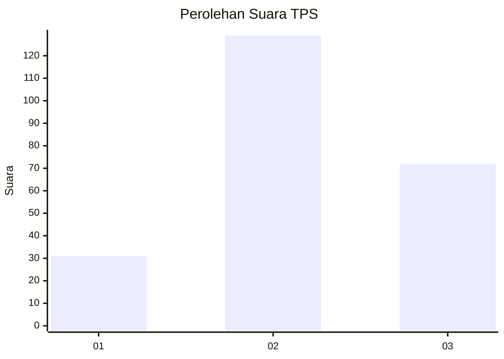
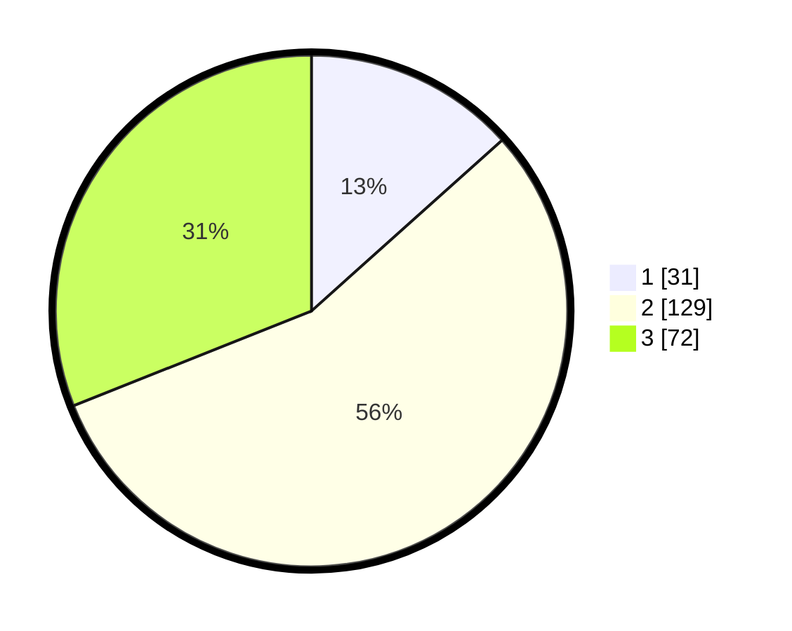

# Hasil

## Grafik

## Tabel

| No. | Nama Paslon    | Suara | Suara (raw) | Persentase |
|:--- |:-------------- | -----:| -----------:| ----------:|
| 1   | ANIES MUHAIMIN | 31    | [31][p-1]   | 13,36      |
| 2   | PRABOWO GIBRAN | 129   | [129][p-2]  | 55,60      |
| 3   | GANJAR MAHFUD  | 72    | [72][p-3]   | 31,03      |

[p-1]: https://github.com/gigit-pemilu/pemilu-2024-34-di-yogyakarta/blob/main/pilpres/hitung-suara/sub/34-di-yogyakarta/sub/04-sleman/sub/13-sleman/sub/2003-tridadi/sub/012-tps/sub/paslon-1.txt
[p-2]: https://github.com/gigit-pemilu/pemilu-2024-34-di-yogyakarta/blob/main/pilpres/hitung-suara/sub/34-di-yogyakarta/sub/04-sleman/sub/13-sleman/sub/2003-tridadi/sub/012-tps/sub/paslon-2.txt
[p-3]: https://github.com/gigit-pemilu/pemilu-2024-34-di-yogyakarta/blob/main/pilpres/hitung-suara/sub/34-di-yogyakarta/sub/04-sleman/sub/13-sleman/sub/2003-tridadi/sub/012-tps/sub/paslon-3.txt

## Foto C Plano

https://sirekap-obj-formc.kpu.go.id/957d/pemilu/ppwp/34/04/13/20/03/3404132003012-20240214-155320--ac89d321-c67a-40cc-81d2-5d1780c8d205.jpg

https://sirekap-obj-formc.kpu.go.id/957d/pemilu/ppwp/34/04/13/20/03/3404132003012-20240214-155447--470adfcb-9de1-4cb9-8fdd-7ed198ee0de5.jpg

https://sirekap-obj-formc.kpu.go.id/957d/pemilu/ppwp/34/04/13/20/03/3404132003012-20240214-155612--3edeea38-7923-4eca-b16f-942e41ee8089.jpg

## Metadata

| Key        | Value               |
| ---------- | ------------------- |
| Time Stamp | 2024-02-15 15:00:29 |

