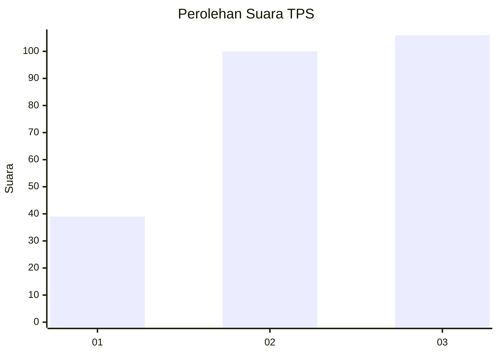
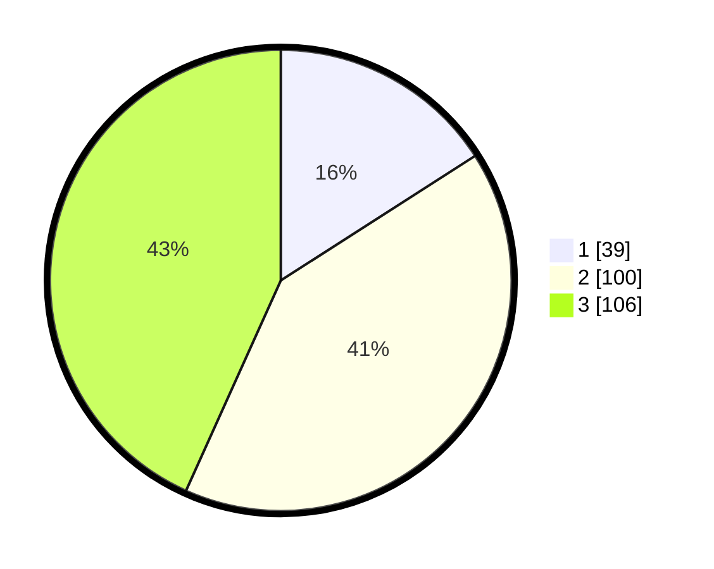

# Hasil

## Grafik

## Tabel

| No. | Nama Paslon    | Suara | Suara (raw) | Persentase |
|:--- |:-------------- | -----:| -----------:| ----------:|
| 1   | ANIES MUHAIMIN | 39    | [39][p-1]   | 15,92      |
| 2   | PRABOWO GIBRAN | 100   | [100][p-2]  | 40,82      |
| 3   | GANJAR MAHFUD  | 106   | [106][p-3]  | 43,27      |

[p-1]: https://github.com/gigit-pemilu/pemilu-2024-34-di-yogyakarta/blob/main/pilpres/hitung-suara/sub/34-di-yogyakarta/sub/04-sleman/sub/13-sleman/sub/2003-tridadi/sub/018-tps/sub/paslon-1.txt
[p-2]: https://github.com/gigit-pemilu/pemilu-2024-34-di-yogyakarta/blob/main/pilpres/hitung-suara/sub/34-di-yogyakarta/sub/04-sleman/sub/13-sleman/sub/2003-tridadi/sub/018-tps/sub/paslon-2.txt
[p-3]: https://github.com/gigit-pemilu/pemilu-2024-34-di-yogyakarta/blob/main/pilpres/hitung-suara/sub/34-di-yogyakarta/sub/04-sleman/sub/13-sleman/sub/2003-tridadi/sub/018-tps/sub/paslon-3.txt

## Foto C Plano

https://sirekap-obj-formc.kpu.go.id/0034/pemilu/ppwp/34/04/13/20/03/3404132003018-20240214-224550--32bb8a4c-a451-4910-8d2c-00ce8f01085c.jpg

https://sirekap-obj-formc.kpu.go.id/0034/pemilu/ppwp/34/04/13/20/03/3404132003018-20240214-224827--5a6ba38c-3a30-4575-bc4d-4b1e34e9922f.jpg

https://sirekap-obj-formc.kpu.go.id/0034/pemilu/ppwp/34/04/13/20/03/3404132003018-20240214-224941--f4dfb180-943e-4925-9799-719ad1c0ac22.jpg

## Metadata

| Key        | Value               |
| ---------- | ------------------- |
| Time Stamp | 2024-02-25 11:00:00 |

