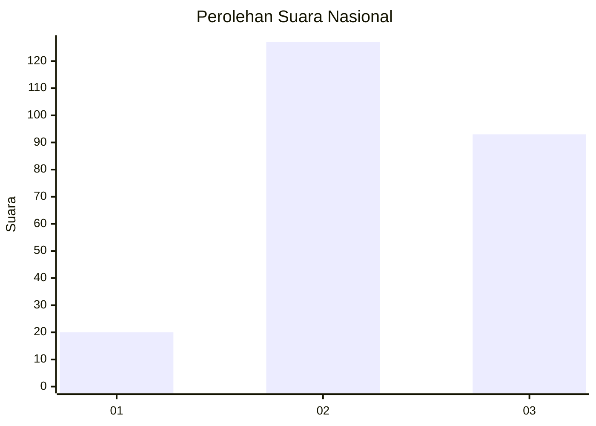
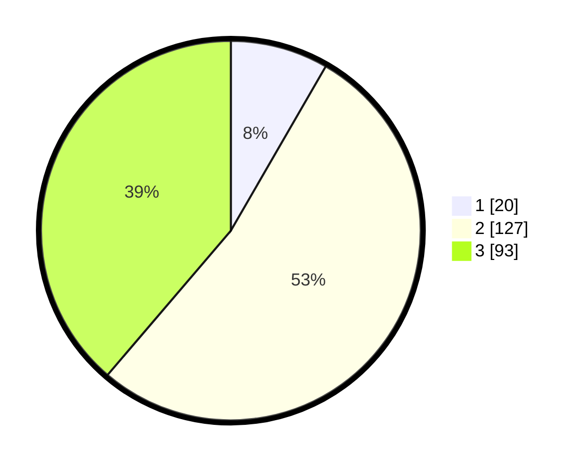

# Hasil

## Grafik

## Tabel

| No. | Nama Paslon    | Suara | Suara (raw) | Persentase |
|:--- |:-------------- | -----:| -----------:| ----------:|
| 1   | ANIES MUHAIMIN | 20    | [20][p-1]   | 8,33       |
| 2   | PRABOWO GIBRAN | 127   | [127][p-2]  | 52,92      |
| 3   | GANJAR MAHFUD  | 93    | [93][p-3]   | 38,75      |

[p-1]: https://github.com/gigit-pemilu/pemilu-2024/blob/main/pilpres/hitung-suara/sub/34-di-yogyakarta/sub/04-sleman/sub/13-sleman/sub/2003-tridadi/sub/029-tps/sub/paslon-1.txt
[p-2]: https://github.com/gigit-pemilu/pemilu-2024/blob/main/pilpres/hitung-suara/sub/34-di-yogyakarta/sub/04-sleman/sub/13-sleman/sub/2003-tridadi/sub/029-tps/sub/paslon-2.txt
[p-3]: https://github.com/gigit-pemilu/pemilu-2024/blob/main/pilpres/hitung-suara/sub/34-di-yogyakarta/sub/04-sleman/sub/13-sleman/sub/2003-tridadi/sub/029-tps/sub/paslon-3.txt

## Foto C Plano

https://sirekap-obj-formc.kpu.go.id/7f2f/pemilu/ppwp/34/04/13/20/03/3404132003029-20240214-235612--70309f20-55b4-4b00-8e6b-5f3b4c569f4f.jpg

https://sirekap-obj-formc.kpu.go.id/7f2f/pemilu/ppwp/34/04/13/20/03/3404132003029-20240214-235633--95567ce0-dc92-4f84-979a-32bbe0008543.jpg

https://sirekap-obj-formc.kpu.go.id/7f2f/pemilu/ppwp/34/04/13/20/03/3404132003029-20240214-235723--a6974ec4-d371-4694-8cca-325c01368142.jpg

## Metadata

| Key        | Value               |
| ---------- | ------------------- |
| Time Stamp | 2024-02-15 15:00:29 |

