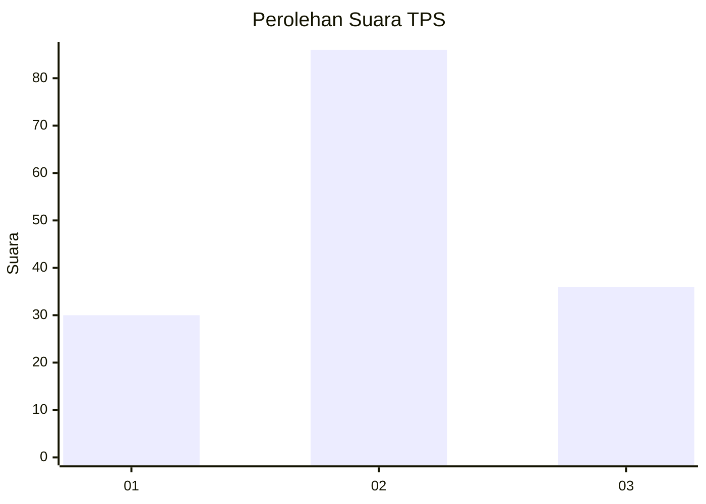
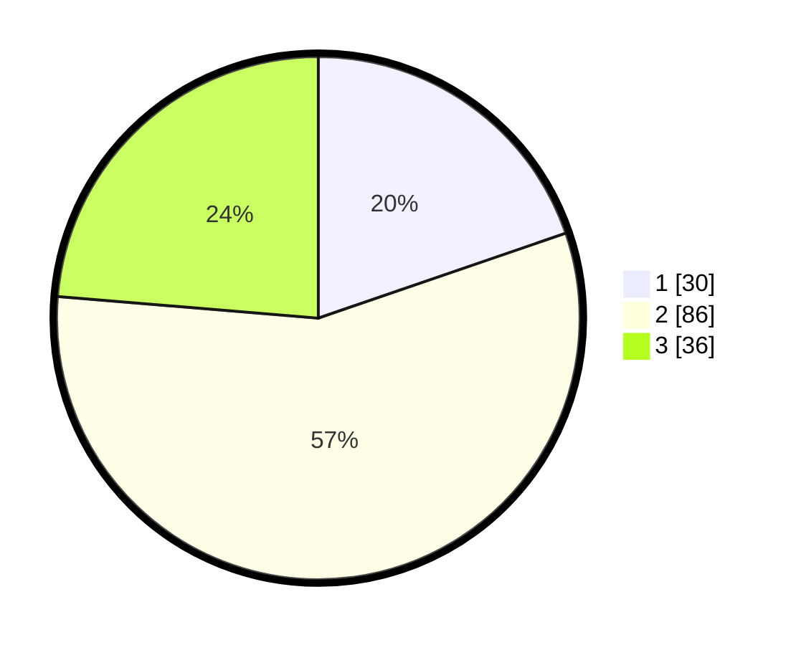

# Hasil

## Grafik

## Tabel

| No. | Nama Paslon    | Suara | Suara (raw) | Persentase |
|:--- |:-------------- | -----:| -----------:| ----------:|
| 1   | ANIES MUHAIMIN | 30    | [30][p-1]   | 19,74      |
| 2   | PRABOWO GIBRAN | 86    | [86][p-2]   | 56,58      |
| 3   | GANJAR MAHFUD  | 36    | [36][p-3]   | 23,68      |

[p-1]: https://github.com/gigit-pemilu/pemilu-2024-34-di-yogyakarta/blob/main/pilpres/hitung-suara/sub/34-di-yogyakarta/sub/04-sleman/sub/13-sleman/sub/2003-tridadi/sub/032-tps/sub/paslon-1.txt
[p-2]: https://github.com/gigit-pemilu/pemilu-2024-34-di-yogyakarta/blob/main/pilpres/hitung-suara/sub/34-di-yogyakarta/sub/04-sleman/sub/13-sleman/sub/2003-tridadi/sub/032-tps/sub/paslon-2.txt
[p-3]: https://github.com/gigit-pemilu/pemilu-2024-34-di-yogyakarta/blob/main/pilpres/hitung-suara/sub/34-di-yogyakarta/sub/04-sleman/sub/13-sleman/sub/2003-tridadi/sub/032-tps/sub/paslon-3.txt

## Foto C Plano

https://sirekap-obj-formc.kpu.go.id/07d7/pemilu/ppwp/34/04/13/20/03/3404132003032-20240214-194047--5fe07ece-0def-41bb-9f90-d0ed3af373c3.jpg

https://sirekap-obj-formc.kpu.go.id/07d7/pemilu/ppwp/34/04/13/20/03/3404132003032-20240214-194726--517d0545-a1b1-4d41-9bd7-25c8fcc2c021.jpg

https://sirekap-obj-formc.kpu.go.id/07d7/pemilu/ppwp/34/04/13/20/03/3404132003032-20240214-194854--e2c87e84-ab40-4003-907b-3f15ca60efd5.jpg

## Metadata

| Key        | Value               |
| ---------- | ------------------- |
| Time Stamp | 2024-02-15 15:00:29 |

