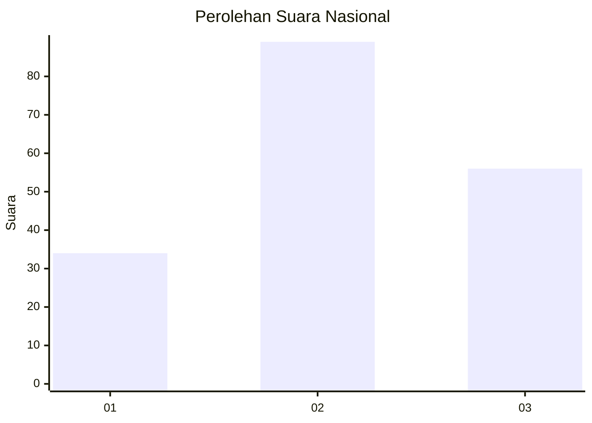
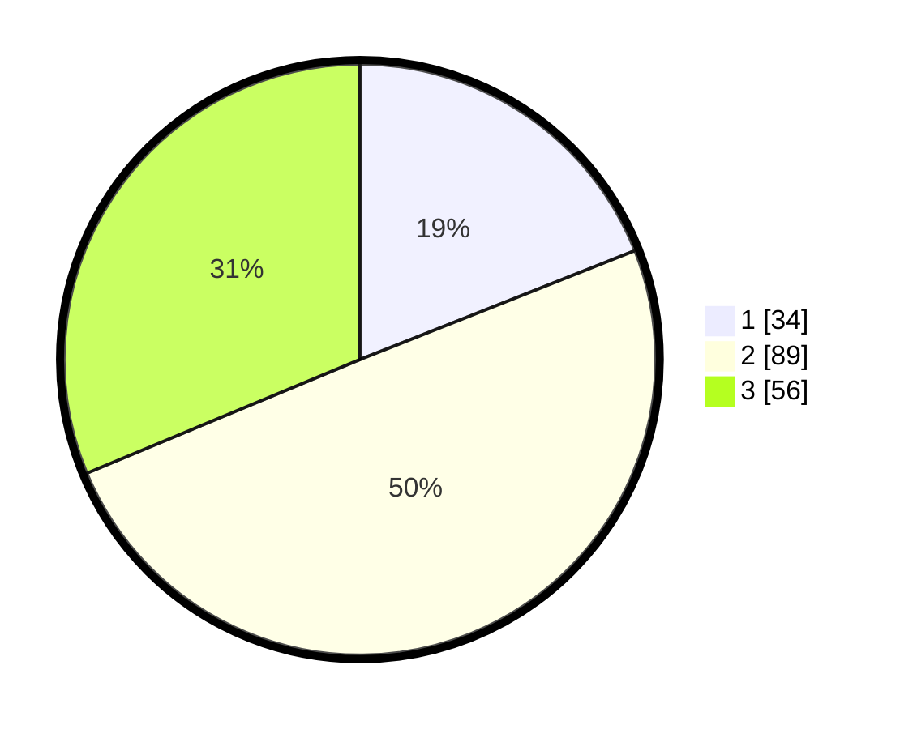

# Hasil

## Grafik

## Tabel

| No. | Nama Paslon    | Suara | Suara (raw) | Persentase |
|:--- |:-------------- | -----:| -----------:| ----------:|
| 1   | ANIES MUHAIMIN | 34    | [34][p-1]   | 18,99      |
| 2   | PRABOWO GIBRAN | 89    | [89][p-2]   | 49,72      |
| 3   | GANJAR MAHFUD  | 56    | [56][p-3]   | 31,28      |

[p-1]: https://github.com/gigit-pemilu/pemilu-2024/blob/main/pilpres/hitung-suara/sub/34-di-yogyakarta/sub/04-sleman/sub/13-sleman/sub/2003-tridadi/sub/033-tps/sub/paslon-1.txt
[p-2]: https://github.com/gigit-pemilu/pemilu-2024/blob/main/pilpres/hitung-suara/sub/34-di-yogyakarta/sub/04-sleman/sub/13-sleman/sub/2003-tridadi/sub/033-tps/sub/paslon-2.txt
[p-3]: https://github.com/gigit-pemilu/pemilu-2024/blob/main/pilpres/hitung-suara/sub/34-di-yogyakarta/sub/04-sleman/sub/13-sleman/sub/2003-tridadi/sub/033-tps/sub/paslon-3.txt

## Foto C Plano

https://sirekap-obj-formc.kpu.go.id/6236/pemilu/ppwp/34/04/13/20/03/3404132003033-20240214-192407--fe6ba74e-17f0-41b3-855c-ba1b462b98e4.jpg

https://sirekap-obj-formc.kpu.go.id/6236/pemilu/ppwp/34/04/13/20/03/3404132003033-20240214-192525--760a9a38-da3d-4457-a018-8a1f4ce78465.jpg

https://sirekap-obj-formc.kpu.go.id/6236/pemilu/ppwp/34/04/13/20/03/3404132003033-20240214-192643--7a1785a9-59f1-4d1d-b174-d36d63d4e954.jpg

## Metadata

| Key        | Value               |
| ---------- | ------------------- |
| Time Stamp | 2024-02-15 12:00:28 |

## DATA PEMILIH TETAP

Jumlah pemilih dalam DPT: **190**.
 * L: **96**.
 * P: **94**.

## DATA PENGGUNA HAK PILIH

Jumlah pengguna hak pilih dalam DPT: **171**.
 * L: **87**.
 * P: **84**.

Jumlah pengguna hak pilih dalam DPTb: **11**.
 * L: **9**.
 * P: **2**.

Jumlah pengguna hak pilih dalam DPK: **2**.
 * L: **0**.
 * P: **2**.

Jumlah pengguna hak pilih: **184**.
 * L: **96**.
 * P: **88**.

## JUMLAH SUARA SAH DAN TIDAK SAH

JUMLAH SELURUH SUARA SAH: **179**.

JUMLAH SUARA TIDAK SAH: **5**.

JUMLAH SELURUH SUARA SAH DAN SUARA TIDAK SAH: **184**.

