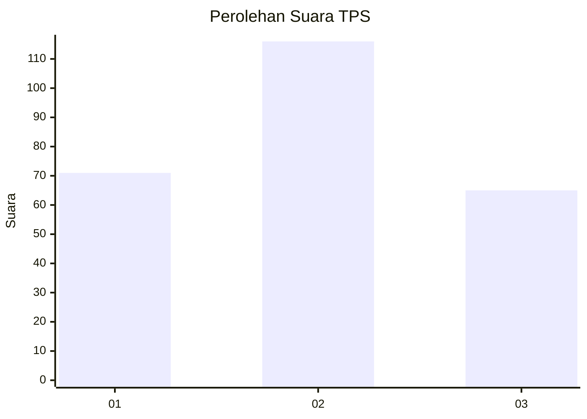
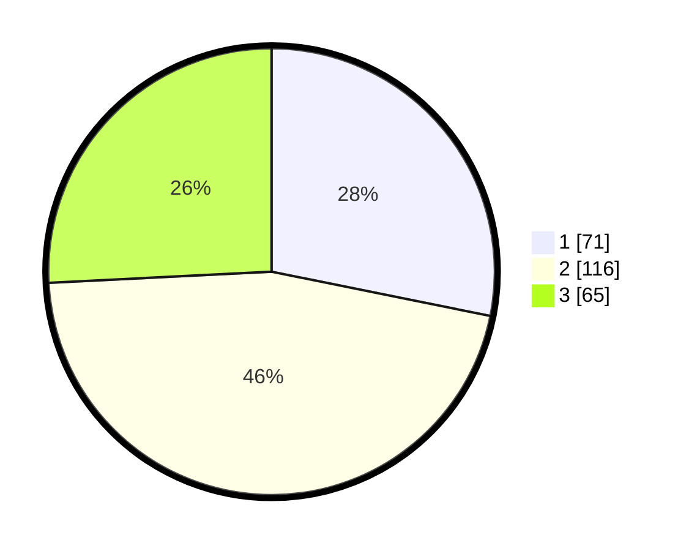

# Hasil

## Grafik

## Tabel

| No. | Nama Paslon    | Suara | Suara (raw) | Persentase |
|:--- |:-------------- | -----:| -----------:| ----------:|
| 1   | ANIES MUHAIMIN | 71    | [71][p-1]   | 28,17      |
| 2   | PRABOWO GIBRAN | 116   | [116][p-2]  | 46,03      |
| 3   | GANJAR MAHFUD  | 65    | [65][p-3]   | 25,79      |

[p-1]: https://github.com/gigit-pemilu/pemilu-2024-34-di-yogyakarta/blob/main/pilpres/hitung-suara/sub/34-di-yogyakarta/sub/04-sleman/sub/13-sleman/sub/2003-tridadi/sub/041-tps/sub/paslon-1.txt
[p-2]: https://github.com/gigit-pemilu/pemilu-2024-34-di-yogyakarta/blob/main/pilpres/hitung-suara/sub/34-di-yogyakarta/sub/04-sleman/sub/13-sleman/sub/2003-tridadi/sub/041-tps/sub/paslon-2.txt
[p-3]: https://github.com/gigit-pemilu/pemilu-2024-34-di-yogyakarta/blob/main/pilpres/hitung-suara/sub/34-di-yogyakarta/sub/04-sleman/sub/13-sleman/sub/2003-tridadi/sub/041-tps/sub/paslon-3.txt

## Foto C Plano

https://sirekap-obj-formc.kpu.go.id/cd44/pemilu/ppwp/34/04/13/20/03/3404132003041-20240215-003042--14b8cad2-1b70-4942-afed-f4d8ee30acd7.jpg

https://sirekap-obj-formc.kpu.go.id/cd44/pemilu/ppwp/34/04/13/20/03/3404132003041-20240215-003111--dcdc1948-fcd2-404f-95d6-f857d83e311e.jpg

https://sirekap-obj-formc.kpu.go.id/cd44/pemilu/ppwp/34/04/13/20/03/3404132003041-20240215-003138--3774b5ea-821d-4dea-a06f-cc60d7fe4883.jpg

## Metadata

| Key        | Value               |
| ---------- | ------------------- |
| Time Stamp | 2024-02-15 15:00:29 |

## DATA PEMILIH TETAP

Jumlah pemilih dalam DPT: **284**.
 * L: **127**.
 * P: **157**.

## DATA PENGGUNA HAK PILIH

Jumlah pengguna hak pilih dalam DPT: **246**.
 * L: **105**.
 * P: **141**.

Jumlah pengguna hak pilih dalam DPTb: **13**.
 * L: **2**.
 * P: **11**.

Jumlah pengguna hak pilih dalam DPK: **2**.
 * L: **1**.
 * P: **1**.

Jumlah pengguna hak pilih: **261**.
 * L: **108**.
 * P: **153**.

## JUMLAH SUARA SAH DAN TIDAK SAH

JUMLAH SELURUH SUARA SAH: **252**.

JUMLAH SUARA TIDAK SAH: **9**.

JUMLAH SELURUH SUARA SAH DAN SUARA TIDAK SAH: **261**.

