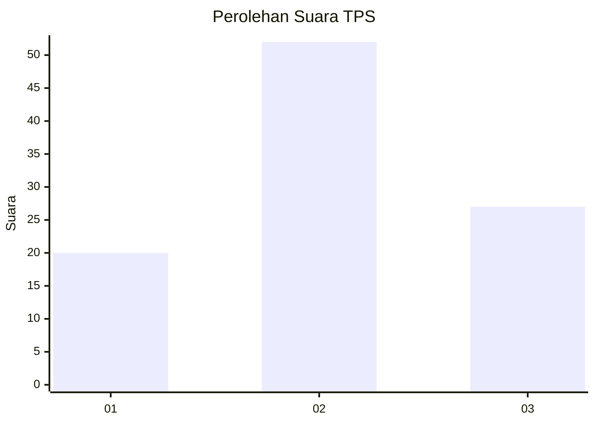
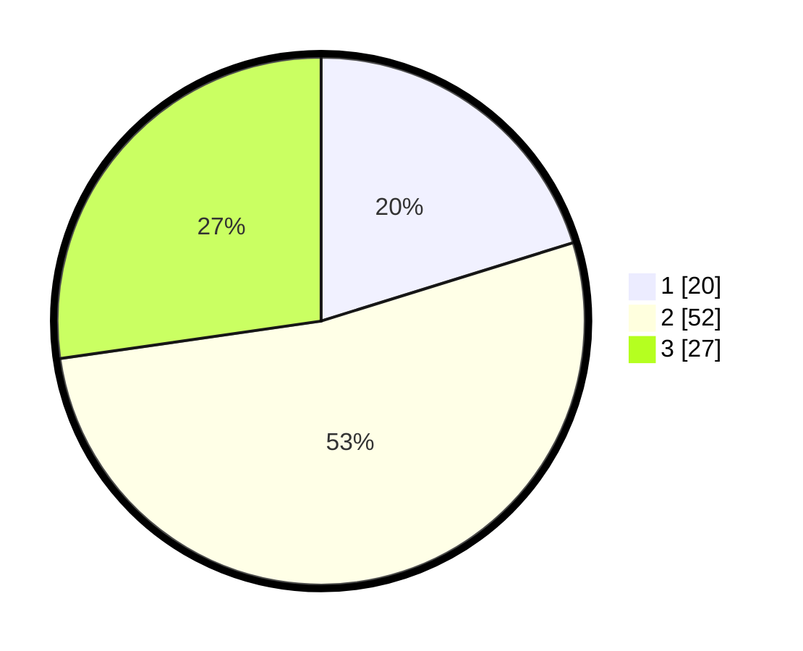

# Hasil

## Grafik

## Tabel

| No. | Nama Paslon    | Suara | Suara (raw) | Persentase |
|:--- |:-------------- | -----:| -----------:| ----------:|
| 1   | ANIES MUHAIMIN | 20    | [20][p-1]   | 20,20      |
| 2   | PRABOWO GIBRAN | 52    | [52][p-2]   | 52,53      |
| 3   | GANJAR MAHFUD  | 27    | [27][p-3]   | 27,27      |

[p-1]: https://github.com/gigit-pemilu/pemilu-2024-34-di-yogyakarta/blob/main/pilpres/hitung-suara/sub/34-di-yogyakarta/sub/04-sleman/sub/13-sleman/sub/2003-tridadi/sub/044-tps/sub/paslon-1.txt
[p-2]: https://github.com/gigit-pemilu/pemilu-2024-34-di-yogyakarta/blob/main/pilpres/hitung-suara/sub/34-di-yogyakarta/sub/04-sleman/sub/13-sleman/sub/2003-tridadi/sub/044-tps/sub/paslon-2.txt
[p-3]: https://github.com/gigit-pemilu/pemilu-2024-34-di-yogyakarta/blob/main/pilpres/hitung-suara/sub/34-di-yogyakarta/sub/04-sleman/sub/13-sleman/sub/2003-tridadi/sub/044-tps/sub/paslon-3.txt

## Foto C Plano

https://sirekap-obj-formc.kpu.go.id/245c/pemilu/ppwp/34/04/13/20/03/3404132003044-20240214-141046--cafbb65e-45f7-4b24-a191-29bc72f33d78.jpg

https://sirekap-obj-formc.kpu.go.id/245c/pemilu/ppwp/34/04/13/20/03/3404132003044-20240214-141146--1be36dd0-e0f1-44b4-934c-cb3d680eb39c.jpg

https://sirekap-obj-formc.kpu.go.id/245c/pemilu/ppwp/34/04/13/20/03/3404132003044-20240214-141242--02e1fd8c-d70e-4010-8152-918fc44091c0.jpg

## Metadata

| Key        | Value               |
| ---------- | ------------------- |
| Time Stamp | 2024-02-15 15:00:29 |

