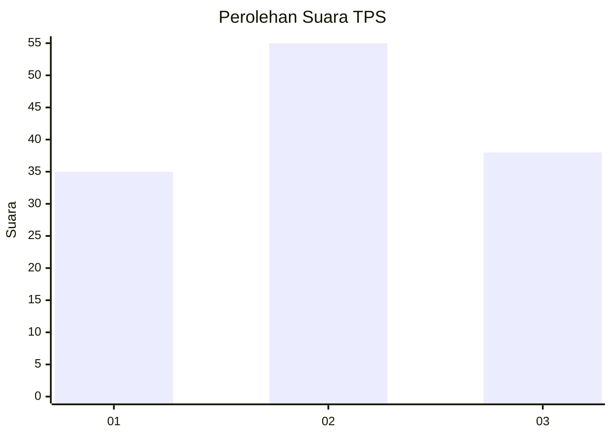
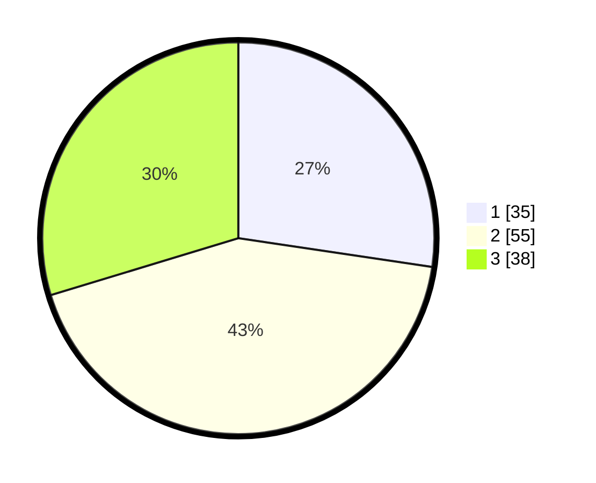

# Hasil

## Grafik

## Tabel

| No. | Nama Paslon    | Suara | Suara (raw) | Persentase |
|:--- |:-------------- | -----:| -----------:| ----------:|
| 1   | ANIES MUHAIMIN | 35    | [35][p-1]   | 27,34      |
| 2   | PRABOWO GIBRAN | 55    | [55][p-2]   | 42,97      |
| 3   | GANJAR MAHFUD  | 38    | [38][p-3]   | 29,69      |

[p-1]: https://github.com/gigit-pemilu/pemilu-2024-34-di-yogyakarta/blob/main/pilpres/hitung-suara/sub/34-di-yogyakarta/sub/04-sleman/sub/13-sleman/sub/2003-tridadi/sub/047-tps/sub/paslon-1.txt
[p-2]: https://github.com/gigit-pemilu/pemilu-2024-34-di-yogyakarta/blob/main/pilpres/hitung-suara/sub/34-di-yogyakarta/sub/04-sleman/sub/13-sleman/sub/2003-tridadi/sub/047-tps/sub/paslon-2.txt
[p-3]: https://github.com/gigit-pemilu/pemilu-2024-34-di-yogyakarta/blob/main/pilpres/hitung-suara/sub/34-di-yogyakarta/sub/04-sleman/sub/13-sleman/sub/2003-tridadi/sub/047-tps/sub/paslon-3.txt

## Foto C Plano

https://sirekap-obj-formc.kpu.go.id/81a5/pemilu/ppwp/34/04/13/20/03/3404132003047-20240215-004619--2670857e-8122-4493-8ced-f10f4a40ff55.jpg

https://sirekap-obj-formc.kpu.go.id/81a5/pemilu/ppwp/34/04/13/20/03/3404132003047-20240215-004833--25e41767-df7d-4164-a4ce-c4fea7dc6ca0.jpg

https://sirekap-obj-formc.kpu.go.id/81a5/pemilu/ppwp/34/04/13/20/03/3404132003047-20240215-005048--c83bdebe-aa21-4ef6-b1f4-300c1452873d.jpg

## Metadata

| Key        | Value               |
| ---------- | ------------------- |
| Time Stamp | 2024-02-15 15:00:29 |

