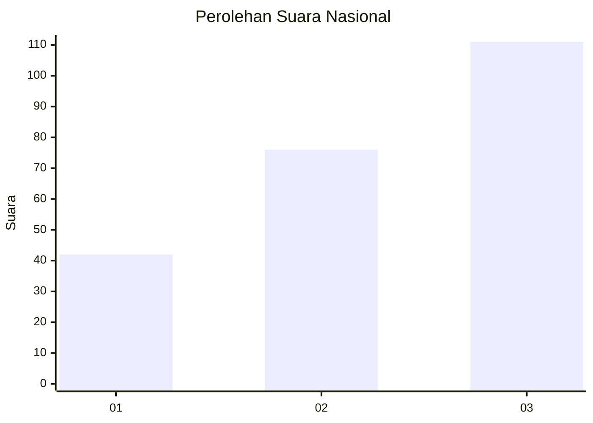
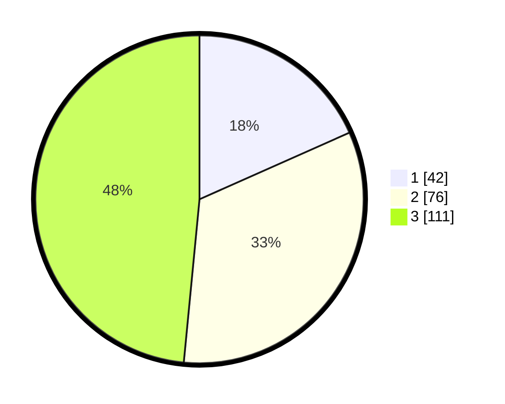

# Hasil

## Grafik

## Tabel

| No. | Nama Paslon    | Suara | Suara (raw) | Persentase |
|:--- |:-------------- | -----:| -----------:| ----------:|
| 1   | ANIES MUHAIMIN | 42    | [42][p-1]   | 18,34      |
| 2   | PRABOWO GIBRAN | 76    | [76][p-2]   | 33,19      |
| 3   | GANJAR MAHFUD  | 111   | [111][p-3]  | 48,47      |

[p-1]: https://github.com/gigit-pemilu/pemilu-2024/blob/main/pilpres/hitung-suara/sub/34-di-yogyakarta/sub/04-sleman/sub/13-sleman/sub/2004-pandowoharjo/sub/003-tps/sub/paslon-1.txt
[p-2]: https://github.com/gigit-pemilu/pemilu-2024/blob/main/pilpres/hitung-suara/sub/34-di-yogyakarta/sub/04-sleman/sub/13-sleman/sub/2004-pandowoharjo/sub/003-tps/sub/paslon-2.txt
[p-3]: https://github.com/gigit-pemilu/pemilu-2024/blob/main/pilpres/hitung-suara/sub/34-di-yogyakarta/sub/04-sleman/sub/13-sleman/sub/2004-pandowoharjo/sub/003-tps/sub/paslon-3.txt

## Foto C Plano

https://sirekap-obj-formc.kpu.go.id/c5f0/pemilu/ppwp/34/04/13/20/04/3404132004003-20240214-204901--a42115f5-985d-4d17-9a5e-effa396c971f.jpg

https://sirekap-obj-formc.kpu.go.id/c5f0/pemilu/ppwp/34/04/13/20/04/3404132004003-20240214-205001--21877d2e-0729-4927-a99e-3059ff43b6a9.jpg

https://sirekap-obj-formc.kpu.go.id/c5f0/pemilu/ppwp/34/04/13/20/04/3404132004003-20240214-205113--87aefc25-3d6b-4160-bd40-a232eef47945.jpg

## Metadata

| Key        | Value               |
| ---------- | ------------------- |
| Time Stamp | 2024-02-15 15:00:29 |

