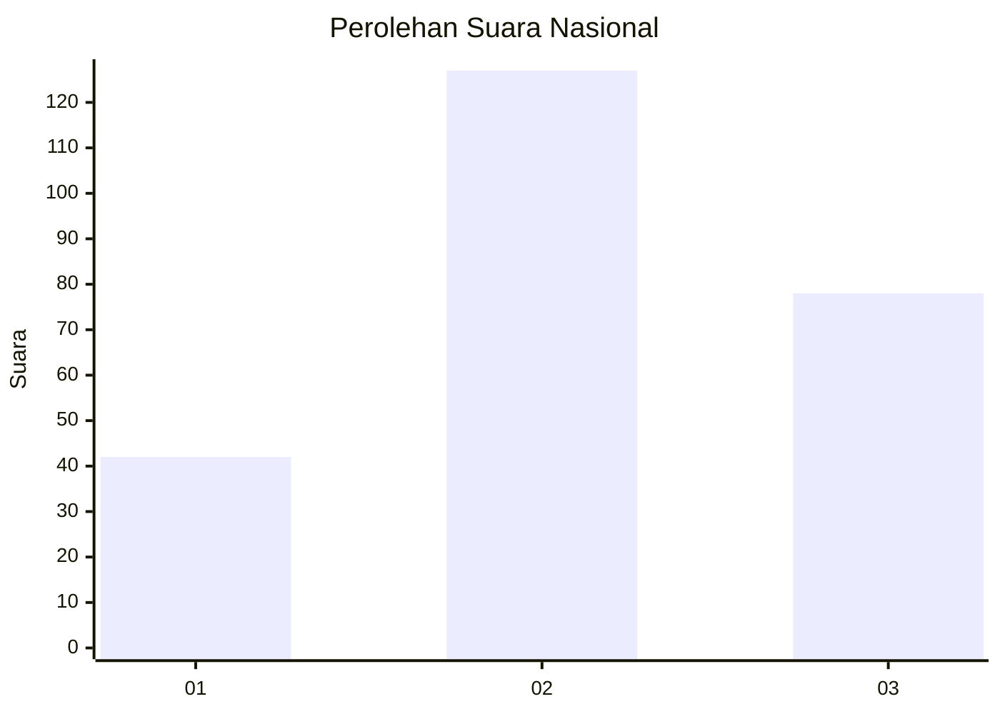
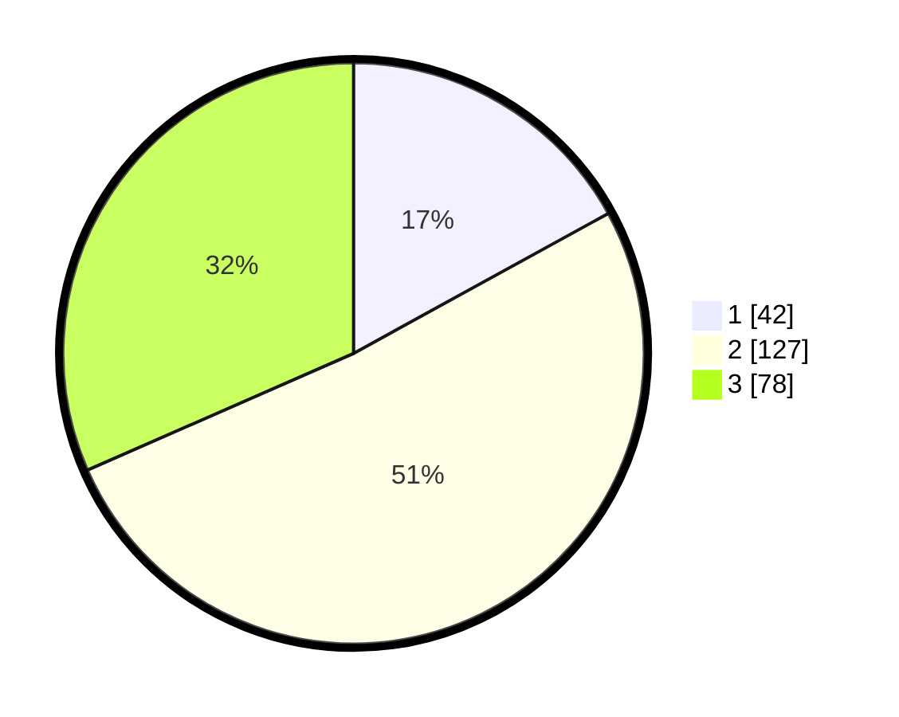

# Hasil

## Grafik

## Tabel

| No. | Nama Paslon    | Suara | Suara (raw) | Persentase |
|:--- |:-------------- | -----:| -----------:| ----------:|
| 1   | ANIES MUHAIMIN | 42    | [42][p-1]   | 17,00      |
| 2   | PRABOWO GIBRAN | 127   | [127][p-2]  | 51,42      |
| 3   | GANJAR MAHFUD  | 78    | [78][p-3]   | 31,58      |

[p-1]: https://github.com/gigit-pemilu/pemilu-2024/blob/main/pilpres/hitung-suara/sub/34-di-yogyakarta/sub/04-sleman/sub/13-sleman/sub/2004-pandowoharjo/sub/021-tps/sub/paslon-1.txt
[p-2]: https://github.com/gigit-pemilu/pemilu-2024/blob/main/pilpres/hitung-suara/sub/34-di-yogyakarta/sub/04-sleman/sub/13-sleman/sub/2004-pandowoharjo/sub/021-tps/sub/paslon-2.txt
[p-3]: https://github.com/gigit-pemilu/pemilu-2024/blob/main/pilpres/hitung-suara/sub/34-di-yogyakarta/sub/04-sleman/sub/13-sleman/sub/2004-pandowoharjo/sub/021-tps/sub/paslon-3.txt

## Foto C Plano

https://sirekap-obj-formc.kpu.go.id/7172/pemilu/ppwp/34/04/13/20/04/3404132004021-20240215-002306--51d0d1b4-5c68-4b88-a807-8ba3c5f04ed1.jpg

https://sirekap-obj-formc.kpu.go.id/7172/pemilu/ppwp/34/04/13/20/04/3404132004021-20240215-002436--aefe5bae-519b-425d-a356-d2cba78a496d.jpg

https://sirekap-obj-formc.kpu.go.id/7172/pemilu/ppwp/34/04/13/20/04/3404132004021-20240214-155649--8fc714cd-89b1-4121-a3e2-6f20858591af.jpg

## Metadata

| Key        | Value               |
| ---------- | ------------------- |
| Time Stamp | 2024-02-15 15:00:29 |

