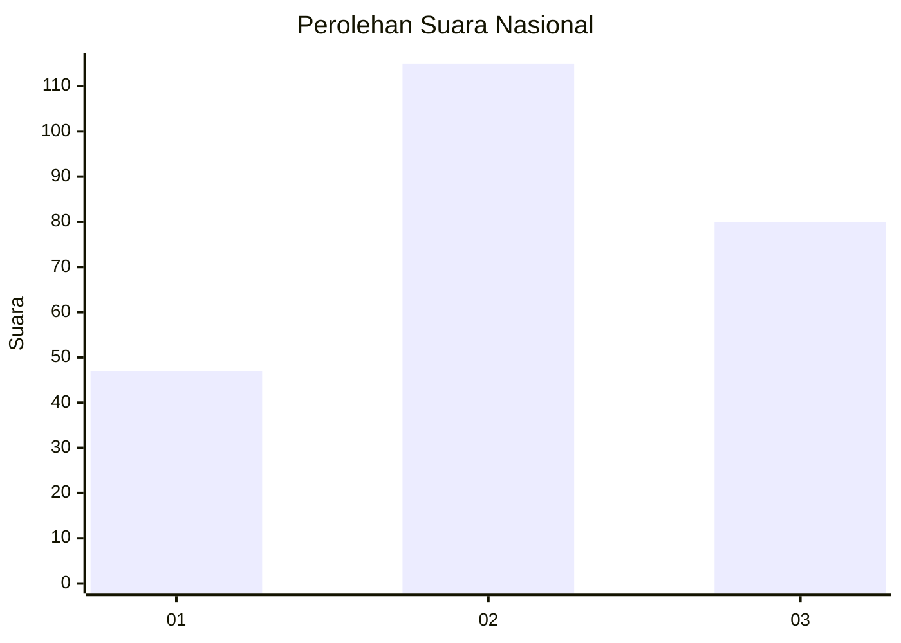
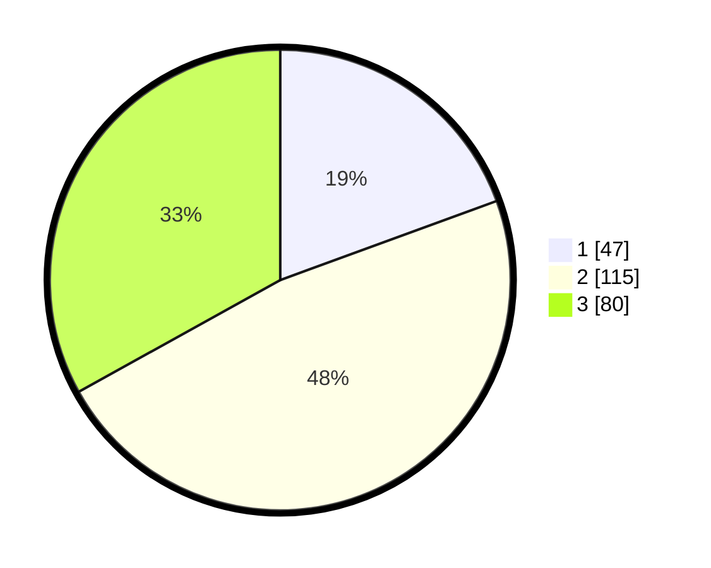

# Hasil

## Grafik

## Tabel

| No. | Nama Paslon    | Suara | Suara (raw) | Persentase |
|:--- |:-------------- | -----:| -----------:| ----------:|
| 1   | ANIES MUHAIMIN | 47    | [47][p-1]   | 19,42      |
| 2   | PRABOWO GIBRAN | 115   | [115][p-2]  | 47,52      |
| 3   | GANJAR MAHFUD  | 80    | [80][p-3]   | 33,06      |

[p-1]: https://github.com/gigit-pemilu/pemilu-2024/blob/main/pilpres/hitung-suara/sub/34-di-yogyakarta/sub/04-sleman/sub/13-sleman/sub/2004-pandowoharjo/sub/030-tps/sub/paslon-1.txt
[p-2]: https://github.com/gigit-pemilu/pemilu-2024/blob/main/pilpres/hitung-suara/sub/34-di-yogyakarta/sub/04-sleman/sub/13-sleman/sub/2004-pandowoharjo/sub/030-tps/sub/paslon-2.txt
[p-3]: https://github.com/gigit-pemilu/pemilu-2024/blob/main/pilpres/hitung-suara/sub/34-di-yogyakarta/sub/04-sleman/sub/13-sleman/sub/2004-pandowoharjo/sub/030-tps/sub/paslon-3.txt

## Foto C Plano

https://sirekap-obj-formc.kpu.go.id/caf2/pemilu/ppwp/34/04/13/20/04/3404132004030-20240214-203342--268ac11c-de30-4bd9-8a8b-6e32e3d4e122.jpg

https://sirekap-obj-formc.kpu.go.id/caf2/pemilu/ppwp/34/04/13/20/04/3404132004030-20240214-203349--554bf723-934e-4df8-9c58-8fb91025a0bd.jpg

https://sirekap-obj-formc.kpu.go.id/caf2/pemilu/ppwp/34/04/13/20/04/3404132004030-20240214-203413--96b8882c-e17a-4f23-8ca8-e9df88fb9d47.jpg

## Metadata

| Key        | Value               |
| ---------- | ------------------- |
| Time Stamp | 2024-02-15 15:00:29 |

